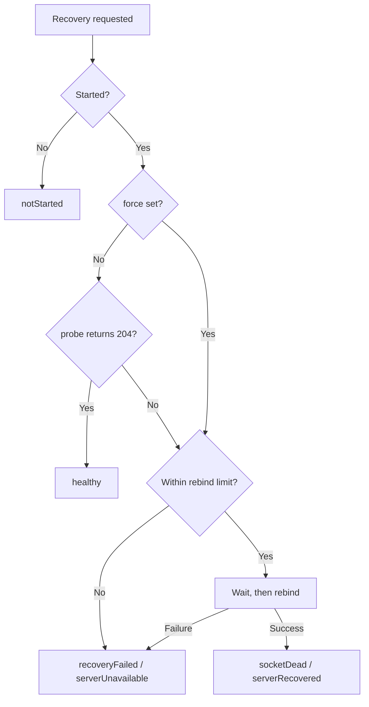

# offline_web_proxy Specification

A local proxy server with offline support that runs within a Flutter app.
The purpose is to enable existing web systems to work as apps without being aware of online/offline status.

This proxy server relays HTTP requests sent from WebView, forwarding them to the upstream server when online, and returning responses from cache when offline. Additionally, it provides seamless offline support by storing update requests (POST/PUT/DELETE) in a queue when offline and automatically sending them when connectivity is restored.

---

## [1] Basic Configuration

### Architecture Overview

- **Base Technology**: shelf (Dart's lightweight HTTP server framework), shelf_router (routing), shelf_proxy (proxy functionality)
- **Communication Path**: WebView → http://127.0.0.1:<port> → (proxy) → Upstream Server
- **Data Persistence**: Local storage using Hive
- **Cache-Control Support**: Use response headers for storage eligibility and fallback eligibility

### Data Processing Strategy

- **Cache**: Store successful GET responses in file-based storage. Do not use proxy cache to suppress online requests, and limit its use to offline or upstream-unreachable fallback
- **Queue**: Manage POST/PUT/DELETE requests in FIFO (First In First Out). Send sequentially when network recovers
- **Offline Response**: Return cache when cache hit, display fallback page when uncached
- **Static Resources**: Index files under `assets/static/` that are declared in `pubspec.yaml` and listed in `AssetManifest.json`. The current response is still the 404 placeholder

### Proxy Target

Relays to the upstream origin server (e.g., https://sample.com). Supports a single origin server.

## [2] Port and Connection Specifications

### Port Management

- **Automatic Assignment**: System automatically selects an available port. Avoids port conflicts
- **Return Value**: Returns the actual port number used when proxy server starts
- **Bind Target**: Only 127.0.0.1 (local loopback). Prevents external access

### Security Considerations

- **HTTPS Not Required**: localhost is treated as a secure context by browsers, so HTTP is sufficient
- **External Access Restriction**: Completely blocks access from outside the device by binding to 127.0.0.1

### Health Monitoring

- The proxy exposes a health check endpoint. The default path is `/__offline_web_proxy/health` and can be changed with `ProxyConfig.healthCheckPath`.
- Health checks accept only `GET` and `HEAD` and are answered with `204 No Content` and `Cache-Control: no-store`. Any other method is handled through the normal proxy path.
- `healthCheckPath` must be a fixed path starting with `/`. Values containing route parameter syntax (`<`, `>`), `?`, `#`, or whitespace are rejected at startup with `ProxyStartException`. An empty value falls back to the default path.
- Health check requests are never forwarded upstream and are excluded from cache, queue, cookie processing, and statistics counters.
- `probe()` sends a request to the health check path on the currently bound port and reports the server as running only when `204` is received. The default timeout is 2 seconds. Connection failure, timeout, and unexpected status are all treated as not running.
- `isRunning` only returns the internal flag and does not guarantee that the socket actually responds. Use `probe()` to verify actual responsiveness.
- To reproduce the "dead socket" state, `closeServerSocketForTesting()` is provided as `@visibleForTesting`. It closes only the socket without changing internal state and is not intended for production use.

### Dead Socket and Automatic Recovery

Device suspension or process resume can leave the socket unresponsive even though the internal flag still reports running. This specification calls that state a "dead socket".

- `ensureRunning()` runs `probe()` and rebinds the server only when the probe fails. Cache, queue, and cookie storage stay open.
- Port selection order on rebind:
  1. `ProxyConfig.port` (when greater than 0, only this port is attempted)
  2. The previously bound port
  3. `ProxyConfig.preferredPort`
  4. Automatic assignment (0)
- When the rebound port differs from the previous one, the result reports `portChanged` as `true`.
- `ensureRunning()` does not know which URL the app is displaying, so `reloadUri` is always `null`. When the port changed, read `portChanged` and `port` and let the app compose the URL to load.
- `ensureRunning(force: true)` rebinds regardless of the probe result.
- When called before `start()`, no rebind is attempted and `cause` is reported as `notStarted`.
- A successful recovery emits the `serverRecovered` event; a failed recovery emits `serverUnavailable`.
- `downtimeMs` in the result and the event is set only when `downtime` was supplied to that call. It is never carried over to other recovery results. The `lastDowntimeMs` diagnostic keeps the most recently supplied value.

Figure: Recovery decision flow



### Recovery Attempt Throttling

- Only one recovery runs at a time. Concurrent requests share the result of the in-flight recovery.
- Wait time for consecutive failures increases as 0, 1, 2, 5, 10 seconds and stays at 10 seconds afterwards.
- Rebinds are limited to 5 per minute by default. Exceeding the limit skips the rebind and returns `recoveryFailed`. The limit is configurable with `ProxyConfig.maxRestartAttemptsPerMinute`.
- A successful recovery resets the consecutive failure count and the wait time.
- Setting `maxRestartAttemptsPerMinute` to zero or less disables rebinding entirely and always returns `recoveryFailed`.
- Recovery and shutdown are mutually exclusive. When `stop()` completes first the recovery is aborted and `recoveryFailed` is returned; when the rebind completes first the following `stop()` reliably closes the socket and the background timers. No rebound socket or timer is ever left running after shutdown.
- `stop()` resets only the recovery control state (attempt history, consecutive failure count, in-flight recovery). Diagnostics such as the rebind count and the last recovery cause are reset on the next `start()`.

### Stale Port URL Rewriting

An app restart or automatic port assignment can leave the WebView holding a URL whose port differs from the current one.

- `resolveReloadUri(String lastUrl)` returns the URL rewritten to the current port when the target URL uses a loopback host (`127.0.0.1` or `localhost`) and only the port differs. Path, query, and fragment are preserved.
- When the port already matches the current port, the URL is returned unchanged.
- The rewritten host is normalized to `ProxyConfig.host`. A URL held with the `localhost` spelling is aligned to the configured host spelling.
- Only ports this instance has bound since startup, the persisted previously bound port, and `ProxyConfig.preferredPort` (when greater than zero) are eligible for rewriting. This keeps navigation to other local servers on different ports intact.
- `null` is returned for non-loopback hosts, non-`http` schemes, unparsable strings, ports outside the eligible set, and while the server is stopped (current port unknown).
- The navigation APIs (`resolveNavigationTarget`, `recommendMainFrameNavigation`, `recommendNewWindowNavigation`) also treat a loopback URL that differs only by port as `ProxyNavigationReason.stalePortUrl` and recommend loading (`loadProxyUrl`) the proxy URL rewritten to the current port.

### Recovery from WebView Errors

- `recoverFromWebResourceError()` evaluates the failing URL reported by the WebView and attempts recovery only when one of the following holds:
  - The failing URL host and port match the current proxy
  - The failing URL uses a loopback host and only the port differs from the current port
- For any other URL (upstream server or external site) no recovery is attempted and `cause` is reported as `unrelated`. A missing `failingUrl` also yields `unrelated`.
- `errorCode` and `isMainFrame` are only recorded as diagnostics and are not used to decide whether to recover.
- When recovery was attempted, `reloadUri` carries `failingUrl` rewritten to the current port. The same URL is carried even when the port did not change. It is `null` when recovery was not possible.
- This API returns no end-user message. Presenting information to the end user is the responsibility of the host app.

### App Lifecycle Integration

- `ProxyLifecycleGuard` is registered as a `WidgetsBindingObserver` and runs `ensureRunning()` when the app transitions to `resumed`.
- `onRecovered` is invoked only when a rebind happened. It is not invoked when `probe()` succeeds.
- `onFailed` is invoked when recovery was not possible. Nothing happens when it is omitted.
- The time of the transition to `paused` is retained, and the elapsed time until `resumed` is recorded as `downtimeMs` in events and diagnostics.
- When `currentUrlProvider` is supplied, `reloadUri` after recovery is that URL rewritten to the current port. When it is omitted and the port did not change, `reloadUri` is `null`.
- This library never reloads the WebView. The host app performs the load using the `reloadUri` supplied to `onRecovered`. When `reloadUri` is `null`, the host app reloads the current URL itself.

### Periodic Health Check

- When `ProxyConfig.healthCheckInterval` is greater than zero, `probe()` runs at that interval and recovery is attempted on failure. The default is zero (disabled).
- The responsiveness-check timeout for the periodic check follows `healthCheckInterval`, clamped between 500 milliseconds and 2 seconds.
- Timers are assumed not to fire while the app is in the background, so recovery after a long idle period relies primarily on the `resumed` check performed by `ProxyLifecycleGuard`.

### Keep-Alive and Idle Timeout

- The internal HTTP server idle timeout is configured with `ProxyConfig.serverIdleTimeout` (default 120 seconds).
- Keep-alive connections that receive no request within the configured time are closed by the server.

## [3] Static Resource Detection

### Detection Logic

At startup, the proxy scans `AssetManifest.json` and builds a static-resource index from files under `assets/static/` that are declared in `pubspec.yaml`. Only URLs present in that index are treated as proxy-local static resources, while ordinary same-origin URLs that are not indexed continue to resolve upstream or through proxy URL conversion. If the manifest cannot be loaded in the current runtime, the proxy continues startup with an empty static-resource index.

### Indexing Rules

Mapping between local assets and proxy URLs:

```
Local asset: assets/static/app.css
           ↓
Indexed at startup as: /app.css
           ↓
Request: http://127.0.0.1:8080/app.css
           ↓
Classification: static resource
           ↓
Current behavior: Return the 404 placeholder response
```

### URL Normalization Processing

- **Slash Compression**: Convert `//` to `/`
- **Relative Path Resolution**: Properly resolve `../` and `./`
- **Index-Based Classification**: Treat only URLs present in the startup index as static resources
- **Ordinary URL Priority**: Prefer upstream resolution for `.js`, `.css`, and image URLs when they are not in the static-resource index

### Processing Flow

1. At startup, read `AssetManifest.json` or the runtime-equivalent manifest and convert files under `assets/static/` into proxy URLs
2. Normalize the incoming request URL
3. If the URL is in the index: Return the 404 placeholder response
4. Otherwise: Proxy forward to upstream or resolve as a proxy URL

### Performance Optimization

- **Startup Index**: Build and keep the `assets/static/` index in memory at startup
- **Content-Type Cache**: Cache Content-Type determination results based on extensions

### Security Measures

- **Path Restriction**: Only URLs derived from files under `assets/static/` are treated as proxy-local static resources
- **Misclassification Prevention**: Prefer upstream forwarding for URLs that are not present in the startup index instead of relying on file extensions alone

### Automatic Content-Type Detection

Automatic Content-Type setting based on extensions:

```
.html → text/html; charset=utf-8
.css  → text/css; charset=utf-8
.js   → application/javascript; charset=utf-8
.json → application/json; charset=utf-8
.png  → image/png
.jpg  → image/jpeg
.woff2 → font/woff2
(Others) → application/octet-stream
```

## [4] Cookie Jar Persistence and Protection

### Storage Strategy

- **Persistence Required**: Persist all cookies in file-based storage. Retain even after app restart
- **Encryption**: Encrypt and save cookie data using AES-256
- **Key Management**: Store the encryption key in secure storage and migrate the legacy plain `proxy_cookies` box once when possible
- **Key Loss Handling**: If the secure storage key is lost, existing encrypted cookies cannot be decrypted and re-authentication is required
- **Memory Cache**: Cache cookies loaded from files in memory for fast access

### Cookie Evaluation Criteria

Implement RFC-compliant cookie evaluation:

- **Domain**: Validate the domain for which the cookie is valid
- **Path**: Validate the path for which the cookie is valid
- **Expires/Max-Age**: Manage cookie expiration
- **Secure**: Control cookies that are only sent over HTTPS connections
- **SameSite**: Process SameSite attribute for CSRF attack prevention

### Management Methods

Provides methods for cookie management. See [20] API Reference for details.

- **`getCookies()`**: Get list of currently stored cookies (values returned masked)
- **`restoreCookies()`**: Restore externally obtained cookies, including before proxy startup
- **`clearCookies()`**: Delete all cookies

## [5] Queue Resend Policy

### Queue Management

- **Stored Order**: Resend in ascending order of the stored timestamp to preserve request order
- **Unique Keys**: Derive keys from a microsecond timestamp plus a per-microsecond sequence number so that requests stored at the same moment are never overwritten
- **Persistence**: Save queue state with Hive. Continue resending after app restart
- **Backoff Handling**: Skip requests that are still waiting for their backoff window and send the following requests whose window has already passed
- **Connection Release**: A resend always reads the upstream response body to completion and releases the connection before moving on, so a queue larger than the concurrent connection limit still drains to the end
- **When Quarantine Fails**: If the request cannot be moved to the quarantine store, it stays in the queue and is retried with backoff applied

### Retry Strategy

- **Staged Backoff**: Apply the seconds listed in `ProxyConfig.retryBackoffSeconds` in retry order (defaults to 1, 2, 5, 10, 20, 30 seconds), then keep using the last value
- **Infinite Retry**: Keep retrying for network errors and 5xx responses

### Conditions for Giving Up a Resend

A request leaves the queue in the following case.

- **4xx Errors**: Client errors (authentication failure, invalid request, etc.). Resending cannot change the result, so the request is removed

Network errors and 5xx errors are treated as temporary failures: they are kept in the queue and retried.

### What Happens to a Removed Request

`ProxyConfig.dropPolicy` decides.

| Policy | Behavior | Use for |
| ------ | -------- | ------- |
| `quarantine` (default) | Move it, body included, to a quarantine store | Business data such as a sales record, where losing a request matters |
| `drop` | Discard it and keep only a history entry | Requests that can be lost safely |

- **Quarantine notification**: Emits `ProxyEventType.requestQuarantined`
- **Drop notification**: Emits `ProxyEventType.requestDropped`
- **No double bookkeeping**: A quarantined request is not also written to the dropped history

### History Management

Provides methods for queue management. See [20] API Reference for details.

- **`getQuarantinedRequests()`**: List quarantined requests. Bodies are not returned
- **`retryQuarantinedRequest(id)`**: Put the request back in the queue after the cause is fixed. The retry count is reset and the stored timestamp is set to the moment it was accepted, so it is sent after requests already waiting
- **`discardQuarantinedRequest(id)`**: Discard a request after reviewing it
- **`clearQuarantinedRequests()`**: Discard every quarantined request
- **`getDroppedRequests()`**: Get history of dropped requests. Useful for debugging and troubleshooting
- **`acknowledgeDroppedRequests()`**: Mark the history as seen. The entries themselves are kept

### Noticing Unhandled Requests

- **`ProxyStats.quarantinedCount`**: Number of quarantined requests. Anything above zero needs a decision
- **`ProxyStats.unacknowledgedDroppedCount`**: Number of dropped history entries not acknowledged yet. Check it at startup to notice requests discarded while nobody was watching

## [6] Idempotency

### Duplicate Request Prevention

A queued request is resent without knowing whether the upstream already received it. If the upstream finished processing and only the response was lost, the resend can apply the same update twice. To avoid that, each update request is assigned one key that is sent on the first forward and on every resend.

- **When the key is decided**: On receiving the request. A key supplied by the client is kept; otherwise the proxy generates one
- **How keys are generated**: From random data, not from the body. Two identical sales totals in a row must not be treated as the same request and collapsed into one
- **Where it applies**: Both the forwarded attempt and every queue resend carry the same key
- **Queue deduplication**: Resubmitting the same key does not add a second queue entry
- **Skipping delivered requests**: A key already known to have reached the upstream within the retention period is not resent

### Division of Responsibility

The proxy guarantees only that the same operation carries the same key. **Deduplication itself must be implemented on the upstream server.** The proxy cannot tell a lost response from a request that never arrived.

### Supported Headers

- **`ProxyConfig.idempotencyHeaderName`**: Defaults to `Idempotency-Key`; change it to match the upstream
- **`ProxyConfig.enableIdempotencyKey`**: Set to `false` to send no key

### Retention Period

- **24 hours by default**: Configurable via `ProxyConfig.idempotencyRetention`. After it expires, a request carrying the key is treated as new
- **Storage**: Persist with Hive. Valid even after app restart
- **Expiry**: Removed by the hourly maintenance task

## [7] Response Compression

### Coordination with Upstream Server

- **Accept-Encoding Management**: Properly convey client's compression support status to upstream server
- **Decompression Processing**: Decompress compressed responses (gzip, deflate) from upstream server at the proxy and forward to client
  - Communication with upstream server remains compressed to save bandwidth
  - Forward uncompressed to client (local communication, so bandwidth is not an issue)
  - Remove Content-Encoding header and update Content-Length

### Uncompressed Option

- **identity Specification**: Can force uncompressed response by specifying `Accept-Encoding: identity`
- **Use Case**: Useful for debugging or direct examination of response content

## [8] Cache Consistency

### Cache-Control Support and Fallback Strategy

#### Online Principles

- **Upstream first**: When online, the proxy forwards requests including GET/HEAD to the upstream server
- **Browser-driven request suppression**: Whether a request is skipped because of Cache-Control is delegated to the WebView / browser HTTP cache
- **Role of proxy cache**: The proxy cache is not an online optimization layer. It is limited to substitute responses while offline or while the upstream is unreachable (connection failure or timeout)

#### Storage Policy

- **Stored responses**: Successful GET responses are eligible for storage
- **no-store**: Do not persist the response
- **max-age / s-maxage / Expires**: Used for internal TTL calculation of cache entries
- **no-cache / must-revalidate**: Retained as metadata for saved entries, but not used by the proxy to suppress online forwarding
- **default TTL**: Apply the configured Content-Type-based default TTL when none of the above are present

#### Fallback Eligibility

1. **When offline**: Return cached entries only when they are fresh or stale
2. **When the upstream is unreachable**: Use a fresh or stale cached entry as a substitute response when the upstream could not be reached. Connection refused, name resolution failure, a connection dropped mid-request, a TLS handshake failure, a failure to parse the upstream response, and exceeding the request timeout are all covered. It does not apply once the upstream has returned a complete status line and headers (including 4xx / 5xx)
3. **On HTTP 4xx**: Return the upstream 4xx response as-is and do not switch to proxy cache
4. **On HTTP 5xx**: Return the upstream 5xx response as-is and do not switch to proxy cache
5. **When expired**: Do not return entries whose stale period has also elapsed
6. **Upstream unreachable with no eligible cache**: GET/HEAD returns 504 (the body can be replaced with `ProxyConfig.gatewayTimeoutHtml`). Mutating requests are queued as before

#### Cache Expiration Calculation Priority

1. **Cache-Control: s-maxage** (treated as proxy-side TTL)
2. **Cache-Control: max-age**
3. **Expires** header
4. **Default TTL in configuration file**

#### Conditional Request Support

- **If-Modified-Since / Last-Modified**: Forward upstream unchanged when the browser sends them
- **If-None-Match / ETag**: Forward upstream unchanged when the browser sends them
- **304 Not Modified**: Treat as the normal browser/upstream flow rather than a proxy-side online cache-hit decision

### Cache File Format

Integrate metadata and content into a single file to simplify management:

#### File Structure

```
[Header Section]
CACHE_VERSION: 1.0
CREATED_AT: 2024-01-01T12:00:00Z
EXPIRES_AT: 2024-01-02T12:00:00Z
STATUS_CODE: 200
CONTENT_TYPE: text/html; charset=utf-8
CONTENT_LENGTH: 1234
CACHE_CONTROL: max-age=3600, public
ETAG: "abc123"
LAST_MODIFIED: Mon, 01 Jan 2024 12:00:00 GMT
X_ORIGINAL_URL: https://example.com/page

[Body Section]
<html>Actual response content</html>
```

#### Benefits of HTTP Protocol Compliance

- **Standards Compliance**: Same header/body separation method as HTTP/1.1 specification
- **Easy Parsing**: Can reuse existing HTTP parser libraries
- **Readability**: Intuitive and easy to understand for developers
- **Debug Efficiency**: Can directly check cache files with HTTP tools

#### Separation Method Details

- **Header Terminator**: Separate header and body sections with CRLF CRLF (`\r\n\r\n`)
- **Line Separator**: Separate each header line with CRLF (`\r\n`)
- **Compatibility**: Flexibly support environments with LF only (`\n\n`)

#### Benefits

- **Atomicity Guarantee**: Metadata and content synchronized with a single file write
- **Eliminate Fragment Problem**: Metadata and content always consistent
- **Simplified Management**: File count reduced by half, disk capacity also reduced
- **Read Efficiency**: Get metadata and content with a single file access
- **HTTP Compatibility**: Saved in standard HTTP message format

#### Drawbacks and Countermeasures

- **No Partial Reading**: Must read entire file even when only metadata is needed
  → **Countermeasure**: Keep header section size small (usually under 1KB), minimize impact
- **Large File Processing**: High cost of checking metadata for large files
  → **Countermeasure**: Read only fixed number of bytes (e.g., 4KB) from file beginning to parse headers

### Atomic Operations

Greatly simplified by single file format:

- **Via Temporary File**: Write header and body sections to temporary file simultaneously with response reception
- **Atomic Move**: After write completion, move to official cache file with rename operation
- **Exclusive Control**: Prevent race conditions during file operations
- **No Backup Needed**: Single file format reduces risk of partial corruption

### Consistency Check (Simplified)

- **Header Validation**: Check if header format at file beginning is correct
- **Separator Confirmation**: Confirm existence of CRLF CRLF (`\r\n\r\n`) or LF LF (`\n\n`)
- **Size Consistency**: Verify actual body section size against `CONTENT_LENGTH`
- **When Corruption Detected**: Delete entire file (no partial repair)

### Performance Optimization

Optimization leveraging single file format advantages:

#### Cache Index

- **Hive Index**: Index by URL, expiration time, file size, etc.
- **Metadata Cache**: Keep frequently accessed metadata in memory
- **Lazy Loading**: Read body section only when necessary

#### Streaming Support

- **Large Files**: Stream body section after reading header section
- **Range Specification**: Can partially deliver within single file for future Range support

#### HTTP Parser Utilization

- **Library Reuse**: Parse header section with existing HTTP message parser
- **Validation**: Directly utilize HTTP header validation functionality
- **Extensibility**: Automatically support future new HTTP headers

### File Naming Convention

```
cache/
├── content/
│   ├── ab/
│   │   ├── cd1234abcd5678ef90...cache     # Integrated cache file
│   │   └── ef9876543210abcd...cache       # Other cache
│   └── gh/
│       └── ij5678901234cdef...cache
└── index.hive                             # Cache index
```

#### URL Hashing

Perform normalization processing before hashing URL to generate consistent hash values:

##### Normalization Steps

1. **URL Decode**: Decode all percent-encoding (%20, etc.)
2. **Scheme Normalization**: Unify `HTTP` → `http`, `HTTPS` → `https`
3. **Hostname Normalization**: Convert uppercase to lowercase (`Example.COM` → `example.com`)
4. **Port Normalization**: Omit default ports (http:80, https:443)
5. **Path Normalization**:
   - Compress consecutive slashes (`//` → `/`)
   - Resolve dot notation (`./`, `../`)
   - Unify trailing slash (add/remove according to configuration)
6. **Query Parameter Normalization**:
   - Sort parameters by key name
   - URL encode values (UTF-8, RFC 3986 compliant)
7. **Fragment Removal**: Remove `#fragment` part (does not affect cache key)
8. **UTF-8 Encoding**: Finally encode in UTF-8 before hashing

##### Normalization Example

```
Input URL: https://Example.COM:443/path//to/../page?b=2&a=1#fragment
                                  ↓
After normalization: https://example.com/path/page?a=1&b=2
                                  ↓
SHA-256: a1b2c3d4e5f6789012345678901234567890abcdef1234567890abcdef123456
```

##### Hash Collision Countermeasure

- **SHA-256**: Hash URL with SHA-256 and use for filename
- **Collision Detection**: Verify actual URL with `X_ORIGINAL_URL` header in file
- **Processing on Collision**:
  1. Read cache file
  2. Compare `X_ORIGINAL_URL` with normalized URL
  3. Treat as cache miss if mismatch
  4. Overwrite with new cache file

##### Hierarchical Directory Structure

- **Subdirectory**: Create subdirectory with first 2 characters of hash
- **Load Distribution**: Limit number of files per directory (usually under 1000 files)
- **Example**: Hash `abcd1234...` → `cache/content/ab/cd1234...cache`

## [9] Content Type and Character Encoding

### Content-Type Processing

- **Upstream Priority**: Prioritize upstream server's Content-Type header
- **Character Encoding Completion**: Automatically append `charset=utf-8` if character encoding is unspecified for text-type Content-Type
- **Default**: Use `application/octet-stream` if Content-Type is completely unspecified

## [10] Offline Response

### Online / Offline Decision

- **Signal**: Uses the link-layer connectivity reported by `connectivity_plus`. It does not guarantee that the upstream server is reachable
- **At startup**: `start()` reads the current connectivity to establish the initial value. The wait is capped (500 milliseconds); when the cap is exceeded or connectivity cannot be read, the proxy stays online as the safe default
- **After startup**: The decision is updated on every connectivity change event. If a change event arrives while the startup read is still pending, the change event wins
- **On coming back online**: Queue draining starts

### Upstream Circuit Breaker

Link-layer connectivity does not prove that the upstream is reachable. When the device is attached to a store Wi-Fi whose uplink is down, sits behind a captive portal, or the upstream server alone is stopped, every request would wait for `requestTimeout` before falling back. Upstream reachability is therefore tracked separately.

| State | Meaning | Request handling |
| ----- | ------- | ---------------- |
| closed | The upstream is reachable | Forwarded to the upstream as usual |
| open | The upstream is unreachable | Not forwarded; answered from cache or stored in the queue immediately |
| halfOpen | A probe is in flight | Only the probe reaches the upstream; other requests are handled as in `open` |

- **What counts as a failure**: Only attempts that could not reach the upstream, such as connection failures, name resolution failures, TLS handshake failures and timeouts. A 4xx or 5xx response proves the upstream is alive, so it resets the counter instead
- **Opening condition**: The circuit opens once consecutive failures reach `ProxyConfig.upstreamFailureThreshold` (defaults to 3; `0` disables it). Failed queue resends and failed warmups count as well as forwarded requests. A queue resend that could not establish a connection at all (a refused connection, for instance) counts too
- **While open**: Nothing is forwarded upstream; queue draining and warmup pause until the upstream comes back
- **Waiting for a free connection slot**: Waiting on the proxy's own limit of concurrent upstream connections is caused by proxy congestion, so it does not count as an upstream failure
- **Probing**: Sends `ProxyConfig.upstreamProbeMethod` (defaults to `HEAD`) to `ProxyConfig.upstreamProbePath` (defaults to `/`) with `ProxyConfig.upstreamProbeTimeout` (defaults to 3 seconds), spaced by `ProxyConfig.upstreamProbeBackoffSeconds` (defaults to [1, 2, 5, 10, 30] seconds). Any response counts as reachable regardless of status code
- **Link-layer events**: Regaining link-layer connectivity triggers an immediate probe but is never the sole basis for the decision. No probe runs while the link layer is down
- **Events**: `ProxyEventType.upstreamCircuitOpened` on opening and `ProxyEventType.upstreamCircuitClosed` on closing
- **Diagnostics**: `getDiagnostics()` exposes the following values
  - `isOnline`: The link-layer online decision
  - `onlineDecisionSource`: What `isOnline` is based on (`initial` for the value read at startup, `linkLayer` for a change event)
  - `isUpstreamReachable`: Whether requests can actually be forwarded, reflecting both the link layer and the circuit breaker
  - `upstreamCircuitState`: The circuit breaker state
  - `consecutiveUpstreamFailures`: Consecutive attempts that could not reach the upstream (probe failures excluded)
  - `lastUpstreamSuccessAt`: When the upstream was last reached

### Response Types and Headers

This section describes offline responses. Upstream-unreachable fallback follows the same cache selection rules, but the debug header contract is defined only for offline responses.

Upstream-unreachable responses behave as follows. `X-Offline` is not added because the link layer is up.

- **When a cached entry is served instead**: Treated the same as a response the upstream returned while online; no extra header is added
- **When no cached entry can be served**: `X-Offline-Source: none` is added so the response can be told apart from a 504 the upstream itself returned
- **While the circuit breaker is open**: Requests take the same path as offline ones, so the headers in this section (including `X-Offline: 1`) apply as written

Add custom headers for debugging to offline responses:

#### On Cache Hit

- **Status**: 200 OK
- **Custom Headers**:
  - `X-Offline: 1`
  - `X-Offline-Source: cache`
  - `X-Cache-Status: hit` (cache within expiration)
  - `X-Cache-Status: stale` (cache expired but used because offline)
- **Content**: Return cached response as-is

#### On Fallback (page navigation)

- **Applies to**: Requests with `Sec-Fetch-Mode: navigate`, or with `text/html` in `Accept`
- **Status**: 200 OK
- **Custom Headers**: `X-Offline: 1`, `X-Offline-Source: fallback`
- **Content**: Pre-prepared fallback page (replaceable via `ProxyConfig.offlineFallbackHtml`)

#### When Unsupported (anything but a navigation)

- **Applies to**: `fetch`, `XMLHttpRequest`, images, stylesheets and other subresource requests
- **Status**: 504 Gateway Timeout (configurable via `ProxyConfig.offlineMissResponse`)
- **Custom Headers**: `X-Offline: 1`, `X-Offline-Source: none`
- **Content**: `{"offline":true}` (configurable via `ProxyConfig.offlineMissResponse`)
- **Why**: Answering a subresource with 200 and HTML looks like a success to the web app and then fails while parsing, so a failed load cannot be handled

#### When Queued (update requests)

- **Applies to**: POST / PUT / PATCH / DELETE while offline or while the upstream is unreachable
- **Status**: 202 Accepted (configurable via `ProxyConfig.queuedResponse`)
- **Custom Headers**: `X-Offline-Queued: 1`, `X-Offline-Queue-Id: <queue id>`, `Connection: close`
- **Content**: `{"queued":true}` (configurable via `ProxyConfig.queuedResponse`)
- **Why**: The upstream has not processed the request yet, so the web app must be able to tell it apart from a real success. The headers are always added, even when the body is customized, so the decision never depends on the body
- **When storing fails**: Answers with 503, `{"queued":false}` and `X-Offline-Queued: 0`. Presenting an unsaved request as a success would lose it silently

#### Update requests answered with an upstream 5xx

- **Status and body**: The upstream response is returned as-is
- **Custom Headers**: `X-Offline-Queued: 1` and `X-Offline-Queue-Id` are added only when the request was stored for resend
- **Why**: Without that marker the web app cannot tell that the proxy will resend, and a person may end up submitting the same request twice

### Processing Cache-Control Response Headers

Preserve original Cache-Control header as much as possible even in offline responses:

- **Original Retention**: Save original value in `X-Original-Cache-Control` header
- **Expiration Display**: Add `Cache-Control: no-cache` for expired cache
- **Diagnostic separation**: Carry fallback reason in diagnostic headers or events instead of rewriting Cache-Control semantics

## [11] Root Path Processing

### Path Interpretation

- **Handling `/`**: Process root path `/` as-is, do not automatically redirect to `index.html`
- **Reason**: Should not be changed on proxy side as it depends on upstream server routing configuration

## [12] Range Request: Not Supported

### Reason for Non-Support

- **Implementation Complexity**: Partial request processing is complexly intertwined with cache mechanism
- **Limited Use**: Mainly used for video streaming, etc., low necessity in general web apps
- **Alternative**: Cache entire content and partially use on client side

## [13] ServiceWorker: Not Supported

### Reason for Non-Support

- **Avoid Conflict**: If both ServiceWorker and proxy server exist, request processing may conflict
- **Complexity**: Management of ServiceWorker registration/update/deletion is complex
- **Alternative**: Proxy server substitutes for ServiceWorker role

## [14] Header Rewriting Granularity

### Hop-by-hop Headers

- **Processing**: Fixed drop (remove headers valid only between proxies like Connection, Upgrade)

### Authorization Header

- **passthrough**: Forward as-is
- **inject**: Inject configured authentication information
- **off**: Remove header

### Cookie Header

- **jar**: Use cookies managed by Cookie Jar
- **passthrough**: Forward cookies from client as-is
- **off**: Remove Cookie header

### Set-Cookie Header

- **capture**: Save cookies in Cookie Jar
- **passthrough**: Pass through as-is

### Origin/Referer Headers

- **replace**: Rewrite to upstream server's origin
- **passthrough**: Forward as-is
- **remove**: Remove header

### Accept-Encoding Header

- **managed**: Proxy manages compression
- **passthrough**: Forward client settings as-is
- **identity-downstream**: Send uncompressed to downstream

### Location Header

- **rewrite**: Rewrite same-origin `301`, `302`, `303`, `307`, and `308` redirects returned to WebView to proxy URLs
- **relative resolution**: Resolve relative `Location` values against the upstream request URL
- **external notify**: Notify external-launch targets such as `tel`, `mailto`, `sms`, `geo`, `google.navigation`, and Google Maps URLs through `ProxyEventType.redirectHandled`, then return 204
- **passthrough**: Pass through `Location` unchanged when it cannot be normalized to a proxy URL

## [15] Timeout/Retry Default Values

### Timeout Settings

- **connectTimeout**: 5 seconds (TCP connection establishment time limit)
- **requestTimeout**: 20 seconds (deadline for one whole request)
- **What the deadline covers**: Waiting for a free upstream connection slot, establishing the connection, receiving the headers and receiving the body all share one budget, so per-stage waits never stack up
- **Connections on deadline**: When body reception is cut short, the subscription is cancelled and the connection is destroyed, so a half-read connection does not keep occupying an upstream connection slot
- **Why the defaults are short**: In front of a WebView a person is waiting for the screen, so the defaults are shorter than they would be for background synchronization
- **Upstream-unreachable fallback**: GET/HEAD may fall back to persisted cache when the connection to the upstream fails or the request exceeds `requestTimeout`
- **Queue resends**: The same deadline applies to each resend attempt
- **Warmup**: The same deadline applies to each path fetched by `warmupCache()` (its `timeout` defaults to requestTimeout)

### Backoff Strategy

- **Interval**: Gradual extension defined by `ProxyConfig.retryBackoffSeconds` (defaults to [1, 2, 5, 10, 20, 30] seconds)
- **Retry**: Infinite retry (for network errors and 5xx responses)

### Queue Processing

- **Drain Interval**: Check queue every 5 seconds and process unsent requests
- **Immediate Drain**: Draining also starts as soon as the proxy detects that connectivity is back

## [16] Cache Capacity and TTL

### Capacity Limit

- **maxCacheBytes**: 200MB (default value)
- **LRU Deletion**: Delete oldest cache first when capacity exceeded
- **Priority Management by Importance**: Differentiate deletion priority between static resources and API responses

### TTL (Time to Live) and Stale Period Management

Manage TTL and stale periods as internal state for fallback decisions while considering Cache-Control headers:

#### Calculation Logic

1. **Cache-Control: s-maxage=X**: Use X seconds as TTL (proxy-specific)
2. **Cache-Control: max-age=X**: Use X seconds as TTL
3. **Expires**: Calculate TTL as difference from Date header
4. **Default TTL**: Apply default value according to Content-Type if all above are unspecified
   - text/html: 1 hour
   - text/css, application/javascript: 24 hours
   - image/\*: 7 days
  - Others: the configured default TTL

#### Cache State Management

Cache is managed in the following 3 states and these states are used for offline or upstream-unreachable fallback decisions rather than online request suppression:

##### 1. Fresh

- **Condition**: Within TTL period
- **Behavior**: Eligible for substitute response when offline or when the upstream request times out
- **Header**: `X-Cache-Status: hit`

##### 2. Stale

- **Condition**: TTL expired, but within stale period
- **Behavior**:
  - **When Online**: Forward upstream and do not substitute from proxy cache
  - **When Offline / When Upstream Unreachable**: Eligible for substitute response from stale cache
- **Header**: `X-Cache-Status: stale`

##### 3. Expired

- **Condition**: Stale period also exceeded
- **Behavior**: Not eligible for fallback
- **Deletion**: Deleted in next purge process

#### Stale Period Setting

```yaml
cache:
  stalePeriod:
    "text/html": 86400 # 1 day (retain as stale for 1 day after TTL expiration)
    "text/css": 604800 # 7 days
    "image/*": 2592000 # 30 days
    "default": 259200 # 3 days
  maxStalePeriod: 2592000 # Maximum stale period (30 days)
```

#### Special Directive Processing

- **no-cache**: May still be stored, but must not be used by the proxy to suppress online forwarding
- **no-store**: Do not persist
- **must-revalidate**: Retain as metadata on the cache entry, while keeping online behavior upstream-first

### Cache Deletion Timing

#### Automatic Deletion (Periodic Purge)

- **Execution Interval**: Every 1 hour
- **Deletion Target**:
  1. **Expired state** cache (stale period also exceeded)
  2. **Corrupted cache** (consistency check failed)
  3. **LRU deletion when capacity exceeded** (target for deletion even in stale state)

#### Manual Deletion Methods

Provides methods for cache management. See [20] API Reference for details.

- **`clearCache()`**: Delete all cache immediately
- **`clearExpiredCache()`**: Delete only Expired state cache
- **`clearCacheForUrl(String url)`**: Delete cache for specific URL

#### Emergency Deletion

- **Disk Space Shortage**: Delete even in stale state when free space falls below configured value
- **Corruption Detection**: Delete immediately when corruption detected during file reading

#### App Lifecycle Integration

- **App Startup**: Detect and delete corrupted cache
- **App Termination**: Clear memory cache (retain file cache)
- **Configuration Change**: Recalculate expiration of existing cache when TTL settings change

### Cache Usage Priority

Decision order during request processing:

#### When Online

1. **Normal flow**: Forward to upstream
2. **304 response**: Pass through as part of the browser's normal cache flow
3. **Upstream unreachable (connection failure / request timeout)**: Use a fresh or stale cached entry as a substitute response, otherwise return 504
4. **HTTP 4xx**: Return the upstream response as-is
5. **HTTP 5xx**: Return the upstream response as-is

#### When Offline

1. **Fresh state**: Use as-is
2. **Stale state**: Use as-is (`X-Cache-Status: stale`)
3. **Expired/Uncached**: Fallback or 504 error

### Maintenance

- **Purge Execution**: Automatically execute Expired cache deletion and LRU cleanup every 1 hour
- **State Refresh**: Periodically re-evaluate TTL / stale state of saved cache
- **Statistics**: Log cache hit rate, stale usage rate, upstream-unreachable fallback count, etc.

### Configuration Example

```yaml
# Offline Web Proxy Configuration File
# assets/config/config.yaml
#
# All configuration items are optional.
# Default values shown below are automatically used for unset items.

proxy:
  # Server basic settings
  server:
    port: 0 # 0=automatic assignment
    host: "127.0.0.1" # Local bind
    origin: "" # Upstream server URL (default is empty, required setting)
      # Example: "https://api.example.com"
    preferredPort: 0 # Port to prefer when available (0=unspecified)
    idleTimeoutSeconds: 120 # Internal server idle timeout

  # Health monitoring and automatic recovery settings
  health:
    checkPath: "/__offline_web_proxy/health" # Health check path
    checkIntervalSeconds: 0 # Periodic health check interval (0=disabled)
    maxRestartAttemptsPerMinute: 5 # Rebind limit per minute

  # Cache settings
  cache:
    maxSizeBytes: 209715200 # 200MB
    purgeIntervalSeconds: 3600 # Every 1 hour

    # Startup warmup settings
    startup:
      enabled: false # Prepare substitute responses for offline or unreachable upstream
      paths: [] # Path list to fetch in advance (default is empty)
        # - "/config"
        # - "/user/profile"
        # - "/assets/app.css"
      timeout: 30 # Timeout for each path (seconds)
      maxConcurrency: 3 # Number of concurrent executions
      onFailure: "continue" # continue/abort

    # TTL settings (seconds)
    ttl:
      "text/html": 3600 # 1 hour
      "text/css": 86400 # 24 hours
      "application/javascript": 86400 # 24 hours
      "image/*": 604800 # 7 days
      "default": 86400 # 24 hours

    # Stale period settings (retention period after TTL expiration)
    stale:
      "text/html": 86400 # 1 day
      "text/css": 604800 # 7 days
      "image/*": 2592000 # 30 days
      "default": 259200 # 3 days
      maxPeriodSeconds: 2592000 # Maximum 30 days

  # Request queue settings
  queue:
    drainIntervalSeconds: 3 # Queue drain interval
    retryBackoffSeconds: [1, 2, 5, 10, 20, 30, 60] # Backoff interval
    jitterPercent: 20 # ±20%

  # Timeout settings (seconds)
  timeouts:
    connect: 10 # TCP connection establishment
    send: 15 # Request send
    receive: 30 # Response receive
    request: 60 # Entire request

  # Idempotency settings
  idempotency:
    retentionHours: 24 # Idempotency key retention period

  # Header rewriting settings (default is empty, configure as needed)
  headers: {} # Empty object=default behavior (default)
    # authorization: "passthrough"  # Example: passthrough/inject/off
    # cookies: "jar"                # Example: jar/passthrough/off
    # setCookies: "capture"         # Example: capture/passthrough
    # origin: "replace"             # Example: replace/passthrough/remove
    # referer: "replace"            # Example: replace/passthrough/remove
    # acceptEncoding: "managed"     # Example: managed/passthrough/identity-downstream
    # location: "rewrite"           # Example: rewrite/passthrough

  # Fallback settings
  fallback:
    offlinePage: "assets/fallback/offline.html"
    errorPage: "assets/fallback/error.html"

  # Logging settings
  logging:
    level: "info" # debug/info/warn/error
    maskSensitiveHeaders: true # Mask Authorization/Cookie, etc.

  # Development/debug settings
  debug:
    enableAdminApi: false # Security-focused, recommend true only during development
    cacheInspection: false # Security-focused, recommend true only during development
    detailedHeaders: false # Performance-focused, recommend true only during development
```

## [17] Thread Safety

### Synchronization Control

Cache operations (put/get/purge) implement exclusive control through serialization (mutex). Guarantees data consistency even when multiple requests access cache simultaneously.

### Implementation Policy

- **Read-Write Separation**: Execute read-only operations concurrently as much as possible
- **Write Exclusion**: Completely exclusive control for write operations
- **Deadlock Avoidance**: Unify lock acquisition order to prevent deadlock

## [18] Logging and Personal Information Protection

### Log Level

- **Default Level**: info (level suitable for production operation)
- **Debug**: Do not output confidential information even when debug is specified

### Masking Targets

- **Authorization**: Authentication information such as Bearer token
- **Cookie**: Confidential cookie values such as session ID
- **Set-Cookie**: Cookie values set in response

### Log Output Example

```
INFO: GET /api/user → 200 OK (Authorization: ***, Cookie: ***)
```

## [19] Platform-Specific Notes

### iOS (App Transport Security)

- **ATS Exception**: Configuration required to allow HTTP connection to 127.0.0.1
- **Info.plist Configuration**:

```xml
<key>NSAppTransportSecurity</key>
<dict>
    <key>NSAllowsLocalNetworking</key>
    <true/>
</dict>
```

### Android (Network Security Config)

- **cleartext Exception**: Allow HTTP connection to 127.0.0.1
- **network_security_config.xml Configuration**:

```xml
<network-security-config>
    <domain-config cleartextTrafficPermitted="true">
        <domain includeSubdomains="false">127.0.0.1</domain>
    </domain-config>
</network-security-config>
```

### Recommendations

- **Use IP Address**: Recommend using `127.0.0.1` over `localhost`
- **Reason**: Name resolution of localhost may be unstable depending on platform

## [20] API Reference

### Basic Operations

#### `Future<int> start({ProxyConfig? config})`

Starts the proxy server.

- **Parameters**:
  - `config`: Configuration object (uses default or file configuration when omitted)
- **Return Value**: Actually used port number
- **Exceptions**:
  - `ProxyStartException`: When server startup fails
  - `PortBindException`: When port binding fails

```dart
final proxy = OfflineWebProxy();
final port = await proxy.start();
print('Proxy started on port: $port');
```

#### `Future<void> stop()`

Stops the proxy server.

- **Return Value**: None
- **Exceptions**:
  - `ProxyStopException`: When server stop fails

```dart
await proxy.stop();
```

#### `bool get isRunning`

Gets the operational state of the proxy server.

- **Return Value**: `true` if server is running

### Connection Recovery

#### `int? get port`

Returns the currently bound port number.

- **Return Value**: Port number while running, `null` when not started

#### `Uri? get baseUri`

Returns the proxy base URI that the WebView loads.

- **Return Value**: URI in `http://<host>:<port>` form, `null` when not started

#### `Future<bool> probe({Duration timeout = const Duration(seconds: 2)})`

Sends a request to the health check path to verify that the proxy actually responds.

- **Parameters**:
  - `timeout`: Maximum time to wait for a response (default 2 seconds)
- **Return Value**: `true` when `204` is received, `false` on connection failure, timeout, or unexpected status

```dart
if (!await proxy.probe()) {
  await proxy.ensureRunning();
}
```

#### `Future<ProxyRecoveryResult> ensureRunning({Duration probeTimeout = const Duration(seconds: 2), bool force = false, Duration? downtime})`

Verifies responsiveness and rebinds the server only when it does not respond.

- **Parameters**:
  - `probeTimeout`: Timeout for the responsiveness check
  - `force`: When `true`, rebinds regardless of the check result
  - `downtime`: Estimated downtime, recorded as `downtimeMs` in events and diagnostics
- **Return Value**: Recovery result (`ProxyRecoveryResult`)
- **Exceptions**: None. Failure details are carried in `cause` and `error` of the result

```dart
final result = await proxy.ensureRunning();
if (result.restarted && result.reloadUri != null) {
  await controller.loadRequest(result.reloadUri!);
}
```

#### `Future<ProxyRecoveryResult> recoverFromWebResourceError({int? errorCode, String? failingUrl, bool isMainFrame = true})`

Attempts recovery triggered by a resource error reported by the WebView.

- **Parameters**:
  - `errorCode`: Error code reported by the WebView (recorded as diagnostics)
  - `failingUrl`: URL that failed
  - `isMainFrame`: Whether the failure occurred in the main frame
- **Return Value**: Recovery result. For URLs unrelated to the proxy, `cause` is `unrelated` and no rebind is performed
- **Note**: No end-user message is returned. Presentation is the responsibility of the host app

#### `Uri? resolveReloadUri(String lastUrl)`

Rewrites a URL held by the WebView into one loadable on the current port.

- **Parameters**:
  - `lastUrl`: URL held by the WebView
- **Return Value**: Rewritten URI, or `null` when the URL is out of scope

#### `Future<ProxyDiagnostics> getDiagnostics()`

Returns diagnostics about health monitoring and recovery.

- **Return Value**: Diagnostics (`ProxyDiagnostics`)
- **Purpose**: Root cause analysis and logging when a failure occurs

#### `ProxyLifecycleGuard`

Observer that verifies responsiveness and recovers in step with the app lifecycle.

- **Constructor Arguments**:
  - `proxy`: `OfflineWebProxy` instance to watch
  - `onRecovered`: Callback invoked when a rebind happened
  - `onFailed`: Callback invoked when recovery was not possible (optional)
  - `currentUrlProvider`: Function returning the currently displayed URL (optional). Used to compute `reloadUri`

```dart
final guard = ProxyLifecycleGuard(
  proxy: proxy,
  currentUrlProvider: () => currentPageUrl,
  onRecovered: (result) {
    final reloadUri = result.reloadUri;
    if (reloadUri != null) {
      controller.loadRequest(reloadUri);
    } else {
      controller.reload();
    }
  },
);
WidgetsBinding.instance.addObserver(guard);
```

### Cache Management

#### `Future<void> clearCache()`

Deletes all cache immediately.

- **Return Value**: None
- **Exceptions**:
  - `CacheOperationException`: When cache deletion fails

```dart
await proxy.clearCache();
```

#### `Future<void> clearExpiredCache()`

Deletes only Expired state cache.

- **Return Value**: None
- **Exceptions**:
  - `CacheOperationException`: When cache deletion fails

```dart
await proxy.clearExpiredCache();
```

#### `Future<void> clearCacheForUrl(String url)`

Deletes cache for a specific URL.

- **Parameters**:
  - `url`: URL to delete (normalized then hashed)
- **Return Value**: None
- **Exceptions**:
  - `ArgumentError`: When invalid URL is specified
  - `CacheOperationException`: When cache deletion fails

```dart
await proxy.clearCacheForUrl('https://example.com/api/data');
```

#### `Future<List<CacheEntry>> getCacheList({int? limit, int? offset})`

Gets list of cache entries.

- **Parameters**:
  - `limit`: Upper limit of items to retrieve (default: 100)
  - `offset`: Starting position for retrieval (default: 0)
- **Return Value**: List of cache entries
- **Exceptions**:
  - `CacheOperationException`: When cache retrieval fails

```dart
final cacheList = await proxy.getCacheList(limit: 50);
for (final entry in cacheList) {
  print('URL: ${entry.url}, Status: ${entry.status}');
}
```

#### `Future<CacheStats> getCacheStats()`

Gets cache statistics.

- **Return Value**: Cache statistics
- **Exceptions**:
  - `CacheOperationException`: When statistics retrieval fails

```dart
final stats = await proxy.getCacheStats();
print('Cache size: ${stats.totalSize} bytes');
```

#### `Future<WarmupResult> warmupCache({List<String>? paths, int? timeout, int? maxConcurrency, WarmupProgressCallback? onProgress, WarmupErrorCallback? onError})`

Pre-fetch fallback cache for the specified path list.

- **Parameters**:
  - `paths`: Path list to pre-fetch (uses the configured startup paths when omitted)
  - `timeout`: Timeout seconds for each path (uses configuration value when omitted)
  - `maxConcurrency`: Number of concurrent executions (uses configuration value when omitted)
  - `onProgress`: Progress callback function
  - `onError`: Error callback function
- **Return Value**: Detailed information of pre-fetch results
- **Exceptions**:
  - `ArgumentError`: When invalid path is included
  - `WarmupException`: When the entire pre-fetch process fails
- **Interaction with upstream reachability**: While the circuit breaker is open (or the link layer is down), no request is sent and every path is reported as a failure. The outcome of each fetch feeds the reachability decision

```dart
// Pre-fetch with configured path list
final result = await proxy.warmupCache();

// Pre-fetch with custom path list
final result = await proxy.warmupCache(
  paths: [
    '/config',
    '/user/profile',
  ],
  timeout: 10,
  maxConcurrency: 2,
  onProgress: (completed, total) {
    print('Progress: $completed/$total');
  },
  onError: (path, error) {
    print('Failed to update $path: $error');
  },
);

print('Success: ${result.successCount}, Failed: ${result.failureCount}');
```

### Cookie Management

#### `Future<List<CookieInfo>> getCookies({String? domain})`

Gets list of currently stored cookies.

- **Parameters**:
  - `domain`: Domain to filter (all domains when omitted)
- **Return Value**: List of cookie information (values masked for security)
- **Exceptions**:
  - `CookieOperationException`: When cookie retrieval fails

```dart
final cookies = await proxy.getCookies(domain: 'example.com');
for (final cookie in cookies) {
  print('Name: ${cookie.name}, Domain: ${cookie.domain}');
}
```

#### `Future<void> restoreCookies(Iterable<CookieRestoreEntry> entries)`

Restores cookies obtained outside the proxy, such as from native implementations. This method can be called before proxy startup, and restored cookies are used for upstream requests after startup.

- **Parameters**:
  - `entries`: List of cookies to restore
- **Return Value**: None
- **Exceptions**:
  - `CookieOperationException`: When cookie restoration fails

`CookieRestoreEntry` provides both a structured constructor and a factory that parses a `Set-Cookie` string.

```dart
await proxy.restoreCookies([
  CookieRestoreEntry.fromSetCookieHeader(
    setCookieHeader: 'SESSION=abc123; Path=/; Secure; HttpOnly',
    requestUrl: 'https://api.example.com/login',
  ),
]);
```

#### `Future<String?> getCookieHeaderForUrl(String url)`

Gets the Cookie header value that should be sent to the specified absolute URL.

This API only accepts URLs that are in the same origin as the `origin` configured at `start()`.

- **Parameters**:
  - `url`: Absolute target URL
- **Return Value**: `Cookie` header value, or `null` when no cookies match
- **Exceptions**:
  - `ArgumentError`: When the URL is invalid or outside the configured origin
  - `CookieOperationException`: When header generation fails

```dart
final cookieHeader =
    await proxy.getCookieHeaderForUrl('https://api.example.com/app/api');
if (cookieHeader != null) {
  print('Cookie: $cookieHeader');
}
```

#### `Uri? tryResolveUpstreamUrl(String url)`

Resolves a proxy URL or a URL in the configured `origin` to the canonical upstream URL that can be used for external delegation decisions.

- **Parameters**:
  - `url`: Absolute URL to resolve
- **Return Value**: Resolved upstream URL, or `null` when it cannot be resolved
- **Notes**:
  - Returns `null` for proxy static-resource URLs
  - Treats `localhost` and `127.0.0.1` as the same loopback alias only when identifying proxy URLs
  - Returns `null` for same-origin URLs that cannot be mapped back into the proxy path when `origin` has a base path

```dart
final upstreamUrl = proxy.tryResolveUpstreamUrl(
  'http://127.0.0.1:$proxyPort/app/map?mode=car',
);
```

#### `ProxyNavigationResolution resolveNavigationTarget({required String targetUrl, String? sourceUrl})`

Resolves a navigation target before WebView navigation and returns the upstream URL, proxy URL, and delegation metadata together.

- **Parameters**:
  - `targetUrl`: Candidate navigation target URL
  - `sourceUrl`: Base URL used to resolve relative, scheme-relative, query-only, and fragment-only targets
- **Return Value**: `ProxyNavigationResolution`
- **Notes**:
  - `disposition` returns `inWebView`, `localOnly`, `external`, `unresolved`, or `invalid`
  - `reason` returns the classification reason such as `proxyUrl`, `configuredOriginUrl`, `staticResource`, or `outsideProxyScope`
  - Non-HTTP(S) schemes return `external`
  - Relative targets without `sourceUrl` return `unresolved`
  - Same-origin URLs outside the proxy-mappable base path return `unresolved`

```dart
final resolution = proxy.resolveNavigationTarget(
  targetUrl: '../map?mode=car',
  sourceUrl: 'http://127.0.0.1:$proxyPort/app/orders/detail',
);

if (resolution.disposition == ProxyNavigationDisposition.inWebView) {
  print('Upstream: ${resolution.upstreamUri}');
  print('Proxy: ${resolution.proxyUri}');
}
```

#### `ProxyWebViewNavigationRecommendation recommendMainFrameNavigation({required String targetUrl, String? sourceUrl})`

Returns a recommended WebView main-frame delegate action: `allow`, `cancel`, `loadProxyUrl`, or `launchExternal`.

- **Parameters**:
  - `targetUrl`: Candidate navigation target URL
  - `sourceUrl`: Base URL used to resolve relative, scheme-relative, query-only, and fragment-only targets
- **Return Value**: `ProxyWebViewNavigationRecommendation`
- **Notes**:
  - `launchExternal` populates `externalUri` with a normalized URL that can be passed directly to an external launcher
  - `loadProxyUrl` populates `webViewUri` with the proxy URL to load explicitly
  - `cancel` is not limited to dangerous URLs; it also covers cases such as `outsideProxyScope` or `relativeUrlWithoutSource`, where this library cannot make a safe decision by itself
  - Upstream redirect `Location` values are handled inside the proxy with the same resolution rules

```dart
final recommendation = proxy.recommendMainFrameNavigation(
  targetUrl: 'https://example.com/base/app/map?mode=car',
  sourceUrl: 'http://127.0.0.1:8080/app/orders/detail',
);

switch (recommendation.action) {
  case ProxyWebViewNavigationAction.allow:
    break;
  case ProxyWebViewNavigationAction.loadProxyUrl:
    await controller.loadRequest(recommendation.webViewUri!);
    break;
  case ProxyWebViewNavigationAction.launchExternal:
    print(recommendation.externalUri);
    break;
  case ProxyWebViewNavigationAction.cancel:
    print(recommendation.resolution.reason);
    break;
}
```

#### `ProxyWebViewNavigationRecommendation recommendNewWindowNavigation({required String targetUrl, String? sourceUrl})`

Returns a recommended WebView new-window delegate action: `cancel`, `loadProxyUrl`, or `launchExternal`.

- **Parameters**:
  - `targetUrl`: Candidate navigation target URL
  - `sourceUrl`: Base URL used to resolve relative, scheme-relative, query-only, and fragment-only targets
- **Return Value**: `ProxyWebViewNavigationRecommendation`
- **Notes**:
  - Uses the same URL resolution rules as the main-frame API
  - Never returns `allow` for a new window

#### `Future<void> clearCookies({String? domain})`

Deletes cookies.

- **Parameters**:
  - `domain`: Domain to delete (deletes all cookies when omitted)
- **Return Value**: None
- **Exceptions**:
  - `CookieOperationException`: When cookie deletion fails
- **Note**: Deletes from both file and memory cache simultaneously

```dart
await proxy.clearCookies(); // Delete all cookies (file + memory)
await proxy.clearCookies(domain: 'example.com'); // Delete only specific domain
```

### Queue Management

#### `Future<List<QueuedRequest>> getQueuedRequests()`

Gets list of requests currently stored in queue.

- **Return Value**: List of queued requests
- **Exceptions**:
  - `QueueOperationException`: When queue retrieval fails

```dart
final queued = await proxy.getQueuedRequests();
print('Queued requests: ${queued.length}');
```

#### `Future<List<DroppedRequest>> getDroppedRequests({int? limit})`

Gets history of dropped requests.

- **Parameters**:
  - `limit`: Upper limit of items to retrieve (default: 100)
- **Return Value**: List of dropped requests
- **Exceptions**:
  - `QueueOperationException`: When history retrieval fails

```dart
final dropped = await proxy.getDroppedRequests();
for (final request in dropped) {
  print('URL: ${request.url}, Reason: ${request.dropReason}');
}
```

#### `Future<void> clearDroppedRequests()`

Clears history of dropped requests.

- **Return Value**: None
- **Exceptions**:
  - `QueueOperationException`: When history deletion fails

```dart
await proxy.clearDroppedRequests();
```

#### `Future<int> acknowledgeDroppedRequests()`

Marks the dropped request history as reviewed.

- **Return Value**: Number of entries changed to acknowledged
- **Exceptions**:
  - `QueueOperationException`: When the update fails
- **Usage**: Detect unreviewed entries at startup with `ProxyStats.unacknowledgedDroppedCount`, then call this once they have been shown to the operator. The history itself is kept, so the content stays available afterwards

```dart
final stats = await proxy.getStats();
if (stats.unacknowledgedDroppedCount > 0) {
  // Show the requests that were lost before marking them as reviewed
  await proxy.acknowledgeDroppedRequests();
}
```

### Quarantine Management

When `ProxyConfig.dropPolicy` is `DropPolicy.quarantine` (the default), a request rejected by the upstream is moved to a quarantine store with its body intact. The following APIs let an operator inspect it and choose between resending and discarding.

#### `Future<List<QuarantinedRequest>> getQuarantinedRequests({int? limit})`

Gets the list of quarantined requests.

- **Parameters**:
  - `limit`: Upper limit of items to retrieve (default: 100)
- **Return Value**: List of quarantined requests, in quarantine order
- **Exceptions**:
  - `QueueOperationException`: When retrieval fails
- **Note**: The body is not returned. Use `retryQuarantinedRequest()` to resend it

```dart
final quarantined = await proxy.getQuarantinedRequests();
for (final request in quarantined) {
  print('${request.method} ${request.url} -> ${request.statusCode}');
}
```

#### `Future<bool> retryQuarantinedRequest(String id)`

Moves a quarantined request back to the queue and resends it.

- **Parameters**:
  - `id`: Identifier returned by `getQuarantinedRequests()`
- **Return Value**: `true` when moved back to the queue, `false` when no entry matches
- **Exceptions**:
  - `QueueOperationException`: When the operation fails
- **Note**: The retry count is reset. Call it after the cause of the rejection has been fixed

```dart
// Resend after the upstream side has been corrected
await proxy.retryQuarantinedRequest(quarantined.first.id);
```

#### `Future<bool> discardQuarantinedRequest(String id)`

Discards a quarantined request.

- **Parameters**:
  - `id`: Identifier returned by `getQuarantinedRequests()`
- **Return Value**: `true` when discarded, `false` when no entry matches
- **Exceptions**:
  - `QueueOperationException`: When the operation fails

```dart
await proxy.discardQuarantinedRequest(quarantined.first.id);
```

#### `Future<void> clearQuarantinedRequests()`

Discards every quarantined request.

- **Return Value**: None
- **Exceptions**:
  - `QueueOperationException`: When deletion fails

```dart
await proxy.clearQuarantinedRequests();
```

### Statistics and Monitoring

#### `Future<ProxyStats> getStats()`

Gets proxy server statistics.

- **Return Value**: Proxy statistics
- **Exceptions**:
  - `StatsOperationException`: When statistics retrieval fails

```dart
final stats = await proxy.getStats();
print('Total requests: ${stats.totalRequests}');
print('Cache hit rate: ${stats.cacheHitRate}%');
print('Queue length: ${stats.queueLength}');
```

#### `Stream<ProxyEvent> get events`

Gets event stream of proxy server.

- **Return Value**: Stream of proxy events
- **Use**: Real-time monitoring, log output

```dart
proxy.events.listen((event) {
  switch (event.type) {
    case ProxyEventType.cacheHit:
      print('Cache hit: ${event.url}');
      break;
    case ProxyEventType.requestQueued:
      print('Request queued: ${event.url}');
      break;
  }
});
```

### Data Class Definitions

#### `CacheEntry`

Class representing cache entry information.

```dart
class CacheEntry {
  final String url; // Original URL of cached resource
  final int statusCode; // HTTP status code (200, 404, etc.)
  final String contentType; // Value of Content-Type header
  final DateTime createdAt; // Cache creation date/time
  final DateTime expiresAt; // Cache expiration time
  final CacheStatus status; // Cache state (fresh, stale, expired)
  final int sizeBytes; // Size of cache file (bytes)
}

enum CacheStatus {
  fresh, // Within TTL period and usable
  stale, // TTL expired but within Stale period
  expired // Stale period also exceeded, target for deletion
}
```

#### `CookieInfo`

Class representing stored cookie information (values masked for security).

```dart
class CookieInfo {
  final String name; // Cookie name
  final String value; // Cookie value (masked with "***" for security)
  final String domain; // Valid domain
  final String path; // Valid path
  final DateTime? expires; // Expiration time (null=session cookie)
  final bool secure; // Presence of Secure attribute
  final String? sameSite; // SameSite attribute ("Strict", "Lax", "None")
}
```

#### `QueuedRequest`

Class representing information of requests queued when offline.

```dart
class QueuedRequest {
  final String url; // Request URL
  final String method; // HTTP method (POST, PUT, DELETE, etc.)
  final Map<String, String> headers; // Request headers (sensitive info already masked)
  final DateTime queuedAt; // Queuing date/time
  final int retryCount; // Current retry count
  final DateTime nextRetryAt; // Next retry scheduled date/time
}
```

#### `DroppedRequest`

Class representing history of requests dropped from queue due to errors.

```dart
class DroppedRequest {
  final String url; // URL of dropped request
  final String method; // HTTP method
  final DateTime droppedAt; // Date/time dropped
  final String dropReason; // Drop reason ("4xx_error", "5xx_error", "network_timeout", etc.)
  final int statusCode; // HTTP status code at error
  final String errorMessage; // Detailed error message
  final bool acknowledged; // Whether it has been shown to the operator (default: false)
}
```

#### `QuarantinedRequest`

Class representing a mutating request the upstream rejected, moved to the quarantine store.

```dart
class QuarantinedRequest {
  final String id; // Identifier inside the quarantine store (used to resend or discard)
  final String url; // URL of the quarantined request
  final String method; // HTTP method
  final DateTime quarantinedAt; // Date/time quarantined
  final DateTime queuedAt; // Date/time first stored in the queue
  final String reason; // Quarantine reason ("4xx_error", etc.)
  final int statusCode; // HTTP status code returned by the upstream
  final String errorMessage; // Detailed error message
}
```

The body is retained but not returned in this list. Use `retryQuarantinedRequest(id)` to resend it.

#### `ProxyStats`

Class representing overall proxy server statistics.

```dart
class ProxyStats {
  final int totalRequests; // Total request count (cumulative since startup)
  final int cacheHits; // Cache hit count
  final int cacheMisses; // Cache miss count
  final double cacheHitRate; // Cache hit rate (0.0~1.0)
  final int queueLength; // Current queue length
  final int droppedRequestsCount; // Dropped request count
  final int unacknowledgedDroppedCount; // Dropped history entries not yet acknowledged
  final int quarantinedCount; // Number of quarantined requests
  final DateTime startedAt; // Proxy server start date/time
  final Duration uptime; // Operation time
}
```

#### `CacheStats`

Class representing cache system-specific statistics.

```dart
class CacheStats {
  final int totalEntries; // Total cache entry count
  final int freshEntries; // Fresh state entry count
  final int staleEntries; // Stale state entry count
  final int expiredEntries; // Expired state entry count
  final int totalSize; // Total cache size (bytes)
  final double hitRate; // Cache hit rate (0.0~1.0)
  final double staleUsageRate; // Stale cache usage rate (offline support indicator)
}
```

#### `WarmupResult`

Class representing results of cache pre-update (Warmup) process.

```dart
class WarmupResult {
  final int successCount; // Number of successful updates
  final int failureCount; // Number of failed updates
  final Duration totalDuration; // Time taken for entire process
  final List<WarmupEntry> entries; // Detailed results for each path
}

/// Type definition for Warmup progress callback function
typedef WarmupProgressCallback = void Function(int completed, int total);

/// Type definition for Warmup error callback function
typedef WarmupErrorCallback = void Function(String path, String error);

class WarmupEntry {
  final String path; // Path to update
  final bool success; // Success/failure of update
  final int? statusCode; // HTTP status code (only on success)
  final String? errorMessage; // Error message (only on failure)
  final Duration duration; // Time taken for this process
}
```

#### `ProxyConfig`

Class representing proxy server configuration.

```dart
class ProxyConfig {
  final String origin; // Upstream server URL (required)
  final String host; // Host to bind (default: "127.0.0.1")
  final int port; // Port to bind (0=automatic assignment)
  final int cacheMaxSize; // Maximum cache capacity (bytes)
  final Map<String, int> cacheTtl; // TTL setting by Content-Type (seconds)
  final Map<String, int> cacheStale; // Stale period setting by Content-Type (seconds)
  final int upstreamFailureThreshold; // Consecutive failures treated as unreachable (default: 3, 0=disabled)
  final String upstreamProbePath; // Path used by the reachability probe (default: "/")
  final String upstreamProbeMethod; // HTTP method used by the probe (default: "HEAD")
  final Duration upstreamProbeTimeout; // Probe timeout (default: 3 seconds)
  final List<int> upstreamProbeBackoffSeconds; // Probe interval (default: [1, 2, 5, 10, 30])
  final Duration connectTimeout; // Connection timeout (default: 5 seconds)
  final Duration requestTimeout; // Deadline for one whole request (default: 20 seconds)
  final List<int> retryBackoffSeconds; // Retry backoff interval
  final bool enableIdempotencyKey; // Attach an idempotency key (default: true)
  final String idempotencyHeaderName; // Idempotency key header name (default: "Idempotency-Key")
  final Duration idempotencyRetention; // Retention of completed keys (default: 24 hours)
  final DropPolicy dropPolicy; // How a request that stopped retrying is handled (default: quarantine)
  final ProxyResponseConfig queuedResponse; // Response for a queued request (default: 202 / JSON)
  final ProxyResponseConfig offlineMissResponse; // Response when nothing can be served (default: 504 / JSON)
  final bool enableAdminApi; // Enable admin API (development only)
  final bool enableWebStorageInheritance; // WebStorage inheritance bridge (default: false)
  final String logLevel; // Log level ("debug", "info", "warn", "error")
  final List<String> startupPaths; // Startup cache update paths
  final int preferredPort; // Port to use when available (0=unspecified)
  final String healthCheckPath; // Health check path (default: "/__offline_web_proxy/health")
  final Duration healthCheckInterval; // Periodic health check interval (Duration.zero=disabled)
  final Duration serverIdleTimeout; // Internal server idle timeout (default: 120 seconds)
  final int maxRestartAttemptsPerMinute; // Rebind limit per minute (default: 5)
  final String? offlineFallbackHtml; // Replacement HTML for offline responses (null=built-in page)
  final String? gatewayTimeoutHtml; // Replacement HTML for timeout responses (null=built-in page)
}
```

#### `DropPolicy`

Enum representing how a mutating request that stopped retrying is handled.

```dart
enum DropPolicy {
  quarantine, // Move it to the quarantine store with its body (default)
  drop // Keep only a history entry and discard it (the body is not retained)
}
```

Use `quarantine` when losing a request means losing business data, such as a sales record.

#### `ProxyResponseConfig`

Class representing a response the proxy generates on its own.

```dart
class ProxyResponseConfig {
  final int statusCode; // Status code of the generated response
  final String contentType; // Value of the Content-Type header
  final String body; // Response body
}
```

Used by `ProxyConfig.queuedResponse` (default: 202 / `{"queued":true}`) and `ProxyConfig.offlineMissResponse` (default: 504 / `{"offline":true}`). Specify a format the web application can parse.

#### `ProxyEvent`

Class representing proxy server event information (for real-time monitoring).

```dart
class ProxyEvent {
  final ProxyEventType type; // Event type
  final String url; // Related URL
  final DateTime timestamp; // Event occurrence date/time
  final Map<String, dynamic> data; // Additional information
}

enum ProxyEventType {
  serverStarted, // Server started
  serverStopped, // Server stopped
  requestReceived, // Request received
  redirectHandled, // Upstream redirect resolved and handled
  cacheHit, // Cache hit
  cacheMiss, // Cache miss
  cacheStaleUsed, // Stale cache used
  requestQueued, // Request queued
  queueDrained, // Queue send completed
  requestDropped, // Request dropped
  requestQuarantined, // Request moved to the quarantine store
  networkOnline, // Network restored
  networkOffline, // Network disconnected
  upstreamCircuitOpened, // Upstream considered unreachable and forwarding stopped
  upstreamCircuitClosed, // Upstream confirmed reachable and forwarding resumed
  cacheCleared, // Cache cleared
  errorOccurred, // Error occurred
  serverUnavailable, // Responsiveness check failed and recovery was not possible
  serverRecovered // Recovered by rebinding
}
```

The `data` of `requestQuarantined` carries the following metadata.

- `quarantineId`: Identifier inside the quarantine store (used by `retryQuarantinedRequest` and friends)
- `statusCode`: Status code returned by the upstream
- `reason`: Quarantine reason (`"4xx_error"`, etc.)

The `data` of `upstreamCircuitOpened` carries the following metadata.

- `consecutiveFailures`: Consecutive failure count when forwarding stopped
- `lastSuccessAt`: Date/time the upstream was last reached (ISO 8601, `null` when there is none)

The `data` of `upstreamCircuitClosed` carries the following metadata.

- `lastSuccessAt`: Date/time reachability was confirmed (ISO 8601)

The `data` of `serverUnavailable` and `serverRecovered` carries the following metadata.

- `cause`: Name of the `ProxyRecoveryCause`
- `previousPort`: Port before recovery
- `newPort`: Port after recovery (`null` on failure)
- `portChanged`: Whether the port changed
- `downtimeMs`: Estimated recent downtime in milliseconds (`null` when unknown)
- `restartCount`: Number of rebinds performed
- `probeError`: Detail of the responsiveness check or rebind failure (`null` when absent)
- `webResourceErrorCode`: Error code passed in when recovery was triggered by a WebView error
- `isMainFrame`: Whether the WebView failure was in the main frame, when recovery was triggered by a WebView error

For `requestReceived`, `data` may include the following metadata:

- `proxyRequestUrl`: Absolute URL received by the proxy
- `resolvedUpstreamUrl`: Upstream URL restored by the resolver API
- `resolvedProxyUrl`: Proxy URL that should be loaded in WebView
- `navigationDisposition`: Name of `ProxyNavigationDisposition`
- `navigationReason`: Name of `ProxyNavigationReason`
- `usedLoopbackAlias`: Whether `localhost` and `127.0.0.1` alias handling was used
- `usedSourceUrl`: Whether a relative target was resolved using `sourceUrl`
- `isStaticResource`: Whether the request was classified as a proxy-local static resource

For `redirectHandled`, `data` may include the following metadata:

- `proxyRequestUrl`: Absolute proxy URL that triggered the redirect
- `sourceUpstreamUrl`: Upstream request URL used to resolve `Location`
- `redirectStatusCode`: Upstream redirect status code
- `locationHeader`: Raw `Location` header value from upstream
- `redirectAction`: `ProxyWebViewNavigationAction` name
- `normalizedTargetUrl`: Normalized target URL after relative resolution
- `resolvedUpstreamUrl`: Resolved upstream URL for the redirect target
- `resolvedProxyUrl`: Proxy URL returned to WebView after rewrite
- `externalUrl`: URL to hand to the app for external launch
- `navigationDisposition`: `ProxyNavigationDisposition` name
- `navigationReason`: `ProxyNavigationReason` name

#### `ProxyRecoveryResult`

Class representing the result of a responsiveness check and recovery.

```dart
class ProxyRecoveryResult {
  final ProxyRecoveryCause cause; // Result category
  final bool restarted; // Whether a rebind was performed
  final int? port; // Port after recovery (null when not started)
  final bool portChanged; // Whether the port changed
  final Uri? reloadUri; // URI the app should reload
  final int? downtimeMs; // Estimated recent downtime in milliseconds
  final Object? error; // Cause of a recovery failure
}

enum ProxyRecoveryCause {
  healthy, // Responded, no rebind needed
  notStarted, // Called before start(), out of scope
  socketDead, // No response, rebind performed
  stalePort, // Port mismatch, rewriting required
  unrelated, // Failure unrelated to the proxy
  recoveryFailed // Rebind failed or attempt limit exceeded
}
```

#### `ProxyDiagnostics`

Class representing diagnostics for health monitoring and recovery.

```dart
class ProxyDiagnostics {
  final bool isRunning; // Running state according to the internal flag
  final int? port; // Current port
  final int preferredPort; // Configured preferred port
  final int? persistedPort; // Persisted previously bound port
  final DateTime? startedAt; // Start time
  final DateTime? lastProbeAt; // Last responsiveness check time
  final bool? lastProbeSucceeded; // Result of the last responsiveness check
  final int restartCount; // Number of rebinds performed
  final ProxyRecoveryCause? lastRecoveryCause; // Category of the last recovery
  final String? lastRecoveryError; // Detail of the last recovery failure
  final int? lastDowntimeMs; // Estimated recent downtime in milliseconds
  final bool isOnline; // Online decision based on link-layer connectivity
  final OnlineDecisionSource onlineDecisionSource; // What isOnline is based on
  final bool isUpstreamReachable; // Whether requests can actually be forwarded
  final UpstreamCircuitState upstreamCircuitState; // Circuit breaker state
  final int consecutiveUpstreamFailures; // Consecutive attempts that could not reach the upstream
  final DateTime? lastUpstreamSuccessAt; // Date/time the upstream was last reached
}
```

`isOnline` through `lastUpstreamSuccessAt` are required arguments. Code that constructs `ProxyDiagnostics` directly has to supply them.

#### `UpstreamCircuitState`

Enum representing the state of the upstream reachability circuit breaker.

```dart
enum UpstreamCircuitState {
  closed, // Considered reachable; requests are forwarded as usual
  open, // Considered unreachable; requests go to the fallback without forwarding
  halfOpen // A reachability probe is in flight
}
```

#### `OnlineDecisionSource`

Enum representing what `ProxyDiagnostics.isOnline` is based on.

```dart
enum OnlineDecisionSource {
  initial, // Connectivity read during start() (including the fallback when it cannot be read)
  linkLayer // A connectivity change event received after startup
}
```

#### Exception Classes

Exception classes that may occur during proxy operations.

```dart
// Proxy server startup failure
class ProxyStartException implements Exception {
  final String message;
  final Exception? cause;
}

// Proxy server stop failure
class ProxyStopException implements Exception {
  final String message;
  final Exception? cause;
}

// Port binding failure
class PortBindException implements Exception {
  final int port;
  final String message;
}

// Cache operation failure
class CacheOperationException implements Exception {
  final String operation; // "clear", "get", "put", etc.
  final String message;
  final Exception? cause;
}

// Cookie operation failure
class CookieOperationException implements Exception {
  final String operation; // "get", "clear", "save", etc.
  final String message;
  final Exception? cause;
}

// Queue operation failure
class QueueOperationException implements Exception {
  final String operation; // "get", "clear", "add", etc.
  final String message;
  final Exception? cause;
}

// Statistics retrieval failure
class StatsOperationException implements Exception {
  final String message;
  final Exception? cause;
}

// Network error
class NetworkException implements Exception {
  final String message;
  final Exception? cause;
}

// Warmup process failure
class WarmupException implements Exception {
  final String message;
  final List<WarmupEntry> partialResults; // Partially successful results
  final Exception? cause;
}
```