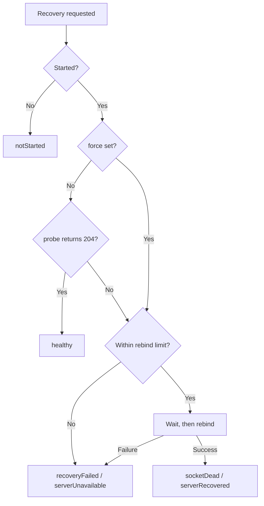

# offline_web_proxy Specification

A local proxy server with offline support that runs within a Flutter app.
The purpose is to enable existing web systems to work as apps without being aware of online/offline status.

This proxy server relays HTTP requests sent from WebView, forwarding them to the upstream server when online, and returning responses from cache when offline. Additionally, it provides seamless offline support by storing update requests (POST/PUT/DELETE) in a queue when offline and automatically sending them when connectivity is restored.

---

## [1] Basic Configuration

### Architecture Overview

- **Base Technology**: shelf (Dart's lightweight HTTP server framework), shelf_router (routing), shelf_proxy (proxy functionality)
- **Communication Path**: WebView → http://127.0.0.1:<port> → (proxy) → Upstream Server
- **Data Persistence**: Local storage using Hive. Cookies, the queue, the quarantine store and the dropped history are encrypted with AES-256 (sections [4] and [5])
- **Cache-Control Support**: Use response headers for storage eligibility and fallback eligibility

### Data Processing Strategy

- **Cache**: Store successful GET responses in file-based storage. Do not use proxy cache to suppress online requests, and limit its use to offline or upstream-unreachable fallback
- **Queue**: Manage POST/PUT/DELETE requests in FIFO (First In First Out). Send sequentially when network recovers
- **Offline Response**: Return cache when cache hit, display fallback page when uncached (the page reloads itself once the upstream is reachable again)
- **Static Resources**: Index files under `assets/static/` that are declared in `pubspec.yaml` and listed in `AssetManifest.json`, and serve them as bundled assets

### Data Stored on the Device

The proxy stores data in Hive boxes and in secure storage. In an encrypted box only the values are encrypted, and the box keys stay in the clear (IDs derived from the stored time for the queue, the quarantine store and the dropped history; the domain, path, name and so on for cookies). **The queue and the quarantine store keep the request headers and body as they were sent.** The content, encryption and retention of each location are as follows.

| Location | Content | Encryption | Retention |
| --- | --- | --- | --- |
| `proxy_cookies_secure` | Cookies (name, value, domain, path, expiry, attributes). Keys consist of the domain, path, name and so on | Values only (AES-256) | An expired cookie is removed when the cookies to send are looked up. `clearCookies()` removes them |
| `proxy_queue_secure` | Unsent update requests (URL with query, method, headers, body, acceptance time, idempotency key and so on). Keys are IDs derived from the time the request was stored | Values only (AES-256) | Until the request is sent, or moved to the quarantine store or the dropped history. No limit |
| `proxy_quarantined_requests_secure` | Requests the upstream rejected with 4xx: the queued content (headers and body included) plus the quarantine time, status code and reason | Values only (AES-256) | Until resent or discarded. Limited to 30 days, 1000 entries and 20 MB by default (see "Retention Limits" in [5]) |
| `proxy_dropped_requests_secure` | History of requests removed from the queue or the quarantine store (URL with query, method, time, reason, status code, error message, whether acknowledged). No headers or body | Values only (AES-256) | 30 days by default. The count limit (1000 by default) applies to acknowledged entries only |
| `proxy_cache` | Response cache (status code, headers, body, expiry). Keys are the SHA-256 of the normalized URL | None | Entries past their stale period are removed every hour |
| `proxy_web_storage` | Web storage snapshot received from the page when `enableWebStorageInheritance` is on | None | Until the next snapshot overwrites it |
| `proxy_idempotency` | Idempotency keys that reached the upstream, with the time they were recorded | None | Keys older than `idempotencyRetention` (24 hours by default) are removed every hour |
| `proxy_port_preferences` | The port last bound for each host | None | Until the next bind overwrites it |
| `offline_web_proxy.cookie_box_encryption_key` in secure storage | The key of the encrypted boxes, shared by cookies, the queue, the quarantine store and the dropped history | Kept in secure storage | Until `recoverEncryptedStorage()` deletes it, or a new key replaces it as the decision tables say (see "Decision Tables" in [4]) |
| `proxy_queue`, `proxy_quarantined_requests`, `proxy_dropped_requests`, `proxy_cookies` | Content stored in the clear by 0.14.0 or earlier (cookies: before 0.4.0) | None | Deleted after migration to the encrypted boxes. The old queue, quarantine and dropped-history boxes are emptied before deletion |

### Proxy Target

Relays to the upstream origin server (e.g., https://sample.com). Application requests go to a single origin server. Another origin that only serves resources, such as a CDN, is relayed only when it is listed in `ProxyConfig.mirroredOrigins`.

### Relaying Another Origin (mirroredOrigins)

Resources of an origin listed in `mirroredOrigins` are fetched through the proxy, which puts them on the ordinary cache, offline fallback and warmup paths. The default is empty, and nothing about another origin is touched unless one is listed.

On a screen that loads its UI library from a CDN, the absolute URL in the HTML never passes through 127.0.0.1: the WebView fetches it directly. Caching the HTML and the API responses is not enough, because the screen does not run without the library that renders it.

#### Relay Path

```
/__offline_web_proxy/ext/<scheme>/<host>[:port]/<original path>?<query>

e.g. https://cdn.example.com/npm/lib@1.0.0/dist/lib.js
   → /__offline_web_proxy/ext/https/cdn.example.com/npm/lib@1.0.0/dist/lib.js
```

Keeping the original origin inside the path means a relative URL held by that resource — `url(../fonts/x.woff)` inside a stylesheet, say — still resolves under the same origin.

#### HTML Rewriting

In a `text/html` response the proxy serves, an absolute URL matching `mirroredOrigins` is rewritten to the relay path.

- The targets are `<script src>`, `<link href>` and ``. A `<link>` counts only when its `rel` names a resource, such as `stylesheet`. The decision reuses the warmup reference scan, so **a rewritten resource is always collected by `warmupCache(followReferences: true)`**. Matching is on the attribute names `src` and `href`, so a prefixed attribute such as `data-src` is treated the same way
- Rewriting happens on the way out, not on the way in. The cache keeps the bytes the upstream returned, so the online path and the offline path go through the same transformation, and removing an origin from the configuration restores the original URLs even in stored responses
- The body is read and written as `latin1`. The target tags and URLs stay within ASCII, so the bytes are preserved whatever the document's character encoding is
- Only a 200 response without a `Content-Encoding` is rewritten. A body an upstream compressed despite the `identity` request cannot be interpreted

#### Relay Behaviour

| Item | Handling |
| --- | --- |
| Method | `GET` and `HEAD` only. Anything else answers `405` and is never queued |
| Origin not listed | Answers `404`. It is never passed through to the configured origin |
| Cache | The cache key is the relayed URL. TTL, stale period and storage eligibility follow the same rules as the configured origin |
| `forceCachePaths` | Matching uses the path the proxy received, so a relay path is listed as `/__offline_web_proxy/ext/**` |
| Cookie | Only jar entries matching the relayed domain are sent. A `Set-Cookie` from the relayed origin is kept under its own domain |
| `Authorization`, `Origin`, `Referer` | Never sent to a relayed origin |
| Redirect | A `Location` naming the configured origin or a mirrored origin is rewritten to a proxy URL |
| Navigation | `resolveNavigationTarget()` treats a mirrored URL as `inWebView` and reports `ProxyNavigationReason.mirroredOriginUrl` |

#### Configuration Validation

Every entry of `mirroredOrigins` has to be an HTTP(S) origin carrying nothing but scheme, host and port. A value with a path, query, fragment or user info stops startup with `ProxyStartException`. A wrong value would otherwise leave rewriting and relaying silently inactive while everything else kept working.

Matching is exact on scheme, host and effective port. `https://cdn.example.com` covers neither `http://cdn.example.com` nor another host.

The relay path is written by the caller, so these shapes are refused as well.

- A `user@host` authority. Even when the host matches, the value would be sent to the relayed origin as credentials
- An authority naming the proxy itself, which would relay a request back into the proxy and, once nested, grow without bound

#### Limitations

- A URL that JavaScript assembles at runtime cannot be rewritten
- A rewritten URL becomes same-origin with the proxy, so a page that returns a `Content-Security-Policy` has to allow `'self'`
- Subresource integrity is expected to survive because the bytes are not altered, though this has not been measured in a browser
- Anything outside `<script>`, `<link>` and `` — `srcset`, `<source>`, `url()` inside CSS — is out of scope
- The scope is any 200 `text/html` response the proxy returns: responses obtained from the upstream and their cached copies, plus the offline response replaced through `offlineFallbackHtml`. `gatewayTimeoutHtml` is answered with 504 and is therefore out of scope, and so is HTML served from `assets/static/`, which is returned earlier as a static resource. A bundled document referencing another origin has to spell out the relay path itself
- `/__offline_web_proxy/ext/` is a namespace the proxy reserves. It is never forwarded upstream, even when `mirroredOrigins` is empty

### Path Pattern Notation Used by Configuration

Every `ProxyConfig` setting that names paths shares one glob notation. Accepting raw regular expressions would let a configuration mistake stall the whole proxy, so the notation is deliberately limited to the following.

| Notation | Meaning |
| --- | --- |
| `*` | Any text within one path segment (never crosses `/`) |
| `**` | Any text, including `/` |
| (no metacharacter) | Exact match |

- Only the path is compared. Query strings and fragments are excluded
- Comparison is case sensitive
- A missing leading `/` is added to both the pattern and the path before comparing
- Patterns are compiled once at startup, never per request

```
/api/registers/auth.json … matches only /api/registers/auth.json
/js/*                   … matches /js/haori.js but not /js/vendor/haori.js
/js/**                  … also matches /js/vendor/haori.js
```

## [2] Port and Connection Specifications

### Port Management

- **Automatic Assignment**: System automatically selects an available port. Avoids port conflicts
- **Return Value**: Returns the actual port number used when proxy server starts
- **Bind Target**: Only 127.0.0.1 (local loopback). Prevents external access

### Security Considerations

- **HTTPS Not Required**: localhost is treated as a secure context by browsers, so HTTP is sufficient
- **External Access Restriction**: Completely blocks access from outside the device by binding to 127.0.0.1

### Health Monitoring

- The proxy exposes a health check endpoint. The default path is `/__offline_web_proxy/health` and can be changed with `ProxyConfig.healthCheckPath`.
- Health checks accept only `GET` and `HEAD` and are answered with `204 No Content` and `Cache-Control: no-store`. Any other method is handled through the normal proxy path.
- `healthCheckPath` must be a fixed path starting with `/`. Values containing route parameter syntax (`<`, `>`), `?`, `#`, or whitespace are rejected at startup with `ProxyStartException`. An empty value falls back to the default path.
- Health check requests are never forwarded upstream and are excluded from cache, queue, cookie processing, and statistics counters.
- `probe()` sends a request to the health check path on the currently bound port and reports the server as running only when `204` is received. The default timeout is 2 seconds. Connection failure, timeout, and unexpected status are all treated as not running.
- `isRunning` only returns the internal flag and does not guarantee that the socket actually responds. Use `probe()` to verify actual responsiveness.
- To reproduce the "dead socket" state, `closeServerSocketForTesting()` is provided as `@visibleForTesting`. It closes only the socket without changing internal state and is not intended for production use.

### Dead Socket and Automatic Recovery

Device suspension or process resume can leave the socket unresponsive even though the internal flag still reports running. This specification calls that state a "dead socket".

- `ensureRunning()` runs `probe()` and rebinds the server only when the probe fails. Cache, queue, and cookie storage stay open.
- Port selection order on rebind:
  1. `ProxyConfig.port` (when greater than 0, only this port is attempted)
  2. The previously bound port
  3. `ProxyConfig.preferredPort`
  4. Automatic assignment (0)
- When the rebound port differs from the previous one, the result reports `portChanged` as `true`.
- `ensureRunning()` does not know which URL the app is displaying, so `reloadUri` is always `null`. When the port changed, read `portChanged` and `port` and let the app compose the URL to load.
- `ensureRunning(force: true)` rebinds regardless of the probe result.
- When called before `start()`, no rebind is attempted and `cause` is reported as `notStarted`.
- A successful recovery emits the `serverRecovered` event; a failed recovery emits `serverUnavailable`.
- `downtimeMs` in the result and the event is set only when `downtime` was supplied to that call. It is never carried over to other recovery results. The `lastDowntimeMs` diagnostic keeps the most recently supplied value.

Figure: Recovery decision flow



### Recovery Attempt Throttling

- Only one recovery runs at a time. Concurrent requests share the result of the in-flight recovery.
- Wait time for consecutive failures increases as 0, 1, 2, 5, 10 seconds and stays at 10 seconds afterwards.
- Rebinds are limited to 5 per minute by default. Exceeding the limit skips the rebind and returns `recoveryFailed`. The limit is configurable with `ProxyConfig.maxRestartAttemptsPerMinute`.
- A successful recovery resets the consecutive failure count and the wait time.
- Setting `maxRestartAttemptsPerMinute` to zero or less disables rebinding entirely and always returns `recoveryFailed`.
- Recovery and shutdown are mutually exclusive. When `stop()` completes first the recovery is aborted and `recoveryFailed` is returned; when the rebind completes first the following `stop()` reliably closes the socket and the background timers. No rebound socket or timer is ever left running after shutdown.
- `stop()` resets only the recovery control state (attempt history, consecutive failure count, in-flight recovery). Diagnostics such as the rebind count and the last recovery cause are reset on the next `start()`.

### Stale Port URL Rewriting

An app restart or automatic port assignment can leave the WebView holding a URL whose port differs from the current one.

- `resolveReloadUri(String lastUrl)` returns the URL rewritten to the current port when the target URL uses a loopback host (`127.0.0.1` or `localhost`) and only the port differs. Path, query, and fragment are preserved.
- When the port already matches the current port, the URL is returned unchanged.
- The rewritten host is normalized to `ProxyConfig.host`. A URL held with the `localhost` spelling is aligned to the configured host spelling.
- Only ports this instance has bound since startup, the persisted previously bound port, and `ProxyConfig.preferredPort` (when greater than zero) are eligible for rewriting. This keeps navigation to other local servers on different ports intact.
- `null` is returned for non-loopback hosts, non-`http` schemes, unparsable strings, ports outside the eligible set, and while the server is stopped (current port unknown).
- The navigation APIs (`resolveNavigationTarget`, `recommendMainFrameNavigation`, `recommendNewWindowNavigation`) also treat a loopback URL that differs only by port as `ProxyNavigationReason.stalePortUrl` and recommend loading (`loadProxyUrl`) the proxy URL rewritten to the current port.

### Recovery from WebView Errors

- `recoverFromWebResourceError()` evaluates the failing URL reported by the WebView and attempts recovery only when one of the following holds:
  - The failing URL host and port match the current proxy
  - The failing URL uses a loopback host and only the port differs from the current port
- For any other URL (upstream server or external site) no recovery is attempted and `cause` is reported as `unrelated`. A missing `failingUrl` also yields `unrelated`.
- `errorCode` and `isMainFrame` are only recorded as diagnostics and are not used to decide whether to recover.
- When recovery was attempted, `reloadUri` carries `failingUrl` rewritten to the current port. The same URL is carried even when the port did not change. It is `null` when recovery was not possible.
- This API returns no end-user message. Presenting information to the end user is the responsibility of the host app.

### App Lifecycle Integration

- `ProxyLifecycleGuard` is registered as a `WidgetsBindingObserver` and runs `ensureRunning()` when the app transitions to `resumed`.
- `onRecovered` is invoked only when a rebind happened. It is not invoked when `probe()` succeeds.
- `onFailed` is invoked when recovery was not possible. Nothing happens when it is omitted.
- The time of the transition to `paused` is retained, and the elapsed time until `resumed` is recorded as `downtimeMs` in events and diagnostics.
- When `currentUrlProvider` is supplied, `reloadUri` after recovery is that URL rewritten to the current port. When it is omitted and the port did not change, `reloadUri` is `null`.
- This library never reloads the WebView. The host app performs the load using the `reloadUri` supplied to `onRecovered`. When `reloadUri` is `null`, the host app reloads the current URL itself.

### Periodic Health Check

- When `ProxyConfig.healthCheckInterval` is greater than zero, `probe()` runs at that interval and recovery is attempted on failure. The default is zero (disabled).
- The responsiveness-check timeout for the periodic check follows `healthCheckInterval`, clamped between 500 milliseconds and 2 seconds.
- Timers are assumed not to fire while the app is in the background, so recovery after a long idle period relies primarily on the `resumed` check performed by `ProxyLifecycleGuard`.

### Keep-Alive and Idle Timeout

- The internal HTTP server idle timeout is configured with `ProxyConfig.serverIdleTimeout` (default 120 seconds).
- Keep-alive connections that receive no request within the configured time are closed by the server.

## [3] Static Resource Detection

### Detection Logic

At startup, the proxy scans `AssetManifest.json` and builds a static-resource index from files under `assets/static/` that are declared in `pubspec.yaml`. Only URLs present in that index are treated as proxy-local static resources, while ordinary same-origin URLs that are not indexed continue to resolve upstream or through proxy URL conversion. If the manifest cannot be loaded in the current runtime, the proxy continues startup with an empty static-resource index.

### Indexing Rules

Mapping between local assets and proxy URLs:

```
Local asset: assets/static/app.css
           ↓
Indexed at startup as: /app.css
           ↓
Request: http://127.0.0.1:8080/app.css
           ↓
Classification: static resource
           ↓
Serve the bundled asset with 200
```

### Serving Rules

- **Methods**: `GET` and `HEAD` only. An update request on the same path is not treated as static and is forwarded upstream
- **Content-Type**: Derived from the file extension
- **ETag**: The first 16 hex digits of the asset's SHA-256. A matching `If-None-Match` is answered with `304`
- **Cache-Control**: `no-cache`, so the WebView revalidates every time; an app update replaces the asset
- **When the asset cannot be read**: The proxy does not answer `404`; it falls back to forwarding the request upstream
- **Marker header**: `X-Static-Resource: true` is always attached
- **ETag computation**: Bundled assets do not change while the process runs, so the first computation is kept per asset key
- **HEAD limits**: No body is returned, so `Content-Length` is 0. Range requests are not supported

### URL Normalization Processing

- **Slash Compression**: Convert `//` to `/`
- **Relative Path Resolution**: Properly resolve `../` and `./`
- **Index-Based Classification**: Treat only URLs present in the startup index as static resources
- **Ordinary URL Priority**: Prefer upstream resolution for `.js`, `.css`, and image URLs when they are not in the static-resource index

### Processing Flow

1. At startup, read `AssetManifest.json` or the runtime-equivalent manifest and convert files under `assets/static/` into proxy URLs
2. Normalize the incoming request URL
3. If the method is `GET` / `HEAD` and the URL is in the index: Serve the bundled asset (fall through to 4 when it cannot be read)
4. Otherwise: Proxy forward to upstream or resolve as a proxy URL

### Performance Optimization

- **Startup Index**: Build and keep the `assets/static/` index in memory at startup
- **Content-Type Cache**: Cache Content-Type determination results based on extensions

### Security Measures

- **Path Restriction**: Only URLs derived from files under `assets/static/` are treated as proxy-local static resources
- **Misclassification Prevention**: Prefer upstream forwarding for URLs that are not present in the startup index instead of relying on file extensions alone
- **Path Traversal Prevention**: What gets served is decided by an exact match against the startup index. The request path is never joined onto a filesystem path, so a URL containing `../` simply misses the index and falls through to upstream resolution

### Automatic Content-Type Detection

Automatic Content-Type setting based on extensions:

```
.html → text/html; charset=utf-8
.css  → text/css; charset=utf-8
.js   → application/javascript; charset=utf-8
.json → application/json; charset=utf-8
.png  → image/png
.jpg  → image/jpeg
.woff2 → font/woff2
(Others) → application/octet-stream
```

## [4] Cookie Jar Persistence and Protection

### Storage Strategy

- **Persistence Required**: Persist all cookies in file-based storage. Retain even after app restart
- **Encryption**: Encrypt and save cookie data using AES-256 (box `proxy_cookies_secure`). Only the values are encrypted; the keys (domain, path, name and so on) stay in the clear
- **Key Management**: Store the encryption key in secure storage (`offline_web_proxy.cookie_box_encryption_key`) and share it with the encrypted queue, quarantine and dropped-history boxes (section [5])
- **Legacy Plain Box**: Migrate the legacy plain `proxy_cookies` box once, in stage 1 of storage initialization. A cookie whose key already exists in the encrypted box is not copied, so a newer session is never overwritten by an old value. When the legacy box cannot be read, copied or deleted, `CookieOperationException` (`operation: migrateLegacy`) is raised, which `start()` carries as the `cause` of a `ProxyStartException` and cookie APIs as the `cause` of a `CookieOperationException`
- **Key Loss Handling**: The boxes are checked against the key before they are opened. When only the cookie box has a problem, the cookie box is discarded and startup continues, and the user must sign in again. When a queue, quarantine or dropped-history box has a problem, startup fails without deleting anything (see "Encryption Key Management and Verification")
- **Memory Cache**: Cache cookies loaded from files in memory for fast access

### Encryption Key Management and Verification

Hive treats a CRC mismatch in the first frame of an encrypted box opened with the wrong key as corruption and truncates the file. The proxy therefore reads the files of the encrypted boxes (cookies, queue, quarantine, dropped history) without opening them, checks them against the key, and follows the decision tables to open them as they are, discard the cookie box, or fail startup.

#### Serialized Initialization

Storage initialization runs in two stages, inside one serialization shared by every proxy instance in the isolate, so that concurrent cookie API calls right after a fresh install never generate two keys or open a box twice. The work of each stage and the APIs that run it are as follows.

| Stage | Work | Run by |
| --- | --- | --- |
| Stage 1 (key) | Locate the storage, read and verify the key, generate the key and discard the cookie box as the decision tables say, open the cookie box, migrate the legacy plain cookie box | `start()` and cookie APIs (callable before startup and after `stop()`) |
| Stage 2 (business data) | Open the cache, web storage and idempotency boxes and the encrypted queue, quarantine and dropped-history boxes, migrate the legacy plain boxes (section [5]) | `start()` only |

- A failed stage closes the boxes it opened, is not shared, and is retried by the next call. The result of stage 1 (the cookie box) stays usable after stage 2 fails
- `stop()` discards the results of both stages, so a cookie API called after `stop()` and the next `start()` check again from stage 1
- Cookie APIs report an initialization failure as a `CookieOperationException` whose `cause` is the original exception
- Only calls within one isolate are serialized, and using several instances at the same time is not supported (see "Instances and Isolates" in [17])

#### Storage Location and Content

- **Location**: Open the plain port preference box (`proxy_port_preferences`) and use the parent directory of its file as Hive's storage directory. Hive does not expose that directory, and the proxy skips `Hive.initFlutter()` when adapter 0 is already registered, so the directory can differ from the one path_provider reports
- **Box with content**: `<box name>.hive` in that directory (or `<box name>.hivec` when there is no `.hive`) larger than 0 bytes. A box with only a `.lock` file, or with an empty file, has no content

#### Key States

The result of reading the key from secure storage is classified as follows.

| State | Condition | `StorageIntegrityFailure` |
| --- | --- | --- |
| Temporarily unavailable | `isCupertinoProtectedDataAvailable()` returns `false` on iOS / macOS, for example while the device is locked. Neither a `null` read nor a read error is used for the decision then. A `null` return (platforms other than iOS / macOS), or a failure to obtain the value, counts as available | `temporarilyUnavailable` |
| Unreadable | The read throws | `keyUnreadable` |
| Missing | The read returns `null` | `keyMissing` |
| Invalid | Empty, not Base64, or not 32 bytes. The value itself is wrong, so it is not reread | `keyInvalid` |
| Present | Anything else | — |

#### Rereading the Key

Only when an encrypted box has content and the first read is missing or unreadable, the key is reread up to three times, 500 milliseconds apart. Without content nothing can be lost, so the key is not reread.

- A value read even once (including an invalid one) is used for the decision
- Only when every read gives the same result (all `null`, or all errors) is the state considered persistent
- When the results mix `null` and errors, or the state turns temporarily unavailable during the rereads, the key is treated as temporarily unavailable

#### Checking an Encrypted Box

With the key present, each encrypted box with content is checked as follows.

1. **First frame**: Compute the CRC32 of the first frame starting from the value derived from the key (the same value as Hive's `HiveAesCipher.calculateKeyCrc()`) and compare it with the CRC stored in the frame. On a match the rest of the file is not scanned (a first frame larger than 1 MiB is checked in a separate isolate that reads the whole file)
2. **Scan**: When the first frame does not match, or is incomplete (its length field exceeds the rest of the file), search the whole file for a frame that matches the key
   - CRCs are computed only at positions that fit Hive's frame structure: a string key of 1 to 255 bytes, made of digits and `-` only for the queue, quarantine and dropped-history boxes, or of ASCII only for the cookie box. Migration keeps keys, so the 13-digit and 16-digit keys from before v0.11.0 are also candidates
   - The scan runs in a separate isolate so the UI isolate is not blocked
   - It is never cut off by byte count, so the result does not depend on device speed. As a safety net for abnormal cases there is only a time limit (10 seconds per box, excluding reading the file and starting the isolate). The four boxes are checked one after another
3. **Result**: One of the following

| Result | Condition | `StorageBoxCheckResult` |
| --- | --- | --- |
| No content | The file is missing or empty | `empty` |
| Match | The first frame matches the key | `match` |
| No mismatch | The first frame is incomplete and no frame matches the key. Treated as a box that stopped during its first write (Hive truncates it on open) | `noMismatch` |
| Mismatch | The first frame does not match the key and no frame matches | `mismatch` |
| Corrupted | The first frame does not match, but a later frame does. The key is right and the head of the box is damaged | `corrupted` |
| Aborted | The scan exceeded the time limit | `aborted` |
| Not verified | Not checked because no usable key exists (the box has content) | `notVerified` |

"Fine" below means no content, match or no mismatch.

#### Decision Tables

When no encrypted box has content:

| Key | Action |
| --- | --- |
| Temporarily unavailable | Fail startup (`temporarilyUnavailable`) |
| Present | Open as is |
| Missing, invalid or unreadable | Write a new key (no encrypted data exists, so nothing is lost). If the write fails, fail startup (`keyWriteFailed`) without creating any box |

When an encrypted box has content:

| Key | Queue, quarantine and dropped-history boxes | Cookie box | Action |
| --- | --- | --- | --- |
| Temporarily unavailable (including by the rereading rules) | Any | Any | Fail startup (`temporarilyUnavailable`). Delete nothing |
| Present | All fine | Fine | Open as is (an ordinary update from 0.14.0 takes this row or the "Present" row of the table above) |
| Present | All fine | Mismatch, corrupted or aborted | Discard the cookie box and continue. Notify |
| Present | At least one mismatch, corrupted or aborted | Any | Fail startup (`keyMismatch`, `corrupted` or `verificationAborted`, preferred in that order). Delete nothing |
| Invalid, or missing or unreadable after rereading | All without content | With content | Write a new key, then discard the cookie box and continue. Notify. If the write fails, fail startup (`keyWriteFailed`) without deleting anything |
| Invalid, or missing or unreadable after rereading | At least one with content | Any | Fail startup (`keyInvalid`, `keyMissing` or `keyUnreadable`). Delete nothing |

- A corrupted queue, quarantine or dropped-history box is not repaired at startup, because repairing it loses the records at its head. It is rebuilt by the recovery API after the user confirms
- The cookie box alone is discarded and startup continues because losing cookies only costs a sign-in, and an app should not stop starting just because the package was upgraded. Up to 0.14.0, a missing key with a cookie box left behind failed startup

#### Discarding the Cookie Box

- Discarding the cookie box raises `ProxyEventType.cookieStorageDiscarded` with the `StorageIntegrityFailure` name in `data['reason']`
- The discard happens inside `start()` or a cookie API called before `start()` or after `stop()`. Events are broadcast, so an app that subscribes later never receives it
- After startup, `ProxyDiagnostics.lastCookieStorageDiscardedAt` and `lastCookieStorageDiscardReason` report it (per instance)
- Deletion by the recovery API raises no `cookieStorageDiscarded` and leaves the diagnostics unchanged
- Cookies restored by `restoreCookies()` before startup stay in the new box even when that call discarded the old one

#### Startup Failure

- `start()` throws `StorageIntegrityException`, a subclass of `ProxyStartException`, without wrapping it. Cookie APIs carry it as the `cause` of a `CookieOperationException`
- `failure` holds the kind, `boxResults` the check result of every encrypted box (the cookie box included), and `error` the original error, such as the one thrown while reading the key (errors that are not `Exception`s included)
- Nothing has been deleted. Retry `start()` later on `temporarilyUnavailable` and `keyWriteFailed`. For the other kinds, when retries keep failing, call the recovery API after the user confirms
- The exception is thrown before the storage is opened, so after such a failed startup `getStats()` reports zero for the queue, quarantine and dropped-history counts

#### Recovery API

The app calls `recoverEncryptedStorage()` after the user confirms.

- **Preconditions**: While any proxy in the isolate is running or starting, nothing is done and `proxyActive` is returned. The recovery runs inside the same serialization as initialization, so it never overlaps an initialization started by a cookie API
- **Overlap with startup**: A `start()` called after the recovery has begun checking waits for the recovery to finish, then redoes storage initialization from stage 1
- **Decision**: Right before deleting anything, the key is reread and the boxes are checked, with the same time limit as `start()`

What the recovery does:

| Situation | Action | Result |
| --- | --- | --- |
| The key is temporarily unavailable (including by the rereading rules) | Nothing | `rejection: temporarilyUnavailable` |
| The key is present and no queue, quarantine or dropped-history box is mismatched, corrupted or aborted | Nothing (`start()` discards a problematic cookie box on its own) | `rejection: startWillSucceed` |
| The key is present and a queue, quarantine or dropped-history box is mismatched, corrupted or aborted (the cookie box is handled by the same rules) | Keep the key and handle each box (table below) | `performed: true` |
| The key is invalid, or missing or unreadable after rereading, and a queue, quarantine or dropped-history box has content | Delete every encrypted box (cookies, queue, quarantine, dropped history), then the key | `performed: true`, `keyDeleted: true` |
| The key is invalid, or missing or unreadable, and no queue, quarantine or dropped-history box has content | Nothing | `rejection: startWillSucceed` |

- A startup that failed because the key could not be written (`keyWriteFailed`) also gets `startWillSucceed`, since there is no box to delete. Retry `start()` later

Each box is handled as follows when the key is present. Aborted and corrupted boxes are scanned again, without a time limit, in the files as they are after the boxes are closed, before deciding.

| Check result | Handling | Reported in |
| --- | --- | --- |
| Mismatch | Delete | `deletedBoxes` |
| Corrupted | Rebuild without the bytes before the first frame that matches the key. Only the records at the head are lost, and how many is unknown | `rebuiltBoxes` |
| Aborted, and no mismatch on the second scan | Truncate to 0 bytes. No record matches the key and Hive would truncate the box on open anyway, so nothing is lost (left as is, the retried `start()` would abort again) | `rebuiltBoxes` |
| Fine (with content) | Keep | `keptBoxes` |

- An aborted box that turns out mismatched or corrupted on the second scan follows the corresponding row
- **Rebuild procedure**: Write the part to keep to `<box name>.hivec`, flush it to disk, and rename it over `<box name>.hive`. The original `.hive` stays until it is replaced. Hive deletes the `.hivec` when it opens a box that has a `.hive`, so a rebuild interrupted before the rename leaves the original box in use
- **Closing boxes**: All proxy boxes are closed before deleting or rebuilding, including an encrypted box opened by another instance. A leftover `.hivec` of an encrypted box that also has a `.hive` is deleted after closing
- **Unexpected failures**: An unexpected failure, such as a box file or the key that cannot be deleted, throws `StorageRecoveryException`
- **Rerunning**: Running an interrupted recovery again carries out the rest and leaves the files as a completed first run would. The result differs: boxes already deleted or rebuilt by an earlier run are not in `deletedBoxes` or `rebuiltBoxes`. When, on the path for an unusable key, only deleting the key failed after the encrypted boxes were deleted, the rerun returns `startWillSucceed` (the next `start()` replaces the unusable key)
- **Legacy plain boxes**: Never deleted; they can be read without the key and are migrated by the next `start()`. After the key is deleted, the next `start()` generates a key, so that migration becomes the deferred migration of section [5]
- **Afterwards**: The shared initialization results are discarded, so `start()` can be called without restarting the process
- **Counts**: The number of encrypted records cannot be read and is not returned. After startup fails with `StorageIntegrityException`, `getStats()` reports zero, so it must not back a confirmation screen

#### Dependency on Hive's Internal Format

Checking the first frame, scanning, rebuilding and the stored-order rules rely on the internal format of Hive 2.2.3: the frame layout, the key encoding, `calculateKeyCrc`, the handling of `.hive` and `.hivec`, and the key order. Hive's CRC32 is not public, so the proxy carries its own implementation of the same computation. Check compatibility whenever Hive is upgraded. A scan finding a frame that matches by chance is extremely unlikely, but not impossible.

### Cookie Evaluation Criteria

Implement RFC-compliant cookie evaluation:

- **Domain**: Validate the domain for which the cookie is valid
- **Path**: Validate the path for which the cookie is valid
- **Expires/Max-Age**: Manage cookie expiration
- **Secure**: Control cookies that are only sent over HTTPS connections
- **SameSite**: Process SameSite attribute for CSRF attack prevention

### Management Methods

Provides methods for cookie management. See [20] API Reference for details.

- **`getCookies()`**: Get list of currently stored cookies (values returned masked)
- **`restoreCookies()`**: Restore externally obtained cookies, including before proxy startup
- **`clearCookies()`**: Delete all cookies

## [5] Queue Resend Policy

### Queue Management

- **Stored Order**: Resend in ascending order of the stored timestamp to preserve request order
- **Unique Keys**: Derive keys from a microsecond timestamp plus a per-microsecond sequence number so that requests stored at the same moment are never overwritten
- **Persistence**: Save queue state in an encrypted Hive box (`proxy_queue_secure`). Continue resending after app restart (see "Encrypted Storage")
- **Backoff Handling**: Skip requests that are still waiting for their backoff window and send the following requests whose window has already passed
- **Connection Release**: A resend always reads the upstream response body to completion and releases the connection before moving on, so a queue larger than the concurrent connection limit still drains to the end
- **When Quarantine Fails**: If the request cannot be moved to the quarantine store, it stays in the queue and is retried with backoff applied (except a request that alone exceeds `quarantineMaxBytes`; see "Retention Limits")

### Retry Strategy

- **Staged Backoff**: Apply the seconds listed in `ProxyConfig.retryBackoffSeconds` in retry order (defaults to 1, 2, 5, 10, 20, 30 seconds), then keep using the last value
- **Infinite Retry**: Keep retrying for network errors and 5xx responses

### Conditions for Giving Up a Resend

A request leaves the queue in the following case.

- **4xx Errors**: Client errors (authentication failure, invalid request, etc.). Resending cannot change the result, so the request is removed

Network errors and 5xx errors are treated as temporary failures: they are kept in the queue and retried.

### What Happens to a Removed Request

`ProxyConfig.dropPolicy` decides.

| Policy | Behavior | Use for |
| ------ | -------- | ------- |
| `quarantine` (default) | Move it, body included, to a quarantine store. A request that alone exceeds the total size limit (`quarantineMaxBytes`) keeps no body and is recorded in the dropped history as `quarantine_too_large` | Business data such as a sales record, where losing a request matters |
| `drop` | Discard it and keep only a history entry | Requests that can be lost safely |

- **Quarantine notification**: Emits `ProxyEventType.requestQuarantined`
- **Drop notification**: Emits `ProxyEventType.requestDropped`
- **No double bookkeeping**: A quarantined request is not also written to the dropped history. The exception is the retention limits: requests moved out of the quarantine store, and a request that alone exceeds the total size limit, are written to the dropped history (see "Retention Limits")
- **Recording order**: Both the quarantine store and the dropped history are written before the request is removed from the queue. If the write fails the request stays queued, so it is never removed without a record. A request moved out of the quarantine store by a retention limit is likewise written to the dropped history before it is removed

### Update Requests That Are Never Queued (queueExcludePaths)

An update that only makes sense at the moment it is made — a register sign-in, a sign-out — causes two problems when it is queued. Sending it after the connection returns has no business meaning, and the immediate `202 Accepted` makes the web app believe it succeeded.

An update matching `ProxyConfig.queueExcludePaths` is not stored. The proxy answers with the response configured on the rule instead.

- **Default**: Empty. Without an entry every update request is queued, as before
- **Notation**: See "Path Pattern Notation Used by Configuration" in section [1]
- **Methods**: An empty `methods` list covers every update method the proxy would otherwise queue
- **Response**: Each rule carries its own `ProxyResponseConfig`, defaulting to `503` with `{"queued":false,"offline":true}`. Per-rule wording lets each screen show the right message without a front-end change
- **Marker headers**: `X-Offline-Queued: 0` and `X-Offline-Excluded: 1` are attached, so the decision can be made on a header rather than the body

The rules apply to all three paths where the proxy would otherwise queue.

| Path | Behaviour |
| ---- | ---- |
| While offline | Answer with the rule response |
| The upstream answered 5xx | **Return the upstream response as-is** and skip only the queueing |
| The upstream could not be reached | Answer with the rule response |

The 5xx response is not replaced because the upstream did answer, and the web app should see what it said.

### Reporting When the Request Was Accepted (acceptedAt)

An update stored while offline reaches the upstream only after the connection returns. A server that stamps its own clock then records the wrong business time: a connection lost at midnight and restored the next morning turns the previous day's sales into today's, and every daily total built on them is wrong.

The proxy keeps the moment it first accepted the request and sends the same value on the first forward and on every resend.

- **Header name**: `ProxyConfig.acceptedAtHeaderName` (default `X-Offline-Accepted-At`)
- **Enabled**: `ProxyConfig.enableAcceptedAtHeader` (default `true`)
- **Value**: An ISO 8601 timestamp in UTC (for example `2026-09-09T08:03:41.474467Z`), so the timezone cannot be misread
- **Scope**: Update requests only; read requests never carry it
- **Stability**: Stored as `acceptedAt` on the queue entry and preserved across a quarantine retry. `queuedAt` cannot be reused because a retry updates it
- **Older data**: A queue entry saved without `acceptedAt` falls back to its `queuedAt`, converted to UTC

**Note**: The value comes from the device clock. A device whose clock is wrong while offline reports a wrong time.

### Reporting the Outcome of a Resend

A resend happens in the background, so its response never reaches the page that made the request. Each attempt is reported for apps that must reconcile what the upstream actually recorded.

- **Event**: `ProxyEventType.queueResendAttempted` is raised for every outcome — success, quarantine, drop and retry
- **Content**: URL, method, status code, success, idempotency key, drop reason, whether it will retry, and the attempt time
- **Body**: Never included, so business data does not leak into a monitoring path
- **Unreachable upstream**: The status code is `0`
- **Existing event**: `ProxyEventType.queueDrained` now also carries `statusCode` and `idempotencyKey`
- **Recent outcomes**: `recentResendResults` exposes up to 20 entries. They are held in memory for monitoring and are not persisted

### History Management

Provides methods for queue management. See [20] API Reference for details.

- **`getQuarantinedRequests()`**: List quarantined requests. Bodies are not returned. Ordered by quarantine time, oldest first
- **`retryQuarantinedRequest(id)`**: Put the request back in the queue after the cause is fixed. The retry count is reset and the stored timestamp is set to the moment it was accepted, so it is sent after requests already waiting. `acceptedAt`, which carries the business time, is left untouched. An item waiting for migration cannot be resent
- **`discardQuarantinedRequest(id)`**: Discard a request after reviewing it. An item waiting for migration cannot be discarded
- **`clearQuarantinedRequests()`**: Discard every quarantined request
- **`getDroppedRequests()`**: Get history of dropped requests. Useful for debugging and troubleshooting. Ordered by drop time, oldest first
- **`acknowledgeDroppedRequests()`**: Mark the history as seen. The entries themselves are kept

### Noticing Unhandled Requests

- **`ProxyStats.quarantinedCount`**: Number of quarantined requests. Anything above zero needs a decision
- **`ProxyStats.unacknowledgedDroppedCount`**: Number of dropped history entries not acknowledged yet. Check it at startup to notice requests discarded while nobody was watching
- **Entries waiting for migration**: Both counts include entries still waiting in a legacy plain box

### Encrypted Storage

- **Scope**: The queue (`proxy_queue_secure`), the quarantine store (`proxy_quarantined_requests_secure`) and the dropped history (`proxy_dropped_requests_secure`) are AES-256 encrypted Hive boxes. The dropped history is included because moving requests out of the quarantine store copies their URLs, query included, into it
- **Key**: Shared with cookies. Verification and the decision tables follow "Encryption Key Management and Verification" in section [4]
- **What is encrypted**: Only the values. The box keys (IDs derived from the time an entry was stored) stay in the clear
- **What is kept**: The queue and the quarantine store keep the URL (query included), the method, the headers the client sent and the body. The dropped history keeps no headers or body

### Migration from Legacy Plain Boxes

The plain boxes of 0.14.0 or earlier (`proxy_queue`, `proxy_quarantined_requests`, `proxy_dropped_requests`) are migrated to the encrypted boxes automatically.

- **Procedure**: Open the legacy box in the clear → copy the entries to the encrypted box keeping their keys → `flush()` the encrypted box → `clear()` the legacy box → close it → delete its file
- **IDs**: Keys are kept, so `X-Offline-Queue-Id` and quarantine IDs do not change
- **Failed deletion**: If the file cannot be deleted after `clear()`, the box is already empty, so processing continues and `errorOccurred` is raised with `operation: legacyStorageDelete`
  - When a legacy box is deleted inside `start()` (the migration when the key already exists, and the deletion of a legacy box left empty), an app that subscribes after `start()` does not receive the event
  - A legacy box left empty is deleted again by the next `start()`
- **Interruption**: Resending does not run during a migration, so if the process dies between copying and `clear()`, copying again with the same keys next time gives the same result
- **Caveats**: Whether `flush()` guarantees that the data reaches the disk (as fsync does) is not verified, so a power loss may still lose both copies. Deleting the old file does not guarantee erasure from flash storage
- **Rolling back**: Rolling back to 0.14.0 or earlier hides the migrated data. While rolled back, the migrated unsent queue is not sent. Upgrading again migrates the requests stored while rolled back as well
- **Retention limits**: The retention limits also apply to the migrated quarantine store and dropped history (within the same `start()` when migrated in stage 2, after the migration when it is deferred). With the defaults, quarantined requests beyond the limits move to the dropped history without their body and headers, and dropped history entries older than 30 days are removed even when unacknowledged. Acknowledged dropped history entries beyond the count limit are removed as well, oldest first. To keep them, set the corresponding settings to `0` (`Duration.zero` for the periods)

#### When the Migration Runs

- **Normally**: In stage 2 (section [4]), before resending starts. An ordinary update from 0.14.0 already has the key, so it takes this path
  - On failure (including a lock that cannot be acquired within 30 seconds), any copied entries are removed from the encrypted box, the boxes opened in stage 2 are closed, and `start()` fails with `ProxyStartException`. The legacy box remains, so the next `start()` migrates it again
- **Deferred migration**: When this proxy instance generated the encryption key itself (including in a cookie API called before `start()`; the decision is per instance, not per process), the migration is not run in stage 2 on any platform; it waits until 30 seconds after the key was generated
  - Android secure storage updates the in-memory value first and writes to disk asynchronously. Reading the key back in the same process does not prove it was written
  - With no way to confirm that the write was committed, the proxy waits instead (the wait does not guarantee the commit; not verified on devices)
  - Whether the iOS / macOS Keychain and other platforms commit the write immediately has not been verified on devices, so every platform takes the safe side
- **Running the deferred migration**
  - It runs only while the proxy is running. When `start()` is called again on the same instance and a legacy box is still there, the migration is scheduled again
  - It runs inside the same exclusion as queue draining: it waits for a drain in progress, and no drain starts until the legacy box has been cleared. The quarantine lock (for the quarantine store) or the history lock (for the dropped history) is held until `clear()`
  - If it fails before `clear()`, the copied keys are removed from the encrypted box before the exclusion is released, and the next 5-second periodic task tries again. The periodic task waits for the deferred migration to finish before draining the queue, so queue draining keeps running even if the migration keeps failing. The failure is reported with `errorOccurred` (`operation: legacyStorageMigration`), except when a lock could not be acquired
  - In case the copied keys cannot be removed, the keys of the legacy box are kept in memory. Until the legacy box is empty, entries with the same keys in the encrypted box are left out of resending, quarantine changes, dropped-history removal, counts and lists
  - After migrating, the retention limits are checked right away

#### While the Migration Waits

- **Resending**: Resending from the encrypted queue does not stop (online updates bypass the queue and go straight upstream, so stopping could not preserve order anyway). Items in the legacy queue are not sent until migrated, so they go after the others. Once migrated, they are sent in stored-time order
- **Counts**: `queueLength`, `quarantinedCount`, `droppedRequestsCount` and `unacknowledgedDroppedCount` of `getStats()`, and `queueLength`, `quarantinedCount` and `unacknowledgedDroppedCount` of the status endpoint, include the legacy boxes, so a web app that blocks settlement while something is unsent does not miss the legacy queue
- **Lists**: `getQueuedRequests()`, `getQuarantinedRequests()` and `getDroppedRequests()` include the legacy boxes with `pendingMigration` set to `true`. Entries from both boxes are merged in stored order, the `limit` of `getQuarantinedRequests()` and `getDroppedRequests()` counts from the head after merging, and header masking applies the same way
- **Quarantine operations**: A quarantined request in the legacy box can be neither resent nor discarded. `retryQuarantinedRequest()` and `discardQuarantinedRequest()` return `false`, and the administrative endpoints answer `409`
- **Acknowledgement**: `acknowledgeDroppedRequests()` also acknowledges the legacy history, so those entries do not turn unacknowledged again after migration
- **Clearing**: `clearQuarantinedRequests()` clears the legacy box inside the quarantine lock, and `clearDroppedRequests()` inside the history lock. Sharing the lock with the migration keeps cleared entries from being copied into the encrypted box
- **Retention limits**: Entries in a legacy box are not subject to the retention limits until they are migrated

#### Relation to `stop()`

- `stop()` first raises a stopping flag. Queue draining checks it before moving on to the next item and exits
- A deferred migration that has not started copying is cancelled without waiting. One that has started copying is awaited
- If a queued item whose send has finished is being saved (recorded in the quarantine store or the dropped history and removed from the queue), the boxes are closed only after that finishes. Closing midway would leave the item both recorded and still queued, duplicating it at the next startup
- An item that tries to start saving after the boxes began closing is not saved; it stays queued and is resent at the next startup. A request still being sent is not awaited

#### Cookies

- The legacy plain cookie box (`proxy_cookies`) is migrated immediately in stage 1, as before, because lost cookies only cost a sign-in
- A cookie whose key already exists in the encrypted box is not copied, so a newer session is never overwritten by an old value

### Retention Limits

The following `ProxyConfig` settings limit what the quarantine store and the dropped history keep. The queue itself has no limit, so unsent business data is never thrown away.

| Setting | Default | Counted on | When exceeded |
| --- | --- | --- | --- |
| `quarantineMaxCount` | 1000 | Number of quarantined requests | Move the oldest to the dropped history (`quarantine_limit`) |
| `quarantineRetention` | 30 days | Time since `quarantinedAt` | Move to the dropped history (`quarantine_expired`) |
| `quarantineMaxBytes` | 20 MB | Estimated total of bodies plus header names and values | Move the oldest to the dropped history (`quarantine_limit`) |
| `droppedRequestMaxCount` | 1000 | Number of dropped history entries | Remove the oldest acknowledged entries. Unacknowledged entries are never removed by count |
| `droppedRequestRetention` | 30 days | Time since `droppedAt` | Remove, acknowledged or not |

- **Zero and negative values**: `0` (`Duration.zero`) disables that limit. A negative value makes `start()` throw `ProxyStartException`
- **Order of moving out**: A request is written to the dropped history before it is removed from the quarantine store, and is not removed if the write fails. `statusCode` and `errorMessage` keep the values from the quarantine, and `requestDropped` carries `quarantineId` in its `data`
- **A single request over the total size limit**: It neither pushes existing requests out nor enters the quarantine store. Its body is dropped, it is recorded in the dropped history as `quarantine_too_large`, and it is then removed from the queue. "A request that cannot be quarantined stays queued" does not apply, so the same 4xx is not retried forever
- **A newly quarantined request**: The check that runs when a request is quarantined never moves out that request
- **When the limits are checked**: At startup (inside `start()`, after storage initialization), whenever a request is quarantined or a history entry is added, in the hourly periodic task, and after a deferred migration
- **Locks**: Changes to the quarantine store run under the quarantine lock and changes to the dropped history under the history lock. When several are needed they are taken in the order queue-drain exclusion → quarantine lock → history lock. When a lock cannot be acquired within 30 seconds, the startup and periodic checks and the deferred migration wait for the next periodic task, while mutating APIs (resend, discard, clear, acknowledge) throw `QueueOperationException`
- **Compaction**: Hive deletes logically, leaving deletion frames in the file. The checks at startup, every hour and after a deferred migration compact the boxes (`compact()`) outside the locks. Neither guarantees erasure from flash storage
- **Memory**: Hive loads every value of an open box into memory, so the quarantine store is bounded by total size as well as count. Opening it may briefly use about twice the size limit
- **Events**: Events raised by the check at startup do not reach an app that subscribes after `start()`. `ProxyStats.unacknowledgedDroppedCount` still reveals them

### Order of Lists and Limit-Based Removal

- The lists (`getQueuedRequests()`, `getQuarantinedRequests()`, `getDroppedRequests()`), the `limit` of `getQuarantinedRequests()` and `getDroppedRequests()`, the resend order of the queue, and "oldest first" removal by the retention limits all follow the stored time (`queuedAt` / `quarantinedAt` / `droppedAt`)
- Equal times are ordered by the key read as a time in a common unit (19 digits plus a sequence number as microseconds and sequence, 16 digits as microseconds, 13 digits as milliseconds), and then by the key string
- An entry whose stored time cannot be read counts as the oldest
- Among entries with the same stored time, an entry whose key cannot be read as a time goes after those whose keys can
- Hive orders keys lexicographically, and the 19-digit keys used since v0.11.0 sort before the older 13-digit and 16-digit keys, so key order is not stored order
- Stored times are local times without a UTC offset, so a time zone change or the end of daylight saving time can shift the order and the retention decisions

### Status Endpoint

The unsent count and the online state were reachable only from the Dart API, so showing them on the screen meant writing a bridge in the app. `ProxyConfig.statusPath` (default `/__offline_web_proxy/status`) returns the same information as JSON.

- **Method**: `GET` only. Never forwarded upstream, excluded from statistics and events, and omitted from the request log
- **Disabling**: An empty value leaves the route unregistered, and the fallback and 504 pages no longer receive the auto-reload script (see Auto-reload of the Fallback Page in [10])
- **Validation**: Same rules as `healthCheckPath`; a value equal to `healthCheckPath` is rejected at startup
- **Response header**: `Cache-Control: no-store`
- **Counts**: `queueLength`, `quarantinedCount` and `unacknowledgedDroppedCount` are the values of `getStats()` and include entries still waiting for migration from a legacy plain box

```json
{
  "isOnline": true,
  "onlineDecisionSource": "connectivity",
  "isUpstreamReachable": true,
  "upstreamCircuitState": "closed",
  "queueLength": 0,
  "quarantinedCount": 0,
  "unacknowledgedDroppedCount": 0,
  "recentResendResults": []
}
```

With it, "block settlement while something is unsent", "show the unsent count" and "hide the sign-in when offline" are decided entirely in the web app.

### Administrative Endpoints

Setting `ProxyConfig.enableAdminApi` to `true` exposes the quarantine store over HTTP. The person who resolves the cause is usually standing at the screen, so the controls belong on the page. Disabled by default.

| Method | Path | Purpose |
| --- | --- | --- |
| `GET` | `/__offline_web_proxy/admin/quarantine` | List quarantined requests (never the body) |
| `POST` | `/__offline_web_proxy/admin/quarantine/<id>/retry` | Put one back on the queue |
| `DELETE` | `/__offline_web_proxy/admin/quarantine/<id>` | Discard one |

- **List items**: `id`, `url`, `method`, `quarantinedAt`, `queuedAt`, `acceptedAt` (all ISO 8601 in UTC), `reason`, `statusCode`, `errorMessage` and `pendingMigration`, ordered by quarantine time, oldest first
- **Responses**: `200` with `{"retried": true}` for a resend and `{"discarded": true}` for a discard
- **Failure responses**: `404` when no item matches, and `409` when the item is still waiting for migration from a legacy plain box. Both set `retried` or `discarded` to `false` and carry the reason in `error`. `500` (`text/plain`) when the quarantine lock cannot be acquired within 30 seconds

### Origin Control for Internal Endpoints

The status and administrative endpoints serve only callers on the proxy's own origin.

- A request without an `Origin` header is allowed, because a same-origin `fetch` does not send one
- A request whose `Origin` equals the proxy's own (`http://<host>:<port>`) is allowed. `127.0.0.1` and `localhost` name the same proxy, so either spelling is accepted
- Anything else is answered with `403`
- They are excluded from the CORS middleware and never carry `Access-Control-Allow-Origin: *`

**Note**: Same-origin also means *every script running on the page*. Enabling the administrative endpoints while the page still loads third-party scripts from a CDN would let such a script reach as far as discarding a quarantined request. Move those files into the bundled assets (section [3]) first.

## [6] Idempotency

### Duplicate Request Prevention

A queued request is resent without knowing whether the upstream already received it. If the upstream finished processing and only the response was lost, the resend can apply the same update twice. To avoid that, each update request is assigned one key that is sent on the first forward and on every resend.

- **When the key is decided**: On receiving the request. A key supplied by the client is kept; otherwise the proxy generates one
- **How keys are generated**: From random data, not from the body. Two identical sales totals in a row must not be treated as the same request and collapsed into one
- **Where it applies**: Both the forwarded attempt and every queue resend carry the same key
- **Queue deduplication**: Resubmitting the same key does not add a second queue entry
- **Skipping delivered requests**: A key already known to have reached the upstream within the retention period is not resent

### Division of Responsibility

The proxy guarantees only that the same operation carries the same key. **Deduplication itself must be implemented on the upstream server.** The proxy cannot tell a lost response from a request that never arrived.

### Supported Headers

- **`ProxyConfig.idempotencyHeaderName`**: Defaults to `Idempotency-Key`; change it to match the upstream
- **`ProxyConfig.enableIdempotencyKey`**: Set to `false` to send no key

### Retention Period

- **24 hours by default**: Configurable via `ProxyConfig.idempotencyRetention`. After it expires, a request carrying the key is treated as new
- **Storage**: Persist with Hive. Valid even after app restart
- **Expiry**: Removed by the hourly maintenance task

## [7] Response Compression

### Coordination with Upstream Server

- **Accept-Encoding Management**: Properly convey client's compression support status to upstream server
- **Decompression Processing**: Decompress compressed responses (gzip, deflate) from upstream server at the proxy and forward to client
  - Communication with upstream server remains compressed to save bandwidth
  - Forward uncompressed to client (local communication, so bandwidth is not an issue)
  - Remove Content-Encoding header and update Content-Length

### Uncompressed Option

- **identity Specification**: Can force uncompressed response by specifying `Accept-Encoding: identity`
- **Use Case**: Useful for debugging or direct examination of response content

## [8] Cache Consistency

### Cache-Control Support and Fallback Strategy

#### Online Principles

- **Upstream first**: When online, the proxy forwards requests including GET/HEAD to the upstream server
- **Browser-driven request suppression**: Whether a request is skipped because of Cache-Control is delegated to the WebView / browser HTTP cache
- **Role of proxy cache**: The proxy cache is not an online optimization layer. It is limited to substitute responses while offline or while the upstream is unreachable (connection failure or timeout)

#### Storage Policy

- **Stored responses**: Successful GET responses are eligible for storage
- **no-store**: Do not persist the response, unless the path matches `ProxyConfig.forceCachePaths` (see below)
- **max-age / s-maxage / Expires**: Used for internal TTL calculation of cache entries
- **no-cache / must-revalidate**: Retained as metadata for saved entries, but not used by the proxy to suppress online forwarding
- **default TTL**: Apply the configured Content-Type-based default TTL when none of the above are present
- **Storage failure**: A response that was received from the upstream is returned even when it cannot be stored. The response itself is valid, so a storage failure never discards it; the failure is reported through `ProxyEventType.errorOccurred`

#### Fallback Eligibility

1. **When offline**: Return cached entries only when they are fresh or stale
2. **When the upstream is unreachable**: Use a fresh or stale cached entry as a substitute response when the upstream could not be reached. Connection refused, name resolution failure, a connection dropped mid-request, a TLS handshake failure, a failure to parse the upstream response, and exceeding the request timeout are all covered. It does not apply once the upstream has returned a complete status line and headers (including 4xx / 5xx)
3. **On HTTP 4xx**: Return the upstream 4xx response as-is and do not switch to proxy cache
4. **On HTTP 5xx**: Return the upstream 5xx response as-is and do not switch to proxy cache
5. **When expired**: Do not return entries whose stale period has also elapsed
6. **Upstream unreachable with no eligible cache**: GET/HEAD returns 504. A GET page navigation receives the HTML 504 page (replaceable via `ProxyConfig.gatewayTimeoutHtml`), any other GET receives `ProxyConfig.offlineMissResponse`, and HEAD receives a 504 without a body. Mutating requests are queued as before

#### Storing Despite no-store (forceCachePaths)

A web system that sends `no-store` on every response leaves the default policy with nothing to serve offline. Paths listed in `ProxyConfig.forceCachePaths` are stored even when the response says `no-store`.

- **Default**: Empty. Without an entry, `no-store` keeps its usual meaning
- **No global switch**: Storage has to be opted into per path; `no-store` handling cannot be relaxed proxy-wide
- **Scope**: Only `GET` responses with status 200
- **Notation**: See "Path Pattern Notation Used by Configuration" in section [1]

Even on a match, a response is skipped when keeping it would leak or corrupt per-user state:

| Skip condition | Reason |
| --- | --- |
| The response carries `Set-Cookie` | The session would persist on the device and be replayed later |
| The response carries `Vary` (unless it names `Accept-Encoding` alone) | The cache key is the normalized URL alone and cannot honour request-header variance |
| The request carried `Authorization` | The response belongs to one user |

A skipped response raises `ProxyEventType.cacheSkipped` with the reason (`set-cookie` / `vary` / `authorization`), so a path that never becomes available offline can be diagnosed. A response without `no-store` is decided by the ordinary storage policy, so neither the check nor the event applies to it.

**Why `Vary: Accept-Encoding` is not a skip condition**: the proxy pins `Accept-Encoding: identity` on every upstream request it makes — forwarding, queue resend and warmup alike — so only one variant can ever come back and skipping on `Accept-Encoding` protects nothing. Tomcat, nginx and Apache, meanwhile, all add that `Vary` by default once compression is enabled, so treating it as a skip condition removes the screen's HTML, JS and CSS from storage in one go. The value is split on `,` and compared without surrounding whitespace or case; a `Vary` naming `*` or any other header is still skipped.

**Freshness**: A server that sends `no-store` usually sends something like `no-store, max-age=0, must-revalidate`. Honouring those directives would make the entry stale the moment it is stored, leaving only the stale window for offline use. Since the decision to store was already overridden by configuration, the expiry follows configuration too: for a matching path, `s-maxage`, `max-age` and `Expires` are ignored and `cacheTtl` decides the TTL.

**Storage note**: `no-store` exists to ask that a response never be written to storage. The response cache is not encrypted, so the body of a listed path stays on the device in the clear. Weigh what the screen contains, and the impact of a lost device, before listing it.

#### Warmup

- **Cookies**: The cookie jar is sent, exactly as on the forwarding path. Without it, a resource that requires authentication cannot be warmed up
- **Accept-Encoding**: `identity` is sent, exactly as on the forwarding path, so that the stored response cannot differ between the two routes
- **Following references**: `warmupCache(followReferences: true)` also fetches the same-origin resources referenced by the warmed HTML
  - `<script src>`, `<link href>` and `` are covered
  - A `<link>` counts only when its `rel` names a resource (`stylesheet`, `preload`, `prefetch`, `icon`, `apple-touch-icon`, `manifest` and the like). `canonical` and `alternate` point at another page and are skipped
  - Only one level is followed; what those resources reference in turn is not
  - Another origin, `data:`, `javascript:`, `mailto:` and `blob:` are skipped
  - A shared resource is requested only once
  - Extraction is a best-effort regular expression scan. **A URL assembled by JavaScript at runtime is out of reach**, and nothing is extracted from a body an upstream compressed despite the `identity` request (the entry itself is still stored intact)
  - `WarmupEntry.referencedFrom` names the HTML that referenced each entry
- **Default**: `followReferences` is `false`, keeping the previous behaviour of fetching only the listed paths

#### Cache Expiration Calculation Priority

1. **Cache-Control: s-maxage** (treated as proxy-side TTL)
2. **Cache-Control: max-age**
3. **Expires** header
4. **Default TTL in configuration file**

A value that cannot be read as a date, such as `Expires: 0`, is ignored and the default TTL applies. Letting the parse failure escape the storage step would turn an upstream 200 into a forwarding failure, answering 504 and counting against upstream reachability.

For a path matching `ProxyConfig.forceCachePaths`, steps 1 to 3 are skipped and the default TTL in step 4 applies.

#### Conditional Request Support

- **If-Modified-Since / Last-Modified**: Forward upstream unchanged when the browser sends them
- **If-None-Match / ETag**: Forward upstream unchanged when the browser sends them
- **304 Not Modified**: Treat as the normal browser/upstream flow rather than a proxy-side online cache-hit decision

### Cache File Format

Integrate metadata and content into a single file to simplify management:

#### File Structure

```
[Header Section]
CACHE_VERSION: 1.0
CREATED_AT: 2024-01-01T12:00:00Z
EXPIRES_AT: 2024-01-02T12:00:00Z
STATUS_CODE: 200
CONTENT_TYPE: text/html; charset=utf-8
CONTENT_LENGTH: 1234
CACHE_CONTROL: max-age=3600, public
ETAG: "abc123"
LAST_MODIFIED: Mon, 01 Jan 2024 12:00:00 GMT
X_ORIGINAL_URL: https://example.com/page

[Body Section]
<html>Actual response content</html>
```

#### Benefits of HTTP Protocol Compliance

- **Standards Compliance**: Same header/body separation method as HTTP/1.1 specification
- **Easy Parsing**: Can reuse existing HTTP parser libraries
- **Readability**: Intuitive and easy to understand for developers
- **Debug Efficiency**: Can directly check cache files with HTTP tools

#### Separation Method Details

- **Header Terminator**: Separate header and body sections with CRLF CRLF (`\r\n\r\n`)
- **Line Separator**: Separate each header line with CRLF (`\r\n`)
- **Compatibility**: Flexibly support environments with LF only (`\n\n`)

#### Benefits

- **Atomicity Guarantee**: Metadata and content synchronized with a single file write
- **Eliminate Fragment Problem**: Metadata and content always consistent
- **Simplified Management**: File count reduced by half, disk capacity also reduced
- **Read Efficiency**: Get metadata and content with a single file access
- **HTTP Compatibility**: Saved in standard HTTP message format

#### Drawbacks and Countermeasures

- **No Partial Reading**: Must read entire file even when only metadata is needed
  → **Countermeasure**: Keep header section size small (usually under 1KB), minimize impact
- **Large File Processing**: High cost of checking metadata for large files
  → **Countermeasure**: Read only fixed number of bytes (e.g., 4KB) from file beginning to parse headers

### Atomic Operations

Greatly simplified by single file format:

- **Via Temporary File**: Write header and body sections to temporary file simultaneously with response reception
- **Atomic Move**: After write completion, move to official cache file with rename operation
- **Exclusive Control**: Prevent race conditions during file operations
- **No Backup Needed**: Single file format reduces risk of partial corruption

### Consistency Check (Simplified)

- **Header Validation**: Check if header format at file beginning is correct
- **Separator Confirmation**: Confirm existence of CRLF CRLF (`\r\n\r\n`) or LF LF (`\n\n`)
- **Size Consistency**: Verify actual body section size against `CONTENT_LENGTH`
- **When Corruption Detected**: Delete entire file (no partial repair)

### Performance Optimization

Optimization leveraging single file format advantages:

#### Cache Index

- **Hive Index**: Index by URL, expiration time, file size, etc.
- **Metadata Cache**: Keep frequently accessed metadata in memory
- **Lazy Loading**: Read body section only when necessary

#### Streaming Support

- **Large Files**: Stream body section after reading header section
- **Range Specification**: Can partially deliver within single file for future Range support

#### HTTP Parser Utilization

- **Library Reuse**: Parse header section with existing HTTP message parser
- **Validation**: Directly utilize HTTP header validation functionality
- **Extensibility**: Automatically support future new HTTP headers

### File Naming Convention

```
cache/
├── content/
│   ├── ab/
│   │   ├── cd1234abcd5678ef90...cache     # Integrated cache file
│   │   └── ef9876543210abcd...cache       # Other cache
│   └── gh/
│       └── ij5678901234cdef...cache
└── index.hive                             # Cache index
```

#### URL Hashing

Perform normalization processing before hashing URL to generate consistent hash values:

##### Normalization Steps

1. **URL Decode**: Decode all percent-encoding (%20, etc.)
2. **Scheme Normalization**: Unify `HTTP` → `http`, `HTTPS` → `https`
3. **Hostname Normalization**: Convert uppercase to lowercase (`Example.COM` → `example.com`)
4. **Port Normalization**: Omit default ports (http:80, https:443)
5. **Path Normalization**:
   - Compress consecutive slashes (`//` → `/`)
   - Resolve dot notation (`./`, `../`)
   - Unify trailing slash (add/remove according to configuration)
6. **Query Parameter Normalization**:
   - Sort parameters by key name
   - URL encode values (UTF-8, RFC 3986 compliant)
7. **Fragment Removal**: Remove `#fragment` part (does not affect cache key)
8. **UTF-8 Encoding**: Finally encode in UTF-8 before hashing

##### Normalization Example

```
Input URL: https://Example.COM:443/path//to/../page?b=2&a=1#fragment
                                  ↓
After normalization: https://example.com/path/page?a=1&b=2
                                  ↓
SHA-256: a1b2c3d4e5f6789012345678901234567890abcdef1234567890abcdef123456
```

##### Hash Collision Countermeasure

- **SHA-256**: Hash URL with SHA-256 and use for filename
- **Collision Detection**: Verify actual URL with `X_ORIGINAL_URL` header in file
- **Processing on Collision**:
  1. Read cache file
  2. Compare `X_ORIGINAL_URL` with normalized URL
  3. Treat as cache miss if mismatch
  4. Overwrite with new cache file

##### Hierarchical Directory Structure

- **Subdirectory**: Create subdirectory with first 2 characters of hash
- **Load Distribution**: Limit number of files per directory (usually under 1000 files)
- **Example**: Hash `abcd1234...` → `cache/content/ab/cd1234...cache`

## [9] Content Type and Character Encoding

### Content-Type Processing

- **Upstream Priority**: Prioritize upstream server's Content-Type header
- **Character Encoding Completion**: Automatically append `charset=utf-8` if character encoding is unspecified for text-type Content-Type
- **Default**: Use `application/octet-stream` if Content-Type is completely unspecified

## [10] Offline Response

### Online / Offline Decision

- **Signal**: Uses the link-layer connectivity reported by `connectivity_plus`. It does not guarantee that the upstream server is reachable
- **At startup**: `start()` reads the current connectivity to establish the initial value. The wait is capped (500 milliseconds); when the cap is exceeded or connectivity cannot be read, the proxy stays online as the safe default
- **After startup**: The decision is updated on every connectivity change event. If a change event arrives while the startup read is still pending, the change event wins
- **On coming back online**: Queue draining starts

### Upstream Circuit Breaker

Link-layer connectivity does not prove that the upstream is reachable. When the device is attached to a store Wi-Fi whose uplink is down, sits behind a captive portal, or the upstream server alone is stopped, every request would wait for `requestTimeout` before falling back. Upstream reachability is therefore tracked separately.

| State | Meaning | Request handling |
| ----- | ------- | ---------------- |
| closed | The upstream is reachable | Forwarded to the upstream as usual |
| open | The upstream is unreachable | Not forwarded; answered from cache or stored in the queue immediately |
| halfOpen | A probe is in flight | Only the probe reaches the upstream; other requests are handled as in `open` |

- **What counts as a failure**: Only attempts that could not reach the upstream, such as connection failures, name resolution failures, TLS handshake failures and timeouts. A 4xx or 5xx response proves the upstream is alive, so it resets the counter instead
- **Opening condition**: The circuit opens once consecutive failures reach `ProxyConfig.upstreamFailureThreshold` (defaults to 3; `0` disables it). Failed queue resends and failed warmups count as well as forwarded requests. A queue resend that could not establish a connection at all (a refused connection, for instance) counts too
- **While open**: Nothing is forwarded upstream; queue draining and warmup pause until the upstream comes back
- **Waiting for a free connection slot**: Waiting on the proxy's own limit of concurrent upstream connections is caused by proxy congestion, so it does not count as an upstream failure
- **Probing**: Sends `ProxyConfig.upstreamProbeMethod` (defaults to `HEAD`) to `ProxyConfig.upstreamProbePath` (defaults to `/`) with `ProxyConfig.upstreamProbeTimeout` (defaults to 3 seconds), spaced by `ProxyConfig.upstreamProbeBackoffSeconds` (defaults to [1, 2, 5, 10, 30] seconds). Any response counts as reachable regardless of status code
- **Link-layer events**: Regaining link-layer connectivity triggers an immediate probe but is never the sole basis for the decision. No probe runs while the link layer is down
- **Events**: `ProxyEventType.upstreamCircuitOpened` on opening and `ProxyEventType.upstreamCircuitClosed` on closing
- **Diagnostics**: `getDiagnostics()` exposes the following values
  - `isOnline`: The link-layer online decision
  - `onlineDecisionSource`: What `isOnline` is based on (`initial` for the value read at startup, `linkLayer` for a change event)
  - `isUpstreamReachable`: Whether requests can actually be forwarded, reflecting both the link layer and the circuit breaker
  - `upstreamCircuitState`: The circuit breaker state
  - `consecutiveUpstreamFailures`: Consecutive attempts that could not reach the upstream (probe failures excluded)
  - `lastUpstreamSuccessAt`: When the upstream was last reached

### Response Types and Headers

This section describes offline responses. Upstream-unreachable fallback follows the same cache selection rules, but the debug header contract is defined only for offline responses.

Upstream-unreachable responses behave as follows. `X-Offline` is not added because the link layer is up.

- **When a cached entry is served instead**: Treated the same as a response the upstream returned while online; no extra header is added
- **When no cached entry can be served**: `X-Offline-Source: none` is added so the response can be told apart from a 504 the upstream itself returned
- **While the circuit breaker is open**: Requests take the same path as offline ones, so the headers in this section (including `X-Offline: 1`) apply as written

Add custom headers for debugging to offline responses:

#### On Cache Hit

- **Status**: 200 OK
- **Custom Headers**:
  - `X-Offline: 1`
  - `X-Offline-Source: cache`
  - `X-Cache-Status: hit` (cache within expiration)
  - `X-Cache-Status: stale` (cache expired but used because offline)
- **Content**: Return cached response as-is

#### On Fallback (page navigation)

- **Applies to**: Requests with `Sec-Fetch-Mode: navigate`, or with `text/html` in `Accept`
- **Status**: 200 OK
- **Headers**: `Content-Type: text/html; charset=utf-8`, `Cache-Control: no-store`
- **Custom Headers**: `X-Offline: 1`, `X-Offline-Source: fallback`
- **Content**: Pre-prepared fallback page (replaceable via `ProxyConfig.offlineFallbackHtml`). The built-in page carries a retry button, plus the auto-reload script when its condition is met (see Auto-reload of the Fallback Page)
- **Why `no-store`**: Keeps the WebView from showing a stored fallback page again on history navigation

#### Upstream unreachable (page navigation)

- **Applies to**: A page navigation while the link layer is up but the upstream cannot be reached and no cached entry can be served
- **Status**: 504 Gateway Timeout
- **Headers**: `Content-Type: text/html; charset=utf-8`, `Cache-Control: no-store`, `X-Offline-Source: none`, `Connection: close`
- **Content**: Built-in 504 page (replaceable via `ProxyConfig.gatewayTimeoutHtml`). The built-in page carries a retry button, plus the script depending on the auto-reload settings
- **Why an explicit `Content-Type`**: A body passed as a bare string makes shelf attach `application/octet-stream`, which a WebView may fail to treat as a page

#### When Unsupported (anything but a navigation)

- **Applies to**: `fetch`, `XMLHttpRequest`, images, stylesheets and other subresource requests
- **Status**: 504 Gateway Timeout (configurable via `ProxyConfig.offlineMissResponse`)
- **Custom Headers**: `X-Offline: 1`, `X-Offline-Source: none`
- **Content**: `{"offline":true}` (configurable via `ProxyConfig.offlineMissResponse`)
- **Why**: Answering a subresource with 200 and HTML looks like a success to the web app and then fails while parsing, so a failed load cannot be handled

#### When Queued (update requests)

- **Applies to**: POST / PUT / PATCH / DELETE while offline or while the upstream is unreachable
- **Status**: 202 Accepted (configurable via `ProxyConfig.queuedResponse`)
- **Custom Headers**: `X-Offline-Queued: 1`, `X-Offline-Queue-Id: <queue id>`, `Connection: close`
- **Content**: `{"queued":true}` (configurable via `ProxyConfig.queuedResponse`)
- **Why**: The upstream has not processed the request yet, so the web app must be able to tell it apart from a real success. The headers are always added, even when the body is customized, so the decision never depends on the body
- **When storing fails**: Answers with 503, `{"queued":false}` and `X-Offline-Queued: 0`. Presenting an unsaved request as a success would lose it silently

#### Update requests answered with an upstream 5xx

- **Status and body**: The upstream response is returned as-is
- **Custom Headers**: `X-Offline-Queued: 1` and `X-Offline-Queue-Id` are added only when the request was stored for resend
- **Why**: Without that marker the web app cannot tell that the proxy will resend, and a person may end up submitting the same request twice

### Auto-reload of the Fallback Page

The offline fallback page is answered with `200`, so the WebView's error callbacks (`onWebResourceError` / `onHttpError` in webview_flutter, `onReceivedError` / `onReceivedHttpError` in flutter_inappwebview) never fire, and proxy events never reach the page on screen. The pages the proxy generates therefore read `statusPath` on their own origin and recover by themselves.

#### When the Script Is Inserted

| Page | Condition |
| ---- | --------- |
| Fallback page (200) | `statusPath` is not empty and `enableOfflinePageAutoReload` is on |
| 504 page | `statusPath` is not empty and any of `enableOfflinePageAutoReload`, `enableAutoReloadContinuation` or `enableGatewayTimeoutAutoReload` is on (even when it does not monitor, the page processes the marker so the consecutive count of automatic reloads resets correctly) |

- A built-in page carries the script only when the condition is met. It carries the retry button regardless
- A replacement page receives the script only where `ProxyConfig.recoveryScriptPlaceholder` (`<!--offline-web-proxy:recovery-->`) appears. When the marker appears more than once, only the first occurrence receives the script and the rest become empty strings, because two copies on one page would reset each other's reload count. When the condition is not met every marker is replaced with an empty string, and HTML without the marker is returned unchanged
- The script is inserted as a plain inline script, without `type="module"` or `defer`. Embedded values go through `jsonEncode`, and `<` plus the line separator characters are replaced with JavaScript Unicode escapes
- The script does nothing in a WebView with JavaScript disabled. Inside an iframe, each frame acts on its own

#### Activation and Monitoring Rules

- The script acts only when `document.readyState` is `loading` at run time, so a copy inserted into another page after loading does nothing. Matching the URL is not used, because dart:io normalizes the request URL
- When the script runs more than once on the same page, every run after the first does nothing
- Status reads are chained with `setTimeout` and never overlap. Each read times out after the poll interval (at least one second)
- A read counts as failed, and never triggers a reload, when the answer is not 2xx, the JSON cannot be parsed, `isUpstreamReachable` is not a boolean, the network fails or the read times out. While reads keep failing, the interval doubles up to 30 seconds (or the poll interval, if longer)
- After calling `location.reload()` the page stops its timers and never calls it again
- For `requestTimeout` plus 30 seconds after `beforeunload`, a reload is put off and re-evaluated on the next cycle, so a navigation started from the page is not cancelled. A navigation that never replaces the page (a `204` response, a download, a navigation stopped by the app, an external scheme) delays the reload for that long as well. A navigation that takes longer can still be cancelled. Whether WKWebView on iOS fires `beforeunload` has not been verified
- A page restored from bfcache (`pageshow` with `persisted`) restarts monitoring without re-evaluating the marker, the navigation type or `readyState`. The fallback page restarts in "awaiting recovery"; the 504 page restarts in "monitoring" only when `enableGatewayTimeoutAutoReload` is on (it never returns to continuation), and the stored consecutive count is kept. The record of `beforeunload` is cleared
- Recovery from a stopped proxy or a changed port is the job of `ProxyLifecycleGuard`

#### State Transitions

The fallback page starts in "awaiting recovery". The 504 page starts in "continuation" when it was reached by an automatic reload and continuation is on, in "monitoring" otherwise when `enableGatewayTimeoutAutoReload` is on, and does not monitor at all in any other case.

| State | Condition | Next state |
| ----- | --------- | ---------- |
| Monitoring | Read `isUpstreamReachable: false` | Awaiting recovery |
| Awaiting recovery | Read `true` twice in a row (a `false` or a failed read in between restarts the count) | Awaiting queue |
| Continuation | Read `true` after waiting ten seconds | Awaiting queue |
| Continuation | Read `false` | Awaiting recovery |
| Awaiting queue | Read `false`, or a read failed | Awaiting recovery |
| Awaiting queue | The last read succeeded, and either `queueLength` is zero or `autoReloadQueueWaitTimeout` has passed since entering this state | Reload decision |
| Reload decision | Less than `requestTimeout` plus 30 seconds has passed since `beforeunload` | Stay in awaiting queue and decide again on the next cycle |
| Reload decision | The consecutive count of automatic reloads is below the limit (three) | Save the marker and reload |
| Reload decision | The consecutive count of automatic reloads reached the limit | Stop, leaving only the retry button |

- A failed read in monitoring, awaiting recovery or continuation leaves the state unchanged (awaiting recovery only restarts its count of consecutive `true` reads)
- The queue wait is measured from entering "awaiting queue" and discarded when the page returns to "awaiting recovery"
- "Twice in a row" is a waiting time, not a check that the upstream answered. When only the link layer dropped and returned while the circuit breaker stayed closed, no probe runs, so the first reload can end in a 504
- A 504 page that reads `true` from the moment it is shown does not reload unless it is in continuation

#### Consecutive Count of Automatic Reloads and Marker

- `sessionStorage` holds the marker (the time just before a reload) and the consecutive count of automatic reloads, under a key made of `__offline_web_proxy_recovery:` followed by the path and query
- When a proxy page loads, it counts as the result of an automatic reload if the navigation type is `reload` and the difference between `performance.timeOrigin` and the marker is between -1 and 10 seconds; the count then increases, otherwise it resets to zero. Without `performance.timeOrigin`, the difference from `Date.now()` must be within `requestTimeout` plus 30 seconds. Without Navigation Timing Level 2, the navigation type is read from `performance.navigation.type`
- The marker is always removed on load. The retry button never saves a marker, so manual reloads are not counted
- A successful automatic reload that shows the real screen is not counted (the count resets the next time a proxy page is shown)
- Keys of other URLs not updated for ten minutes are removed
- Without `sessionStorage`, nothing is counted and continuation does not run
- When an automatic reload passes through a redirect and lands on another URL, continuation does not act for that one reload. A 504 page reached that way keeps only its retry button unless `enableGatewayTimeoutAutoReload` is on

#### Request Log

- To keep monitoring from flooding the log, `GET` / `HEAD` requests to `healthCheckPath` and `GET` requests to `statusPath` are omitted from `shelf.logRequests`. The admin API and other methods on the same paths are still logged (see [18])

### Processing Cache-Control Response Headers

Preserve original Cache-Control header as much as possible even in offline responses:

- **Original Retention**: Save original value in `X-Original-Cache-Control` header
- **Expiration Display**: Add `Cache-Control: no-cache` for expired cache
- **Diagnostic separation**: Carry fallback reason in diagnostic headers or events instead of rewriting Cache-Control semantics

## [11] Root Path Processing

### Path Interpretation

- **Handling `/`**: Process root path `/` as-is, do not automatically redirect to `index.html`
- **Reason**: Should not be changed on proxy side as it depends on upstream server routing configuration

## [12] Range Request: Not Supported

### Reason for Non-Support

- **Implementation Complexity**: Partial request processing is complexly intertwined with cache mechanism
- **Limited Use**: Mainly used for video streaming, etc., low necessity in general web apps
- **Alternative**: Cache entire content and partially use on client side

## [13] ServiceWorker: Not Supported

### Reason for Non-Support

- **Avoid Conflict**: If both ServiceWorker and proxy server exist, request processing may conflict
- **Complexity**: Management of ServiceWorker registration/update/deletion is complex
- **Alternative**: Proxy server substitutes for ServiceWorker role

## [14] Header Rewriting Granularity

### Hop-by-hop Headers

- **Processing**: Fixed drop (remove headers valid only between proxies like Connection, Upgrade)

### Authorization Header

- **passthrough**: Forward as-is
- **inject**: Inject configured authentication information
- **off**: Remove header
- **mirror relay**: Removed when relaying to a `mirroredOrigins` entry, so credentials held for the configured origin never reach a third party

### Cookie Header

- **jar**: Use cookies managed by Cookie Jar
- **passthrough**: Forward cookies from client as-is
- **off**: Remove Cookie header
- **mirror relay**: When relaying to a `mirroredOrigins` entry, only jar entries matching the relayed domain are sent and the client's own `Cookie` header is discarded

### Set-Cookie Header

- **capture**: Save cookies in Cookie Jar
- **passthrough**: Pass through as-is

### Origin/Referer Headers

- **replace**: Rewrite to upstream server's origin
- **passthrough**: Forward as-is
- **remove**: Remove header
- **mirror relay**: Removed when relaying to a `mirroredOrigins` entry, because the value only names the proxy's loopback URL and means nothing to the relayed origin

### Accept-Encoding Header

- **managed**: Proxy manages compression
- **passthrough**: Forward client settings as-is
- **identity-downstream**: Send uncompressed to downstream

### Location Header

- **rewrite**: Rewrite same-origin `301`, `302`, `303`, `307`, and `308` redirects returned to WebView to proxy URLs
- **relative resolution**: Resolve relative `Location` values against the upstream request URL
- **external notify**: Notify external-launch targets such as `tel`, `mailto`, `sms`, `geo`, `google.navigation`, and Google Maps URLs through `ProxyEventType.redirectHandled`, then return 204
- **mirror rewrite**: Rewrite a `Location` matching `mirroredOrigins` to the relay path
- **passthrough**: Pass through `Location` unchanged when it cannot be normalized to a proxy URL

## [15] Timeout/Retry Default Values

### Timeout Settings

- **connectTimeout**: 5 seconds (TCP connection establishment time limit)
- **requestTimeout**: 20 seconds (deadline for one whole request)
- **What the deadline covers**: Waiting for a free upstream connection slot, establishing the connection, receiving the headers and receiving the body all share one budget, so per-stage waits never stack up
- **Connections on deadline**: When body reception is cut short, the subscription is cancelled and the connection is destroyed, so a half-read connection does not keep occupying an upstream connection slot
- **Why the defaults are short**: In front of a WebView a person is waiting for the screen, so the defaults are shorter than they would be for background synchronization
- **Upstream-unreachable fallback**: GET/HEAD may fall back to persisted cache when the connection to the upstream fails or the request exceeds `requestTimeout`
- **Queue resends**: The same deadline applies to each resend attempt
- **Warmup**: The same deadline applies to each path fetched by `warmupCache()` (its `timeout` defaults to requestTimeout)

### Backoff Strategy

- **Interval**: Gradual extension defined by `ProxyConfig.retryBackoffSeconds` (defaults to [1, 2, 5, 10, 20, 30] seconds)
- **Retry**: Infinite retry (for network errors and 5xx responses)

### Queue Processing

- **Drain Interval**: Check queue every 5 seconds and process unsent requests
- **Immediate Drain**: Draining also starts as soon as the proxy detects that connectivity is back

## [16] Cache Capacity and TTL

### Capacity Limit

- **maxCacheBytes**: 200MB (default value)
- **LRU Deletion**: Delete oldest cache first when capacity exceeded
- **Priority Management by Importance**: Differentiate deletion priority between static resources and API responses

### TTL (Time to Live) and Stale Period Management

Manage TTL and stale periods as internal state for fallback decisions while considering Cache-Control headers:

#### Calculation Logic

1. **Cache-Control: s-maxage=X**: Use X seconds as TTL (proxy-specific)
2. **Cache-Control: max-age=X**: Use X seconds as TTL
3. **Expires**: Calculate TTL as difference from Date header
4. **Default TTL**: Apply default value according to Content-Type if all above are unspecified
   - text/html: 1 hour
   - text/css, application/javascript: 24 hours
   - image/\*: 7 days
  - Others: the configured default TTL

#### Cache State Management

Cache is managed in the following 3 states and these states are used for offline or upstream-unreachable fallback decisions rather than online request suppression:

##### 1. Fresh

- **Condition**: Within TTL period
- **Behavior**: Eligible for substitute response when offline or when the upstream request times out
- **Header**: `X-Cache-Status: hit`

##### 2. Stale

- **Condition**: TTL expired, but within stale period
- **Behavior**:
  - **When Online**: Forward upstream and do not substitute from proxy cache
  - **When Offline / When Upstream Unreachable**: Eligible for substitute response from stale cache
- **Header**: `X-Cache-Status: stale`

##### 3. Expired

- **Condition**: Stale period also exceeded
- **Behavior**: Not eligible for fallback
- **Deletion**: Deleted in next purge process

#### Stale Period Setting

```yaml
cache:
  stalePeriod:
    "text/html": 86400 # 1 day (retain as stale for 1 day after TTL expiration)
    "text/css": 604800 # 7 days
    "image/*": 2592000 # 30 days
    "default": 259200 # 3 days
  maxStalePeriod: 2592000 # Maximum stale period (30 days)
```

#### Special Directive Processing

- **no-cache**: May still be stored, but must not be used by the proxy to suppress online forwarding
- **no-store**: Do not persist
- **must-revalidate**: Retain as metadata on the cache entry, while keeping online behavior upstream-first

### Cache Deletion Timing

#### Automatic Deletion (Periodic Purge)

- **Execution Interval**: Every 1 hour
- **Deletion Target**:
  1. **Expired state** cache (stale period also exceeded)
  2. **Corrupted cache** (consistency check failed)
  3. **LRU deletion when capacity exceeded** (target for deletion even in stale state)

#### Manual Deletion Methods

Provides methods for cache management. See [20] API Reference for details.

- **`clearCache()`**: Delete all cache immediately
- **`clearExpiredCache()`**: Delete only Expired state cache
- **`clearCacheForUrl(String url)`**: Delete cache for specific URL

#### Emergency Deletion

- **Disk Space Shortage**: Delete even in stale state when free space falls below configured value
- **Corruption Detection**: Delete immediately when corruption detected during file reading

#### App Lifecycle Integration

- **App Startup**: Detect and delete corrupted cache
- **App Termination**: Clear memory cache (retain file cache)
- **Configuration Change**: Recalculate expiration of existing cache when TTL settings change

### Cache Usage Priority

Decision order during request processing:

#### When Online

1. **Normal flow**: Forward to upstream
2. **304 response**: Pass through as part of the browser's normal cache flow
3. **Upstream unreachable (connection failure / request timeout)**: Use a fresh or stale cached entry as a substitute response, otherwise return 504
4. **HTTP 4xx**: Return the upstream response as-is
5. **HTTP 5xx**: Return the upstream response as-is

#### When Offline

1. **Fresh state**: Use as-is
2. **Stale state**: Use as-is (`X-Cache-Status: stale`)
3. **Expired/Uncached**: Fallback or 504 error

### Maintenance

- **Purge Execution**: Automatically execute Expired cache deletion and LRU cleanup every 1 hour
- **State Refresh**: Periodically re-evaluate TTL / stale state of saved cache
- **Statistics**: Log cache hit rate, stale usage rate, upstream-unreachable fallback count, etc.

### Configuration Example

```yaml
# Offline Web Proxy Configuration File
# assets/config/config.yaml
#
# All configuration items are optional.
# Default values shown below are automatically used for unset items.

proxy:
  # Server basic settings
  server:
    port: 0 # 0=automatic assignment
    host: "127.0.0.1" # Local bind
    origin: "" # Upstream server URL (default is empty, required setting)
      # Example: "https://api.example.com"
    preferredPort: 0 # Port to prefer when available (0=unspecified)
    idleTimeoutSeconds: 120 # Internal server idle timeout

  # Health monitoring and automatic recovery settings
  health:
    checkPath: "/__offline_web_proxy/health" # Health check path
    checkIntervalSeconds: 0 # Periodic health check interval (0=disabled)
    maxRestartAttemptsPerMinute: 5 # Rebind limit per minute

  # Cache settings
  cache:
    maxSizeBytes: 209715200 # 200MB
    purgeIntervalSeconds: 3600 # Every 1 hour

    # Startup warmup settings
    startup:
      enabled: false # Prepare substitute responses for offline or unreachable upstream
      paths: [] # Path list to fetch in advance (default is empty)
        # - "/config"
        # - "/user/profile"
        # - "/assets/app.css"
      timeout: 30 # Timeout for each path (seconds)
      maxConcurrency: 3 # Number of concurrent executions
      onFailure: "continue" # continue/abort

    # TTL settings (seconds)
    ttl:
      "text/html": 3600 # 1 hour
      "text/css": 86400 # 24 hours
      "application/javascript": 86400 # 24 hours
      "image/*": 604800 # 7 days
      "default": 86400 # 24 hours

    # Stale period settings (retention period after TTL expiration)
    stale:
      "text/html": 86400 # 1 day
      "text/css": 604800 # 7 days
      "image/*": 2592000 # 30 days
      "default": 259200 # 3 days
      maxPeriodSeconds: 2592000 # Maximum 30 days

  # Request queue settings
  queue:
    drainIntervalSeconds: 3 # Queue drain interval
    retryBackoffSeconds: [1, 2, 5, 10, 20, 30, 60] # Backoff interval
    jitterPercent: 20 # ±20%

  # Timeout settings (seconds)
  timeouts:
    connect: 10 # TCP connection establishment
    send: 15 # Request send
    receive: 30 # Response receive
    request: 60 # Entire request

  # Idempotency settings
  idempotency:
    retentionHours: 24 # Idempotency key retention period

  # Header rewriting settings (default is empty, configure as needed)
  headers: {} # Empty object=default behavior (default)
    # authorization: "passthrough"  # Example: passthrough/inject/off
    # cookies: "jar"                # Example: jar/passthrough/off
    # setCookies: "capture"         # Example: capture/passthrough
    # origin: "replace"             # Example: replace/passthrough/remove
    # referer: "replace"            # Example: replace/passthrough/remove
    # acceptEncoding: "managed"     # Example: managed/passthrough/identity-downstream
    # location: "rewrite"           # Example: rewrite/passthrough

  # Fallback settings
  fallback:
    offlinePage: "assets/fallback/offline.html"
    errorPage: "assets/fallback/error.html"

  # Logging settings
  logging:
    level: "info" # debug/info/warn/error
    maskSensitiveHeaders: true # Mask Authorization/Cookie, etc.

  # Development/debug settings
  debug:
    enableAdminApi: false # Security-focused, recommend true only during development
    cacheInspection: false # Security-focused, recommend true only during development
    detailedHeaders: false # Performance-focused, recommend true only during development
```

## [17] Thread Safety

### Synchronization Control

Cache operations (put/get/purge) implement exclusive control through serialization (mutex). Guarantees data consistency even when multiple requests access cache simultaneously.

### Implementation Policy

- **Read-Write Separation**: Execute read-only operations concurrently as much as possible
- **Write Exclusion**: Completely exclusive control for write operations
- **Deadlock Avoidance**: Unify lock acquisition order to prevent deadlock

### Instances and Isolates

Using several `OfflineWebProxy` instances at the same time in one app is not supported.

- Storage initialization (stages 1 and 2 in [4]) and the recovery API are serialized across instances within one isolate
- The queue-drain exclusion, the quarantine lock and the history lock (retention limits and migration included) belong to each instance and are not serialized across instances
- When the proxy is used from several isolates at once, even storage initialization and recovery are not serialized

## [18] Logging and Personal Information Protection

### Log Level

- **Default Level**: info (level suitable for production operation)
- **Debug**: Do not output confidential information even when debug is specified

### Request Log

- `shelf.logRequests` writes one line per request
- To keep the fallback page's monitoring from flooding the log, `GET` / `HEAD` requests to `healthCheckPath` and `GET` requests to `statusPath` are not written (see Auto-reload of the Fallback Page in [10])

### Masking Targets

- **Authorization**: Authentication information such as Bearer token
- **Cookie**: Confidential cookie values such as session ID
- **Set-Cookie**: Cookie values set in response

### Log Output Example

```
INFO: GET /api/user → 200 OK (Authorization: ***, Cookie: ***)
```

## [19] Platform-Specific Notes

### iOS (App Transport Security)

- **ATS Exception**: Configuration required to allow HTTP connection to 127.0.0.1
- **Info.plist Configuration**:

```xml
<key>NSAppTransportSecurity</key>
<dict>
    <key>NSAllowsLocalNetworking</key>
    <true/>
</dict>
```

### Android (Network Security Config)

- **cleartext Exception**: Allow HTTP connection to 127.0.0.1
- **network_security_config.xml Configuration**:

```xml
<network-security-config>
    <domain-config cleartextTrafficPermitted="true">
        <domain includeSubdomains="false">127.0.0.1</domain>
    </domain-config>
</network-security-config>
```

### Android Auto Backup

- **Scope**: Android Auto Backup may include Hive's storage directory and the secure storage data (not verified on a device)
- **After restore**: On a device restored from such a backup, the key for the restored encrypted boxes may be unreadable (`keyUnreadable`) or missing (`keyMissing`) (neither verified on a device). When a queue, quarantine or dropped-history box has content, startup fails and the recovery API applies (see [4])
- **Recommendation**: Exclude Hive's storage directory and the secure storage data from backup in the app

### Recommendations

- **Use IP Address**: Recommend using `127.0.0.1` over `localhost`
- **Reason**: Name resolution of localhost may be unstable depending on platform

## [20] API Reference

### Basic Operations

#### `Future<int> start({ProxyConfig? config})`

Starts the proxy server.

- **Parameters**:
  - `config`: Configuration object (uses default or file configuration when omitted)
- **Return Value**: Actually used port number
- **Exceptions**:
  - `ProxyStartException`: When server startup fails, including when the server is already running or still starting, or when a retention limit is negative
  - `StorageIntegrityException`: When the encrypted storage cannot be used (see the decision tables in [4]). A subclass of `ProxyStartException`, thrown without wrapping. Nothing has been deleted
  - `PortBindException`: When port binding fails
- **Storage**: After storage initialization, the retention limits of the quarantine store and the dropped history are checked (see [5])

```dart
final proxy = OfflineWebProxy();
final port = await proxy.start();
print('Proxy started on port: $port');
```

#### `Future<void> stop()`

Stops the proxy server.

- **Return Value**: None
- **Exceptions**:
  - `ProxyStopException`: When server stop fails, including when the exclusion with rebind recovery (such as `ensureRunning()`) cannot be acquired within the time limit (30 seconds; `cause` is the `TimeoutException`, and the server is not stopped)
- **Queue draining**: A drain in progress exits instead of moving on to the next item. A deferred migration that has not started copying is cancelled; one that is copying is awaited
- **Item being saved**: The save of a queued item whose send has finished is awaited before the boxes are closed. An item that tries to start saving after closing has begun stays queued and is resent at the next startup

```dart
await proxy.stop();
```

#### `bool get isRunning`

Gets the operational state of the proxy server.

- **Return Value**: `true` if server is running

### Connection Recovery

#### `int? get port`

Returns the currently bound port number.

- **Return Value**: Port number while running, `null` when not started

#### `Uri? get baseUri`

Returns the proxy base URI that the WebView loads.

- **Return Value**: URI in `http://<host>:<port>` form, `null` when not started

#### `Future<bool> probe({Duration timeout = const Duration(seconds: 2)})`

Sends a request to the health check path to verify that the proxy actually responds.

- **Parameters**:
  - `timeout`: Maximum time to wait for a response (default 2 seconds)
- **Return Value**: `true` when `204` is received, `false` on connection failure, timeout, or unexpected status

```dart
if (!await proxy.probe()) {
  await proxy.ensureRunning();
}
```

#### `Future<ProxyRecoveryResult> ensureRunning({Duration probeTimeout = const Duration(seconds: 2), bool force = false, Duration? downtime})`

Verifies responsiveness and rebinds the server only when it does not respond.

- **Parameters**:
  - `probeTimeout`: Timeout for the responsiveness check
  - `force`: When `true`, rebinds regardless of the check result
  - `downtime`: Estimated downtime, recorded as `downtimeMs` in events and diagnostics
- **Return Value**: Recovery result (`ProxyRecoveryResult`)
- **Exceptions**: None. Failure details are carried in `cause` and `error` of the result

```dart
final result = await proxy.ensureRunning();
if (result.restarted && result.reloadUri != null) {
  await controller.loadRequest(result.reloadUri!);
}
```

#### `Future<ProxyRecoveryResult> recoverFromWebResourceError({int? errorCode, String? failingUrl, bool isMainFrame = true})`

Attempts recovery triggered by a resource error reported by the WebView.

- **Parameters**:
  - `errorCode`: Error code reported by the WebView (recorded as diagnostics)
  - `failingUrl`: URL that failed
  - `isMainFrame`: Whether the failure occurred in the main frame
- **Return Value**: Recovery result. For URLs unrelated to the proxy, `cause` is `unrelated` and no rebind is performed
- **Note**: No end-user message is returned. Presentation is the responsibility of the host app

#### `Uri? resolveReloadUri(String lastUrl)`

Rewrites a URL held by the WebView into one loadable on the current port.

- **Parameters**:
  - `lastUrl`: URL held by the WebView
- **Return Value**: Rewritten URI, or `null` when the URL is out of scope

#### `Future<ProxyDiagnostics> getDiagnostics()`

Returns diagnostics about health monitoring and recovery.

- **Return Value**: Diagnostics (`ProxyDiagnostics`)
- **Purpose**: Root cause analysis and logging when a failure occurs
- **Cookie storage**: `lastCookieStorageDiscardedAt` and `lastCookieStorageDiscardReason` show when and why this instance discarded the cookie box (see [4])

#### `ProxyLifecycleGuard`

Observer that verifies responsiveness and recovers in step with the app lifecycle.

- **Constructor Arguments**:
  - `proxy`: `OfflineWebProxy` instance to watch
  - `onRecovered`: Callback invoked when a rebind happened
  - `onFailed`: Callback invoked when recovery was not possible (optional)
  - `currentUrlProvider`: Function returning the currently displayed URL (optional). Used to compute `reloadUri`
- **Relation to the fallback page**: The offline fallback page generated by the proxy reloads itself by reading the status endpoint. The 504 page reloads only when it was reached by an automatic reload (`enableAutoReloadContinuation`) or when `enableGatewayTimeoutAutoReload` is on (see Auto-reload of the Fallback Page in [10]). `ProxyLifecycleGuard` covers recovery when the proxy socket itself stops responding

```dart
final guard = ProxyLifecycleGuard(
  proxy: proxy,
  currentUrlProvider: () => currentPageUrl,
  onRecovered: (result) {
    final reloadUri = result.reloadUri;
    if (reloadUri != null) {
      controller.loadRequest(reloadUri);
    } else {
      controller.reload();
    }
  },
);
WidgetsBinding.instance.addObserver(guard);
```

### Cache Management

#### `Future<void> clearCache()`

Deletes all cache immediately.

- **Return Value**: None
- **Exceptions**:
  - `CacheOperationException`: When cache deletion fails

```dart
await proxy.clearCache();
```

#### `Future<void> clearExpiredCache()`

Deletes only Expired state cache.

- **Return Value**: None
- **Exceptions**:
  - `CacheOperationException`: When cache deletion fails

```dart
await proxy.clearExpiredCache();
```

#### `Future<void> clearCacheForUrl(String url)`

Deletes cache for a specific URL.

- **Parameters**:
  - `url`: URL to delete (normalized then hashed)
- **Return Value**: None
- **Exceptions**:
  - `ArgumentError`: When invalid URL is specified
  - `CacheOperationException`: When cache deletion fails

```dart
await proxy.clearCacheForUrl('https://example.com/api/data');
```

#### `Future<List<CacheEntry>> getCacheList({int? limit, int? offset})`

Gets list of cache entries.

- **Parameters**:
  - `limit`: Upper limit of items to retrieve (default: 100)
  - `offset`: Starting position for retrieval (default: 0)
- **Return Value**: List of cache entries
- **Exceptions**:
  - `CacheOperationException`: When cache retrieval fails

```dart
final cacheList = await proxy.getCacheList(limit: 50);
for (final entry in cacheList) {
  print('URL: ${entry.url}, Status: ${entry.status}');
}
```

#### `Future<CacheStats> getCacheStats()`

Gets cache statistics.

- **Return Value**: Cache statistics
- **Exceptions**:
  - `CacheOperationException`: When statistics retrieval fails

```dart
final stats = await proxy.getCacheStats();
print('Cache size: ${stats.totalSize} bytes');
```

#### `Future<WarmupResult> warmupCache({List<String>? paths, int? timeout, int? maxConcurrency, bool followReferences = false, WarmupProgressCallback? onProgress, WarmupErrorCallback? onError})`

Pre-fetch fallback cache for the specified path list.

- **Parameters**:
  - `paths`: Path list to pre-fetch (uses the configured startup paths when omitted)
  - `timeout`: Timeout seconds for each path (uses configuration value when omitted)
  - `maxConcurrency`: Number of concurrent executions (uses configuration value when omitted)
  - `followReferences`: Also fetch the same-origin resources referenced by the warmed HTML (default `false`)
  - `onProgress`: Progress callback function
  - `onError`: Error callback function
- **Return Value**: Detailed information of pre-fetch results
- **Exceptions**:
  - `ArgumentError`: When invalid path is included
  - `WarmupException`: When the entire pre-fetch process fails
- **Interaction with upstream reachability**: While the circuit breaker is open (or the link layer is down), no request is sent and every path is reported as a failure. The outcome of each fetch feeds the reachability decision
- **Cookies**: The cookie jar is sent, exactly as on the forwarding path, so a resource that requires authentication can be warmed up

```dart
// Pre-fetch with configured path list
final result = await proxy.warmupCache();

// Pre-fetch with custom path list
final result = await proxy.warmupCache(
  paths: [
    '/config',
    '/user/profile',
  ],
  timeout: 10,
  maxConcurrency: 2,
  onProgress: (completed, total) {
    print('Progress: $completed/$total');
  },
  onError: (path, error) {
    print('Failed to update $path: $error');
  },
);

print('Success: ${result.successCount}, Failed: ${result.failureCount}');
```

### Cookie Management

Cookie APIs wait for stage 1 of storage initialization (see [4]), even before startup or after `stop()`. When the encrypted storage cannot be used, the `CookieOperationException` they throw carries a `StorageIntegrityException` as its `cause`. The failure is not kept; the next call or `start()` checks again.

#### `Future<List<CookieInfo>> getCookies({String? domain})`

Gets list of currently stored cookies.

- **Parameters**:
  - `domain`: Domain to filter (all domains when omitted)
- **Return Value**: List of cookie information (values masked for security)
- **Exceptions**:
  - `CookieOperationException`: When cookie retrieval fails

```dart
final cookies = await proxy.getCookies(domain: 'example.com');
for (final cookie in cookies) {
  print('Name: ${cookie.name}, Domain: ${cookie.domain}');
}
```

#### `Future<void> restoreCookies(Iterable<CookieRestoreEntry> entries)`

Restores cookies obtained outside the proxy, such as from native implementations. This method can be called before proxy startup, and restored cookies are used for upstream requests after startup.

- **Parameters**:
  - `entries`: List of cookies to restore
- **Return Value**: None
- **Exceptions**:
  - `CookieOperationException`: When cookie restoration fails

`CookieRestoreEntry` provides both a structured constructor and a factory that parses a `Set-Cookie` string.

```dart
await proxy.restoreCookies([
  CookieRestoreEntry.fromSetCookieHeader(
    setCookieHeader: 'SESSION=abc123; Path=/; Secure; HttpOnly',
    requestUrl: 'https://api.example.com/login',
  ),
]);
```

#### `Future<String?> getCookieHeaderForUrl(String url)`

Gets the Cookie header value that should be sent to the specified absolute URL.

This API only accepts URLs that are in the same origin as the `origin` configured at `start()`.

- **Parameters**:
  - `url`: Absolute target URL
- **Return Value**: `Cookie` header value, or `null` when no cookies match
- **Exceptions**:
  - `ArgumentError`: When the URL is invalid or outside the configured origin
  - `CookieOperationException`: When header generation fails

```dart
final cookieHeader =
    await proxy.getCookieHeaderForUrl('https://api.example.com/app/api');
if (cookieHeader != null) {
  print('Cookie: $cookieHeader');
}
```

#### `Uri? tryResolveUpstreamUrl(String url)`

Resolves a proxy URL or a URL in the configured `origin` to the canonical upstream URL that can be used for external delegation decisions.

- **Parameters**:
  - `url`: Absolute URL to resolve
- **Return Value**: Resolved upstream URL, or `null` when it cannot be resolved
- **Notes**:
  - Returns `null` for proxy static-resource URLs
  - Treats `localhost` and `127.0.0.1` as the same loopback alias only when identifying proxy URLs
  - Returns `null` for same-origin URLs that cannot be mapped back into the proxy path when `origin` has a base path

```dart
final upstreamUrl = proxy.tryResolveUpstreamUrl(
  'http://127.0.0.1:$proxyPort/app/map?mode=car',
);
```

#### `ProxyNavigationResolution resolveNavigationTarget({required String targetUrl, String? sourceUrl})`

Resolves a navigation target before WebView navigation and returns the upstream URL, proxy URL, and delegation metadata together.

- **Parameters**:
  - `targetUrl`: Candidate navigation target URL
  - `sourceUrl`: Base URL used to resolve relative, scheme-relative, query-only, and fragment-only targets
- **Return Value**: `ProxyNavigationResolution`
- **Notes**:
  - `disposition` returns `inWebView`, `localOnly`, `external`, `unresolved`, or `invalid`
  - `reason` returns the classification reason such as `proxyUrl`, `configuredOriginUrl`, `staticResource`, or `outsideProxyScope`
  - Non-HTTP(S) schemes return `external`
  - Relative targets without `sourceUrl` return `unresolved`
  - Same-origin URLs outside the proxy-mappable base path return `unresolved`

```dart
final resolution = proxy.resolveNavigationTarget(
  targetUrl: '../map?mode=car',
  sourceUrl: 'http://127.0.0.1:$proxyPort/app/orders/detail',
);

if (resolution.disposition == ProxyNavigationDisposition.inWebView) {
  print('Upstream: ${resolution.upstreamUri}');
  print('Proxy: ${resolution.proxyUri}');
}
```

#### `ProxyWebViewNavigationRecommendation recommendMainFrameNavigation({required String targetUrl, String? sourceUrl})`

Returns a recommended WebView main-frame delegate action: `allow`, `cancel`, `loadProxyUrl`, or `launchExternal`.

- **Parameters**:
  - `targetUrl`: Candidate navigation target URL
  - `sourceUrl`: Base URL used to resolve relative, scheme-relative, query-only, and fragment-only targets
- **Return Value**: `ProxyWebViewNavigationRecommendation`
- **Notes**:
  - `launchExternal` populates `externalUri` with a normalized URL that can be passed directly to an external launcher
  - `loadProxyUrl` populates `webViewUri` with the proxy URL to load explicitly
  - `cancel` is not limited to dangerous URLs; it also covers cases such as `outsideProxyScope` or `relativeUrlWithoutSource`, where this library cannot make a safe decision by itself
  - Upstream redirect `Location` values are handled inside the proxy with the same resolution rules

```dart
final recommendation = proxy.recommendMainFrameNavigation(
  targetUrl: 'https://example.com/base/app/map?mode=car',
  sourceUrl: 'http://127.0.0.1:8080/app/orders/detail',
);

switch (recommendation.action) {
  case ProxyWebViewNavigationAction.allow:
    break;
  case ProxyWebViewNavigationAction.loadProxyUrl:
    await controller.loadRequest(recommendation.webViewUri!);
    break;
  case ProxyWebViewNavigationAction.launchExternal:
    print(recommendation.externalUri);
    break;
  case ProxyWebViewNavigationAction.cancel:
    print(recommendation.resolution.reason);
    break;
}
```

#### `ProxyWebViewNavigationRecommendation recommendNewWindowNavigation({required String targetUrl, String? sourceUrl})`

Returns a recommended WebView new-window delegate action: `cancel`, `loadProxyUrl`, or `launchExternal`.

- **Parameters**:
  - `targetUrl`: Candidate navigation target URL
  - `sourceUrl`: Base URL used to resolve relative, scheme-relative, query-only, and fragment-only targets
- **Return Value**: `ProxyWebViewNavigationRecommendation`
- **Notes**:
  - Uses the same URL resolution rules as the main-frame API
  - Never returns `allow` for a new window

#### `Future<void> clearCookies({String? domain})`

Deletes cookies.

- **Parameters**:
  - `domain`: Domain to delete (deletes all cookies when omitted)
- **Return Value**: None
- **Exceptions**:
  - `CookieOperationException`: When cookie deletion fails
- **Note**: Deletes from both file and memory cache simultaneously

```dart
await proxy.clearCookies(); // Delete all cookies (file + memory)
await proxy.clearCookies(domain: 'example.com'); // Delete only specific domain
```

### Queue Management

#### `Future<List<QueuedRequest>> getQueuedRequests()`

Gets list of requests currently stored in queue.

- **Return Value**: List of queued requests, ordered by `queuedAt`, oldest first (see "Order of Lists and Limit-Based Removal" in [5])
- **Exceptions**:
  - `QueueOperationException`: When queue retrieval fails
- **Waiting for migration**: Items still in a legacy plain box are included with `pendingMigration` set to `true`
- **Header masking**: The value of any header that may carry secrets is replaced with `***`. Names are compared lower-cased, with `_` read as `-`
  - Masked on an exact name: `cookie`, `authorization`, `proxy-authorization`
  - Masked on a name fragment: `auth`, `token`, `secret`, `session`, `csrf`, `xsrf`, `key`, `pass`, `credential`, `signature`, `jwt`, `cookie`
  - Never masked: the header named by `ProxyConfig.idempotencyHeaderName`
  - Only the headers the client sent are stored; the headers the proxy adds are attached when sending
  - The query of the URL is not masked. Resends use the stored values

```dart
final queued = await proxy.getQueuedRequests();
print('Queued requests: ${queued.length}');
```

#### `List<QueueResendResult> get recentResendResults`

Gets the recent resend outcomes. A queued request is resent in the background, so its response never reaches the page that made it; read these when the app has to reconcile what the upstream recorded.

- **Return Value**: Outcomes with the newest last (up to 20)
- **Exceptions**: None
- **Note**: The body is never included. They are held in memory for monitoring only and are lost when the app process ends

```dart
for (final result in proxy.recentResendResults) {
  print('${result.method} ${result.url} -> ${result.statusCode}');
}
```

#### `Future<List<DroppedRequest>> getDroppedRequests({int? limit})`

Gets history of dropped requests.

- **Parameters**:
  - `limit`: Upper limit of items to retrieve (every item when omitted, an empty list when 0 or less). Counted from the head after sorting
- **Return Value**: List of dropped requests, ordered by `droppedAt`, oldest first
- **Waiting for migration**: Entries still in a legacy plain box are included with `pendingMigration` set to `true`
- **Exceptions**:
  - `QueueOperationException`: When history retrieval fails

```dart
final dropped = await proxy.getDroppedRequests();
for (final request in dropped) {
  print('URL: ${request.url}, Reason: ${request.dropReason}');
}
```

#### `Future<void> clearDroppedRequests()`

Clears history of dropped requests.

- **Return Value**: None
- **Exceptions**:
  - `QueueOperationException`: When history deletion fails, including when the history lock cannot be acquired within 30 seconds
- **Note**: Also clears the entries waiting in a legacy plain box

```dart
await proxy.clearDroppedRequests();
```

#### `Future<int> acknowledgeDroppedRequests()`

Marks the dropped request history as reviewed.

- **Return Value**: Number of entries changed to acknowledged
- **Exceptions**:
  - `QueueOperationException`: When the update fails, including when the history lock cannot be acquired within 30 seconds
- **Usage**: Detect unreviewed entries at startup with `ProxyStats.unacknowledgedDroppedCount`, then call this once they have been shown to the operator. The history itself is kept, so the content stays available afterwards
- **Note**: Also acknowledges the entries waiting in a legacy plain box, so they do not turn unacknowledged after migration

```dart
final stats = await proxy.getStats();
if (stats.unacknowledgedDroppedCount > 0) {
  // Show the requests that were lost before marking them as reviewed
  await proxy.acknowledgeDroppedRequests();
}
```

### Quarantine Management

When `ProxyConfig.dropPolicy` is `DropPolicy.quarantine` (the default), a request rejected by the upstream is moved to a quarantine store with its body intact. The following APIs let an operator inspect it and choose between resending and discarding.

#### `Future<List<QuarantinedRequest>> getQuarantinedRequests({int? limit})`

Gets the list of quarantined requests.

- **Parameters**:
  - `limit`: Upper limit of items to retrieve (every item when omitted, an empty list when 0 or less). Counted from the head after sorting
- **Return Value**: List of quarantined requests, ordered by `quarantinedAt`, oldest first
- **Waiting for migration**: Items still in a legacy plain box are included with `pendingMigration` set to `true`
- **Exceptions**:
  - `QueueOperationException`: When retrieval fails
- **Note**: The body is not returned. Use `retryQuarantinedRequest()` to resend it

```dart
final quarantined = await proxy.getQuarantinedRequests();
for (final request in quarantined) {
  print('${request.method} ${request.url} -> ${request.statusCode}');
}
```

#### `Future<bool> retryQuarantinedRequest(String id)`

Moves a quarantined request back to the queue and resends it.

- **Parameters**:
  - `id`: Identifier returned by `getQuarantinedRequests()`
- **Return Value**: `true` when moved back to the queue, `false` when no entry matches or the entry is waiting for migration from a legacy plain box
- **Exceptions**:
  - `QueueOperationException`: When the operation fails, including when the quarantine lock cannot be acquired within 30 seconds
- **Note**: The retry count is reset. Call it after the cause of the rejection has been fixed

```dart
// Resend after the upstream side has been corrected
await proxy.retryQuarantinedRequest(quarantined.first.id);
```

#### `Future<bool> discardQuarantinedRequest(String id)`

Discards a quarantined request.

- **Parameters**:
  - `id`: Identifier returned by `getQuarantinedRequests()`
- **Return Value**: `true` when discarded, `false` when no entry matches or the entry is waiting for migration from a legacy plain box
- **Exceptions**:
  - `QueueOperationException`: When the operation fails, including when the quarantine lock cannot be acquired within 30 seconds

```dart
await proxy.discardQuarantinedRequest(quarantined.first.id);
```

#### `Future<void> clearQuarantinedRequests()`

Discards every quarantined request.

- **Return Value**: None
- **Exceptions**:
  - `QueueOperationException`: When deletion fails, including when the quarantine lock cannot be acquired within 30 seconds
- **Note**: Also discards the requests waiting in a legacy plain box

```dart
await proxy.clearQuarantinedRequests();
```

### Encrypted Storage Recovery

#### `Future<EncryptedStorageRecoveryResult> recoverEncryptedStorage()`

Call it when `start()` or a cookie API fails with `StorageIntegrityException` and retries do not help, after explaining to the user what will be lost and obtaining consent. See "Recovery API" in [4] for the decisions and handling.

- **Return Value**: `EncryptedStorageRecoveryResult`: whether anything was done, why not, which boxes were deleted, rebuilt or kept, and whether the key was deleted
- **Exceptions**:
  - `StorageRecoveryException`: When deleting a box file or the key fails, for example. Running the recovery again is safe
- **Notes**:
  - While a proxy in the isolate is running or starting, nothing is done and `proxyActive` is returned
  - Rebuilding a box damaged at its head loses the records at its head, and how many is unknown (`rebuiltBoxes`)
  - A box whose check exceeded the time limit is checked again without a time limit after the boxes are closed, and handled by that result: deleted when it does not match the key (`deletedBoxes`), rebuilt when it is damaged at its head (`rebuiltBoxes`). When its first record is only partly written and no record matches the key, it is truncated to 0 bytes, losing nothing (`rebuiltBoxes`)
  - Deleting the key also removes cookies, and with them the sign-in state
  - After startup fails with `StorageIntegrityException`, `getStats()` returns zero, so do not base a confirmation screen on it

```dart
// Example for when StorageIntegrityException persists after retrying start()
try {
  await proxy.start(config: config);
} on StorageIntegrityException catch (error) {
  if (error.failure == StorageIntegrityFailure.temporarilyUnavailable ||
      error.failure == StorageIntegrityFailure.keyWriteFailed) {
    // The recovery API cannot fix these. Retry start() later.
    rethrow;
  }

  // Recover only after explaining what will be lost and obtaining consent.
  // askUserToConfirm is a placeholder for a function the app provides.
  if (!await askUserToConfirm(error.failure)) {
    rethrow;
  }
  final result = await proxy.recoverEncryptedStorage();
  if (!result.performed &&
      result.rejection != StorageRecoveryRejection.startWillSucceed) {
    // temporarilyUnavailable / proxyActive: retry later
    rethrow;
  }
  await proxy.start(config: config);
}
```

### Statistics and Monitoring

#### `Future<ProxyStats> getStats()`

Gets proxy server statistics.

- **Return Value**: Proxy statistics
- **Exceptions**:
  - `StatsOperationException`: When statistics retrieval fails
- **Counts**: The queue, quarantine and dropped-history counts include entries waiting in a legacy plain box. They are zero when startup failed before the storage was opened (for example with `StorageIntegrityException`) and after `stop()`

```dart
final stats = await proxy.getStats();
print('Total requests: ${stats.totalRequests}');
print('Cache hit rate: ${stats.cacheHitRate}%');
print('Queue length: ${stats.queueLength}');
```

#### `Stream<ProxyEvent> get events`

Gets event stream of proxy server.

- **Return Value**: Stream of proxy events
- **Use**: Real-time monitoring, log output

```dart
proxy.events.listen((event) {
  switch (event.type) {
    case ProxyEventType.cacheHit:
      print('Cache hit: ${event.url}');
      break;
    case ProxyEventType.requestQueued:
      print('Request queued: ${event.url}');
      break;
  }
});
```

### Data Class Definitions

#### `CacheEntry`

Class representing cache entry information.

```dart
class CacheEntry {
  final String url; // Original URL of cached resource
  final int statusCode; // HTTP status code (200, 404, etc.)
  final String contentType; // Value of Content-Type header
  final DateTime createdAt; // Cache creation date/time
  final DateTime expiresAt; // Cache expiration time
  final CacheStatus status; // Cache state (fresh, stale, expired)
  final int sizeBytes; // Size of cache file (bytes)
}

enum CacheStatus {
  fresh, // Within TTL period and usable
  stale, // TTL expired but within Stale period
  expired // Stale period also exceeded, target for deletion
}
```

#### `CookieInfo`

Class representing stored cookie information (values masked for security).

```dart
class CookieInfo {
  final String name; // Cookie name
  final String value; // Cookie value (masked with "***" for security)
  final String domain; // Valid domain
  final String path; // Valid path
  final DateTime? expires; // Expiration time (null=session cookie)
  final bool secure; // Presence of Secure attribute
  final String? sameSite; // SameSite attribute ("Strict", "Lax", "None")
}
```

#### `QueuedRequest`

Class representing information of requests queued when offline.

```dart
class QueuedRequest {
  final String url; // Request URL
  final String method; // HTTP method (POST, PUT, DELETE, etc.)
  final Map<String, String> headers; // Request headers (sensitive info already masked)
  final DateTime queuedAt; // Queuing date/time (updated by a quarantine retry)
  final DateTime acceptedAt; // First accepted (never changes across a retry)
  final int retryCount; // Current retry count
  final DateTime nextRetryAt; // Next retry scheduled date/time
  final bool pendingMigration; // Waiting for migration from a legacy plain box (default: false)
}
```

#### `DroppedRequest`

Class representing history of requests dropped from queue due to errors.

```dart
class DroppedRequest {
  final String url; // URL of dropped request
  final String method; // HTTP method
  final DateTime droppedAt; // Date/time dropped
  final String dropReason; // Drop reason ("4xx_error" and so on; "quarantine_limit", "quarantine_expired" or "quarantine_too_large" for the quarantine retention limits)
  final int statusCode; // HTTP status code at error
  final String errorMessage; // Detailed error message
  final bool acknowledged; // Whether it has been shown to the operator (default: false)
  final bool pendingMigration; // Waiting for migration from a legacy plain box (default: false)
}
```

#### `QuarantinedRequest`

Class representing a mutating request the upstream rejected, moved to the quarantine store.

```dart
class QuarantinedRequest {
  final String id; // Identifier inside the quarantine store (used to resend or discard)
  final String url; // URL of the quarantined request
  final String method; // HTTP method
  final DateTime quarantinedAt; // Date/time quarantined
  final DateTime queuedAt; // Date/time stored in the queue before quarantine
  final DateTime acceptedAt; // First accepted (never changes across a retry)
  final String reason; // Quarantine reason ("4xx_error", etc.)
  final int statusCode; // HTTP status code returned by the upstream
  final String errorMessage; // Detailed error message
  final bool pendingMigration; // Waiting for migration from a legacy plain box; cannot be resent or discarded (default: false)
}
```

The body is retained but not returned in this list. Use `retryQuarantinedRequest(id)` to resend it.

#### `QueueExcludeRule`

Class representing a rule for update requests that are never queued.

```dart
class QueueExcludeRule {
  final String path; // Path pattern the rule applies to
  final List<String> methods; // Methods covered (empty = every update method)
  final ProxyResponseConfig response; // Response returned instead (default: 503 / JSON)
}
```

#### `QueueResendResult`

Class representing the outcome of one resend attempt. The body is never retained.

```dart
class QueueResendResult {
  final String url; // URL the request was sent to
  final String method; // HTTP method
  final int statusCode; // Upstream status code (0 when unreachable)
  final bool success; // Whether the upstream accepted the request
  final String? idempotencyKey; // Key that was attached
  final String? dropReason; // Why it left the queue
  final bool willRetry; // Whether it stays queued for another attempt
  final DateTime attemptedAt; // When the attempt finished (UTC)
}
```

#### `ProxyStats`

Class representing overall proxy server statistics.

```dart
class ProxyStats {
  final int totalRequests; // Total request count (cumulative since startup)
  final int cacheHits; // Cache hit count
  final int cacheMisses; // Cache miss count
  final double cacheHitRate; // Cache hit rate (0.0~1.0)
  final int queueLength; // Current queue length
  final int droppedRequestsCount; // Dropped request count
  final int unacknowledgedDroppedCount; // Dropped history entries not yet acknowledged
  final int quarantinedCount; // Number of quarantined requests
  final DateTime startedAt; // Proxy server start date/time
  final Duration uptime; // Operation time
}
```

#### `CacheStats`

Class representing cache system-specific statistics.

```dart
class CacheStats {
  final int totalEntries; // Total cache entry count
  final int freshEntries; // Fresh state entry count
  final int staleEntries; // Stale state entry count
  final int expiredEntries; // Expired state entry count
  final int totalSize; // Total cache size (bytes)
  final double hitRate; // Cache hit rate (0.0~1.0)
  final double staleUsageRate; // Stale cache usage rate (offline support indicator)
}
```

#### `WarmupResult`

Class representing results of cache pre-update (Warmup) process.

```dart
class WarmupResult {
  final int successCount; // Number of successful updates
  final int failureCount; // Number of failed updates
  final Duration totalDuration; // Time taken for entire process
  final List<WarmupEntry> entries; // Detailed results for each path
}

/// Type definition for Warmup progress callback function
typedef WarmupProgressCallback = void Function(int completed, int total);

/// Type definition for Warmup error callback function
typedef WarmupErrorCallback = void Function(String path, String error);

class WarmupEntry {
  final String path; // Path to update
  final bool success; // Success/failure of update
  final int? statusCode; // HTTP status code (only on success)
  final String? errorMessage; // Error message (only on failure)
  final Duration duration; // Time taken for this process
  final String? referencedFrom; // Path of the HTML that referenced it (null when listed directly)
}
```

#### `ProxyConfig`

Class representing proxy server configuration.

```dart
class ProxyConfig {
  final String origin; // Upstream server URL (required)
  final String host; // Host to bind (default: "127.0.0.1")
  final int port; // Port to bind (0=automatic assignment)
  final int cacheMaxSize; // Maximum cache capacity (bytes)
  final Map<String, int> cacheTtl; // TTL setting by Content-Type (seconds)
  final Map<String, int> cacheStale; // Stale period setting by Content-Type (seconds)
  final List<String> forceCachePaths; // Paths stored despite no-store (default: empty)
  final List<String> mirroredOrigins; // Other origins relayed through the proxy (default: empty)
  final int upstreamFailureThreshold; // Consecutive failures treated as unreachable (default: 3, 0=disabled)
  final String upstreamProbePath; // Path used by the reachability probe (default: "/")
  final String upstreamProbeMethod; // HTTP method used by the probe (default: "HEAD")
  final Duration upstreamProbeTimeout; // Probe timeout (default: 3 seconds)
  final List<int> upstreamProbeBackoffSeconds; // Probe interval (default: [1, 2, 5, 10, 30])
  final Duration connectTimeout; // Connection timeout (default: 5 seconds)
  final Duration requestTimeout; // Deadline for one whole request (default: 20 seconds)
  final List<int> retryBackoffSeconds; // Retry backoff interval
  final bool enableIdempotencyKey; // Attach an idempotency key (default: true)
  final String idempotencyHeaderName; // Idempotency key header name (default: "Idempotency-Key")
  final Duration idempotencyRetention; // Retention of completed keys (default: 24 hours)
  final List<QueueExcludeRule> queueExcludePaths; // Updates never queued (default: empty)
  final bool enableAcceptedAtHeader; // Report the acceptance time (default: true)
  final String acceptedAtHeaderName; // Acceptance time header (default: "X-Offline-Accepted-At")
  final DropPolicy dropPolicy; // How a request that stopped retrying is handled (default: quarantine)
  final int quarantineMaxCount; // Maximum number of quarantined requests (default: 1000, 0 = no limit)
  final Duration quarantineRetention; // Retention of quarantined requests (default: 30 days, Duration.zero = no limit)
  final int quarantineMaxBytes; // Total size limit of quarantined requests (default: 20 MB, 0 = no limit)
  final int droppedRequestMaxCount; // Maximum number of dropped history entries (default: 1000, 0 = no limit)
  final Duration droppedRequestRetention; // Retention of dropped history entries (default: 30 days, Duration.zero = no limit)
  final ProxyResponseConfig queuedResponse; // Response for a queued request (default: 202 / JSON)
  final ProxyResponseConfig offlineMissResponse; // Response when nothing can be served (default: 504 / JSON)
  final bool enableAdminApi; // Enable admin API (development only)
  final bool enableWebStorageInheritance; // WebStorage inheritance bridge (default: false)
  final String logLevel; // Log level ("debug", "info", "warn", "error")
  final List<String> startupPaths; // Startup cache update paths
  final int preferredPort; // Port to use when available (0=unspecified)
  final String healthCheckPath; // Health check path (default: "/__offline_web_proxy/health")
  final String statusPath; // Status path (default: "/__offline_web_proxy/status", empty = disabled)
  final Duration healthCheckInterval; // Periodic health check interval (Duration.zero=disabled)
  final Duration serverIdleTimeout; // Internal server idle timeout (default: 120 seconds)
  final int maxRestartAttemptsPerMinute; // Rebind limit per minute (default: 5)
  final String? offlineFallbackHtml; // Replacement HTML for offline responses (null=built-in page)
  final String? gatewayTimeoutHtml; // Replacement HTML for timeout responses (null=built-in page)
  final bool enableOfflinePageAutoReload; // Auto-reload of the fallback page (default: true)
  final bool enableAutoReloadContinuation; // Reload of a 504 page reached by an automatic reload (default: true)
  final bool enableGatewayTimeoutAutoReload; // Auto-reload of the 504 page from the moment it is shown (default: false)
  final Duration autoReloadPollInterval; // Interval for reading the status (default: 3 seconds, between 100 milliseconds and 24 hours)
  final Duration autoReloadQueueWaitTimeout; // Longest wait for queued requests (default: 10 seconds, zero = no wait)
  static const String recoveryScriptPlaceholder = '<!--offline-web-proxy:recovery-->'; // Marker in replacement HTML
}
```

A negative value for any of the five retention settings makes `start()` throw `ProxyStartException` (see "Retention Limits" in [5]).

#### `DropPolicy`

Enum representing how a mutating request that stopped retrying is handled.

```dart
enum DropPolicy {
  quarantine, // Move it to the quarantine store with its body (default). A request that alone exceeds quarantineMaxBytes keeps no body and is recorded in the dropped history as quarantine_too_large ([5])
  drop // Keep only a history entry and discard it (the body is not retained)
}
```

Use `quarantine` when losing a request means losing business data, such as a sales record.

#### `ProxyResponseConfig`

Class representing a response the proxy generates on its own.

```dart
class ProxyResponseConfig {
  final int statusCode; // Status code of the generated response
  final String contentType; // Value of the Content-Type header
  final String body; // Response body
}
```

Used by `ProxyConfig.queuedResponse` (default: 202 / `{"queued":true}`) and `ProxyConfig.offlineMissResponse` (default: 504 / `{"offline":true}`). Specify a format the web application can parse.

#### `ProxyEvent`

Class representing proxy server event information (for real-time monitoring).

```dart
class ProxyEvent {
  final ProxyEventType type; // Event type
  final String url; // Related URL
  final DateTime timestamp; // Event occurrence date/time
  final Map<String, dynamic> data; // Additional information
}

enum ProxyEventType {
  serverStarted, // Server started
  serverStopped, // Server stopped
  requestReceived, // Request received
  redirectHandled, // Upstream redirect resolved and handled
  cacheHit, // Cache hit
  cacheMiss, // Cache miss
  cacheStaleUsed, // Stale cache used
  cacheSkipped, // Matched a stored path but was skipped for safety
  requestQueued, // Request queued
  queueDrained, // Queue send completed
  queueResendAttempted, // Outcome of one resend attempt
  requestDropped, // Request dropped
  requestQuarantined, // Request moved to the quarantine store
  networkOnline, // Network restored
  networkOffline, // Network disconnected
  upstreamCircuitOpened, // Upstream considered unreachable and forwarding stopped
  upstreamCircuitClosed, // Upstream confirmed reachable and forwarding resumed
  cacheCleared, // Cache cleared
  errorOccurred, // Error occurred
  serverUnavailable, // Responsiveness check failed and recovery was not possible
  serverRecovered, // Recovered by rebinding
  cookieStorageDiscarded // Discarded a cookie box that did not match the key
}
```

The `data` of `cacheSkipped` carries why the response was not stored.

- `reason`: One of `set-cookie`, `vary` or `authorization`

The `data` of `queueResendAttempted` carries the outcome of one resend. The body is never included.

- `url`, `method`: The request that was resent
- `statusCode`: The upstream status code, or `0` when it could not be reached
- `success`: Whether the upstream accepted the request
- `idempotencyKey`: The key that was attached, or `null`
- `dropReason`: Why it left the queue, or `null` on success or retry
- `willRetry`: Whether it stays queued for another attempt
- `attemptedAt`: When the attempt finished (ISO 8601 in UTC)

The `data` of `queueDrained` carries `statusCode` and `idempotencyKey`.

The `data` of `requestQuarantined` carries the following metadata.

- `quarantineId`: Identifier inside the quarantine store (used by `retryQuarantinedRequest` and friends)
- `statusCode`: Status code returned by the upstream
- `reason`: Quarantine reason (`"4xx_error"`, etc.)

The `data` of `requestDropped` carries the following metadata.

- `statusCode`: Status code returned by the upstream (for a request moved out of the quarantine store, the value from the quarantine)
- `dropReason`: Why the request was removed (`"4xx_error"` and so on; `quarantine_limit`, `quarantine_expired` or `quarantine_too_large` for the quarantine retention limits)
- `quarantineId`: Identifier inside the quarantine store, when a count, age or total size limit moved the request out of it

The `data` of `cookieStorageDiscarded` carries the following metadata.

- `reason`: Why the cookie box was discarded (name of the `StorageIntegrityFailure`)

For `errorOccurred` raised by the legacy plain box migration and the retention limits, `data` carries `operation` (`legacyStorageDelete` or `legacyStorageMigration` for the migration, `retentionLimit` for the retention limits) and `error`. With `legacyStorageDelete`, `box` holds the name of the legacy plain box.

The `data` of `upstreamCircuitOpened` carries the following metadata.

- `consecutiveFailures`: Consecutive failure count when forwarding stopped
- `lastSuccessAt`: Date/time the upstream was last reached (ISO 8601, `null` when there is none)

The `data` of `upstreamCircuitClosed` carries the following metadata.

- `lastSuccessAt`: Date/time reachability was confirmed (ISO 8601)

The `data` of `serverUnavailable` and `serverRecovered` carries the following metadata.

- `cause`: Name of the `ProxyRecoveryCause`
- `previousPort`: Port before recovery
- `newPort`: Port after recovery (`null` on failure)
- `portChanged`: Whether the port changed
- `downtimeMs`: Estimated recent downtime in milliseconds (`null` when unknown)
- `restartCount`: Number of rebinds performed
- `probeError`: Detail of the responsiveness check or rebind failure (`null` when absent)
- `webResourceErrorCode`: Error code passed in when recovery was triggered by a WebView error
- `isMainFrame`: Whether the WebView failure was in the main frame, when recovery was triggered by a WebView error

For `requestReceived`, `data` may include the following metadata:

- `proxyRequestUrl`: Absolute URL received by the proxy
- `resolvedUpstreamUrl`: Upstream URL restored by the resolver API
- `resolvedProxyUrl`: Proxy URL that should be loaded in WebView
- `navigationDisposition`: Name of `ProxyNavigationDisposition`
- `navigationReason`: Name of `ProxyNavigationReason`
- `usedLoopbackAlias`: Whether `localhost` and `127.0.0.1` alias handling was used
- `usedSourceUrl`: Whether a relative target was resolved using `sourceUrl`
- `isStaticResource`: Whether the request was classified as a proxy-local static resource

For `redirectHandled`, `data` may include the following metadata:

- `proxyRequestUrl`: Absolute proxy URL that triggered the redirect
- `sourceUpstreamUrl`: Upstream request URL used to resolve `Location`
- `redirectStatusCode`: Upstream redirect status code
- `locationHeader`: Raw `Location` header value from upstream
- `redirectAction`: `ProxyWebViewNavigationAction` name
- `normalizedTargetUrl`: Normalized target URL after relative resolution
- `resolvedUpstreamUrl`: Resolved upstream URL for the redirect target
- `resolvedProxyUrl`: Proxy URL returned to WebView after rewrite
- `externalUrl`: URL to hand to the app for external launch
- `navigationDisposition`: `ProxyNavigationDisposition` name
- `navigationReason`: `ProxyNavigationReason` name

#### `ProxyRecoveryResult`

Class representing the result of a responsiveness check and recovery.

```dart
class ProxyRecoveryResult {
  final ProxyRecoveryCause cause; // Result category
  final bool restarted; // Whether a rebind was performed
  final int? port; // Port after recovery (null when not started)
  final bool portChanged; // Whether the port changed
  final Uri? reloadUri; // URI the app should reload
  final int? downtimeMs; // Estimated recent downtime in milliseconds
  final Object? error; // Cause of a recovery failure
}

enum ProxyRecoveryCause {
  healthy, // Responded, no rebind needed
  notStarted, // Called before start(), out of scope
  socketDead, // No response, rebind performed
  stalePort, // Port mismatch, rewriting required
  unrelated, // Failure unrelated to the proxy
  recoveryFailed // Rebind failed or attempt limit exceeded
}
```

#### `ProxyDiagnostics`

Class representing diagnostics for health monitoring and recovery.

```dart
class ProxyDiagnostics {
  final bool isRunning; // Running state according to the internal flag
  final int? port; // Current port
  final int preferredPort; // Configured preferred port
  final int? persistedPort; // Persisted previously bound port
  final DateTime? startedAt; // Start time
  final DateTime? lastProbeAt; // Last responsiveness check time
  final bool? lastProbeSucceeded; // Result of the last responsiveness check
  final int restartCount; // Number of rebinds performed
  final ProxyRecoveryCause? lastRecoveryCause; // Category of the last recovery
  final String? lastRecoveryError; // Detail of the last recovery failure
  final int? lastDowntimeMs; // Estimated recent downtime in milliseconds
  final bool isOnline; // Online decision based on link-layer connectivity
  final OnlineDecisionSource onlineDecisionSource; // What isOnline is based on
  final bool isUpstreamReachable; // Whether requests can actually be forwarded
  final UpstreamCircuitState upstreamCircuitState; // Circuit breaker state
  final int consecutiveUpstreamFailures; // Consecutive attempts that could not reach the upstream
  final DateTime? lastUpstreamSuccessAt; // Date/time the upstream was last reached
  final DateTime? lastCookieStorageDiscardedAt; // When this instance last discarded the cookie box (null when it has not)
  final StorageIntegrityFailure? lastCookieStorageDiscardReason; // Why it was discarded (null when it has not)
}
```

`isOnline` through `lastUpstreamSuccessAt` are required arguments. Code that constructs `ProxyDiagnostics` directly has to supply them. `lastCookieStorageDiscardedAt` and `lastCookieStorageDiscardReason` are optional arguments.

#### `UpstreamCircuitState`

Enum representing the state of the upstream reachability circuit breaker.

```dart
enum UpstreamCircuitState {
  closed, // Considered reachable; requests are forwarded as usual
  open, // Considered unreachable; requests go to the fallback without forwarding
  halfOpen // A reachability probe is in flight
}
```

#### `OnlineDecisionSource`

Enum representing what `ProxyDiagnostics.isOnline` is based on.

```dart
enum OnlineDecisionSource {
  initial, // Connectivity read during start() (including the fallback when it cannot be read)
  linkLayer // A connectivity change event received after startup
}
```

#### `ProxyStorageBox`

Enum representing the boxes the proxy stores encrypted.

```dart
enum ProxyStorageBox {
  cookies, // Cookies (proxy_cookies_secure)
  queue, // Queue (proxy_queue_secure)
  quarantine, // Quarantine store (proxy_quarantined_requests_secure)
  droppedRequests // Dropped history (proxy_dropped_requests_secure)
}
```

#### `StorageBoxCheckResult`

Enum representing the result of checking an encrypted box file against the key (see "Checking an Encrypted Box" in [4]).

```dart
enum StorageBoxCheckResult {
  empty, // The file is missing or has no content
  match, // The first record matches the key
  noMismatch, // The first record is partly written and no record matches the key (opened as is)
  mismatch, // The first record does not match the key and no record matches
  corrupted, // The head is damaged, but a later record matches the key
  aborted, // The check exceeded the time limit
  notVerified // Not checked because no usable key exists (the box has content)
}
```

#### `StorageIntegrityFailure`

Enum representing why the encrypted storage cannot be used, or why the cookie box was discarded.

```dart
enum StorageIntegrityFailure {
  temporarilyUnavailable, // The key cannot be read for now, for example while the device is locked
  keyUnreadable, // Reading the key keeps failing
  keyMissing, // There is no key
  keyInvalid, // The key is malformed (empty, not Base64, or not 32 bytes)
  keyMismatch, // An encrypted box does not match the key
  corrupted, // An encrypted box is damaged at its head
  verificationAborted, // Checking an encrypted box exceeded the time limit
  keyWriteFailed // A new key could not be written to secure storage
}
```

#### `StorageRecoveryRejection`

Enum representing why the recovery API did nothing.

```dart
enum StorageRecoveryRejection {
  proxyActive, // A proxy is running or starting
  temporarilyUnavailable, // The key cannot be read for now, for example while the device is locked
  startWillSucceed // No box needs deleting; retry start() (also after keyWriteFailed)
}
```

#### `EncryptedStorageRecoveryResult`

Class representing the result of the recovery API.

```dart
class EncryptedStorageRecoveryResult {
  final bool performed; // Whether anything was deleted or rebuilt
  final StorageRecoveryRejection? rejection; // Why nothing was done (null when performed is true)
  final Set<ProxyStorageBox> deletedBoxes; // Deleted boxes
  final Set<ProxyStorageBox> rebuiltBoxes; // Rebuilt boxes (a corrupted box loses the records at its head, count unknown; an aborted box truncated to 0 bytes loses nothing)
  final Set<ProxyStorageBox> keptBoxes; // Boxes with content kept as they were
  final bool keyDeleted; // Whether the key in secure storage was deleted
}
```

#### `Semaphore`

Internal utility that caps the number of concurrent operations. It is used to limit concurrent upstream connections and to bound warmup concurrency.

```dart
class Semaphore {
  final int maxCount; // Maximum number of concurrent operations

  Semaphore(this.maxCount);

  // Acquires a slot, waiting when none is free and throwing TimeoutException past the timeout
  Future<void> acquire({Duration timeout = const Duration(seconds: 30)});

  // Releases a slot
  void release();
}
```

- **Status**: It is reachable because it is declared in the library file, but it exists for the proxy's internal implementation. It may move out of the public surface in a future version, so depending on it from application code is discouraged

#### Exception Classes

Exception classes that may occur during proxy operations.

```dart
// Proxy server startup failure
class ProxyStartException implements Exception {
  final String message;
  final Exception? cause;
}

// Encrypted storage cannot be used (thrown by start() as is, carried as the cause by cookie APIs)
class StorageIntegrityException extends ProxyStartException {
  final StorageIntegrityFailure failure; // Why the storage cannot be used
  final Map<ProxyStorageBox, StorageBoxCheckResult> boxResults; // Check result of every encrypted box, cookies included
  final Object? error; // Original error, including errors that are not Exceptions
}

// Unexpected failure while recovering encrypted storage
class StorageRecoveryException implements Exception {
  final String message;
  final Object? error;
}

// Proxy server stop failure
class ProxyStopException implements Exception {
  final String message;
  final Exception? cause;
}

// Port binding failure
class PortBindException implements Exception {
  final int port;
  final String message;
}

// Cache operation failure
class CacheOperationException implements Exception {
  final String operation; // "clear", "get", "put", etc.
  final String message;
  final Exception? cause;
}

// Cookie operation failure
class CookieOperationException implements Exception {
  final String operation; // "get", "clear", "save", etc.
  final String message;
  final Exception? cause;
}

// Queue operation failure
class QueueOperationException implements Exception {
  final String operation; // "get", "clear", "add", etc.
  final String message;
  final Exception? cause;
}

// Statistics retrieval failure
class StatsOperationException implements Exception {
  final String message;
  final Exception? cause;
}

// Network error
class NetworkException implements Exception {
  final String message;
  final Exception? cause;
}

// Warmup process failure
class WarmupException implements Exception {
  final String message;
  final List<WarmupEntry> partialResults; // Partially successful results
  final Exception? cause;
}
```