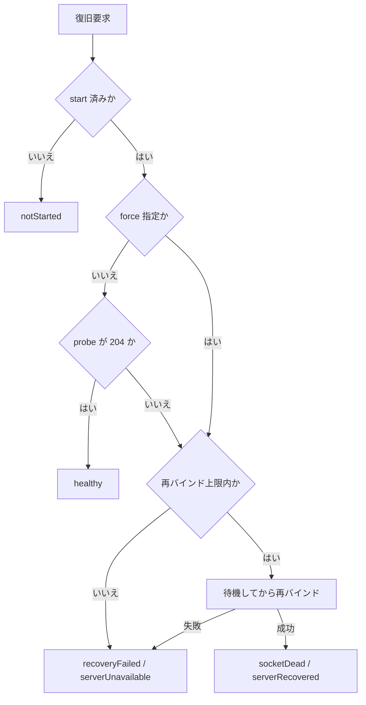

# offline_web_proxy 仕様書

Flutter アプリ内で動作するオフライン対応ローカルプロキシサーバ。
既存の Web システムをアプリ化する際に、オンライン／オフラインを意識せずに動作させることを目的とします。

本プロキシサーバは、WebView から送信される HTTP リクエストを中継し、オンライン時は上流サーバへ転送、オフライン時はキャッシュからレスポンスを返却します。また、更新系リクエスト（POST/PUT/DELETE）はオフライン時にキューに保存し、オンライン復帰時に自動送信することで、シームレスなオフライン対応を実現します。

---

## 【1】基本構成

### アーキテクチャ概要

- **ベース技術**: shelf（Dart の軽量 HTTP サーバフレームワーク）, shelf_router（ルーティング）, shelf_proxy（プロキシ機能）
- **通信経路**: WebView → http://127.0.0.1:<port> → (proxy) → 上流サーバ
- **データ永続化**: Hive を使用したローカルストレージ。Cookie、キュー、隔離、ドロップ履歴は AES-256 で暗号化して保存（【4】【5】）
- **Cache-Control 対応**: レスポンスヘッダを保存可否とフォールバック可否の判定に利用

### データ処理戦略

- **キャッシュ**: GET リクエストの成功レスポンスをファイルベースで保存。オンライン時の送信抑止には使わず、オフライン時または上流到達不能時の代替応答に限定して利用
- **キュー**: POST/PUT/DELETE リクエストを FIFO（先入先出）で管理。ネットワーク復旧時に順次送信
- **オフライン応答**: キャッシュヒット時はキャッシュを返却、未キャッシュ時はフォールバックページを表示（上流へ到達できる状態に戻るとページ自身が再読込）
- **静的リソース**: `pubspec.yaml` で宣言され `AssetManifest.json` に掲載された `assets/static/` 配下ファイルを一覧化し、同梱アセットとして配信

### 端末に保存するデータ

proxy は Hive の Box と secure storage にデータを保存します。暗号化 Box で暗号化されるのは値だけで、Box のキーは平文のまま保存されます（キュー・隔離・ドロップ履歴は保存した時刻から採番した ID、Cookie はドメイン・パス・名前など）。**キューと隔離は、要求のヘッダと本文をそのまま保持します。** 保存先ごとの内容、暗号化の有無、保持期間は次のとおりです。

| 保存先 | 内容 | 暗号化 | 保持期間 |
| --- | --- | --- | --- |
| `proxy_cookies_secure` | Cookie（名前、値、ドメイン、パス、有効期限、属性）。キーはドメイン、パス、名前など | 値のみ（AES-256） | 有効期限を過ぎたものは、送信する Cookie を探すときに削除。`clearCookies()` で削除 |
| `proxy_queue_secure` | 未送信の更新系要求（クエリを含む URL、メソッド、ヘッダ、本文、受け付けた日時、べき等性キーなど）。キーは保存した時刻から採番した ID | 値のみ（AES-256） | 送信に成功するか、隔離またはドロップ履歴へ移すまで。上限なし |
| `proxy_quarantined_requests_secure` | 上流が 4xx で拒否した要求。キューの内容（ヘッダと本文を含む）に、隔離した日時、ステータスコード、理由を加えたもの | 値のみ（AES-256） | 再送または破棄するまで。既定では 30 日、1000 件、20 MB が上限（【5】の「保持上限」） |
| `proxy_dropped_requests_secure` | キューまたは隔離から外した要求の履歴（クエリを含む URL、メソッド、日時、理由、ステータスコード、エラーメッセージ、確認済みか）。ヘッダと本文は持たない | 値のみ（AES-256） | 既定では 30 日。件数の上限（既定 1000 件）は確認済みの履歴だけに適用 |
| `proxy_cache` | 応答キャッシュ（ステータスコード、ヘッダ、本文、有効期限）。キーは正規化した URL の SHA-256 | なし | stale 期間を過ぎたものを 1 時間ごとに削除 |
| `proxy_web_storage` | `enableWebStorageInheritance` を有効にした場合に、Web ページから受け取った Web ストレージのスナップショット | なし | 次のスナップショットで上書きされるまで |
| `proxy_idempotency` | 上流へ届いたべき等性キーと、その記録日時 | なし | `idempotencyRetention`（既定 24 時間）を過ぎたものを 1 時間ごとに削除 |
| `proxy_port_preferences` | ホストごとの、直前にバインドしたポート番号 | なし | 次のバインドで上書きされるまで |
| secure storage の `offline_web_proxy.cookie_box_encryption_key` | 暗号化 Box の鍵。Cookie、キュー、隔離、ドロップ履歴で共有 | secure storage に保存 | `recoverEncryptedStorage()` が削除するか、判定表に従って作り直すまで（【4】の「判定表」） |
| `proxy_queue`、`proxy_quarantined_requests`、`proxy_dropped_requests`、`proxy_cookies` | 0.14.0 以前（Cookie は 0.4.0 より前）が平文で保存した内容 | なし | 暗号化 Box へ移行した後に削除。キュー・隔離・ドロップ履歴の旧 Box は、削除の前に空にする |

### プロキシ対象

上流オリジンサーバ（例: https://sample.com）への中継を行います。業務要求の転送先は 1 つのオリジンサーバです。CDN のように資源だけを配信する別 origin は、`ProxyConfig.mirroredOrigins` に列挙した場合に限り中継します。

### 別 origin の中継（mirroredOrigins）

`mirroredOrigins` に列挙した origin の資源を proxy 経由で取得し、通常のキャッシュ、オフライン代替、ウォームアップの対象にします。既定は空で、指定が無い限り別 origin には一切関与しません。

CDN から UI ライブラリを読み込む画面では、HTML 内の絶対 URL が 127.0.0.1 を経由せず WebView から直接取得されます。HTML と API を保存できても、描画を担うライブラリが読めなければ画面は動きません。

#### 中継用のパス

```
/__offline_web_proxy/ext/<scheme>/<host>[:port]/<元のパス>?<クエリ>

例）https://cdn.example.com/npm/lib@1.0.0/dist/lib.js
  → /__offline_web_proxy/ext/https/cdn.example.com/npm/lib@1.0.0/dist/lib.js
```

元の origin をパスの一部として保つため、その資源が持つ相対 URL（CSS 内の `url(../fonts/x.woff)` など）は同じ origin 配下へ解決されます。

#### HTML の書き換え

proxy が返す `text/html` の応答について、`mirroredOrigins` に一致する絶対 URL を中継用のパスへ書き換えます。

- 対象は `<script src>`、`<link href>`、`` です。`<link>` は `stylesheet` など資源を指す `rel` だけを対象とします。ウォームアップの参照抽出と同じ判定を使うため、**書き換えた資源は必ず `warmupCache(followReferences: true)` の対象になります**。照合は属性名 `src` と `href` で行うため、`data-src` のような接頭辞付きの属性も同じ扱いになります
- 書き換えは保存時ではなく応答時に行います。キャッシュには上流が返したバイト列をそのまま保持するため、オンラインとオフラインのどちらの経路でも同じ変換を通せます。設定から origin を外せば、保存済みの応答も元の URL に戻ります
- 本文は `latin1` で読み書きします。対象タグと URL は ASCII の範囲に収まるため、文字コードが何であってもバイト列を保てます
- 対象は 200 応答かつ `Content-Encoding` を持たない場合に限ります。上流が `identity` を無視して圧縮した本文は解釈できません

#### 中継の扱い

| 項目 | 扱い |
| --- | --- |
| メソッド | `GET` と `HEAD` のみ。ほかは `405` を返し、キューにも載せません |
| 許可外の origin | `404` を返します。設定済み origin へ素通しさせません |
| キャッシュ | キャッシュキーは中継先の URL です。TTL、stale 期間、保存判定は設定済み origin と同じ規則で働きます |
| `forceCachePaths` | 照合対象は proxy が受け取ったパスです。中継経路を対象にする場合は `/__offline_web_proxy/ext/**` の形で指定します |
| Cookie | Cookie Jar のうち中継先のドメインに一致するものだけを送ります。中継先が返す `Set-Cookie` も自身のドメインで保存します |
| `Authorization`、`Origin`、`Referer` | 中継先へは送りません |
| redirect | `Location` が設定済み origin かミラー対象を指す場合は proxy URL へ書き換えます |
| 遷移解決 | `resolveNavigationTarget()` はミラー対象の URL を `inWebView` と判定し、`ProxyNavigationReason.mirroredOriginUrl` を返します |

#### 設定値の検証

`mirroredOrigins` の各要素はスキーム、ホスト、ポートだけを持つ HTTP(S) の origin である必要があります。パス、クエリ、フラグメント、ユーザ情報を含む値は `ProxyStartException` で起動を止めます。誤った値のままでも書き換えと中継が静かに行われないだけで動作は続くため、設定の誤りに気付けるようにしています。

一致判定はスキーム、ホスト、実効ポートの完全一致です。`https://cdn.example.com` は `http://cdn.example.com` にも別ホストにも一致しません。

中継用のパスは要求元が自由に組み立てられるため、次の形も受け付けません。

- `user@host` のように認証情報を含む形。host が一致していても、その値が中継先への認証として送られるため
- proxy 自身を指す形。自分への転送になり、入れ子にすると段数が際限なく増えるため

#### 制限

- 実行時に JavaScript が組み立てる URL は書き換えられません
- `Content-Security-Policy` を返す画面では、書き換え後の URL が proxy と same-origin になるため `'self'` の許可が必要です
- サブリソース完全性（`integrity`）はバイト列を改変しないため維持される想定ですが、ブラウザでの実測は行っていません
- `<script>`、`<link>`、`` 以外（`srcset`、`<source>`、CSS 内の `url()`）は対象外です
- 対象は proxy が返す 200 の `text/html` 応答です。上流から取得した応答とそのキャッシュに加え、`offlineFallbackHtml` で差し替えたオフライン応答も含みます。`gatewayTimeoutHtml` は 504 のため対象外です。`assets/static/` から配信する同梱 HTML も、静的リソースとして先に返すため対象外です。同梱 HTML から別 origin を参照する場合は中継用のパスを直接書きます
- `/__offline_web_proxy/ext/` は proxy が予約する名前空間です。`mirroredOrigins` が空でも上流へは転送しません

### 設定のパスパターン記法

`ProxyConfig` でパスを指定する設定は、共通の glob 記法で照合します。利用側が正規表現を直接指定できるようにすると、設定の誤りが proxy 全体を止め得るため、記法は次に限定します。

| 記法 | 意味 |
| --- | --- |
| `*` | `/` を含まない 1 セグメント内の任意文字列 |
| `**` | `/` を含む任意文字列 |
| （メタ文字なし） | 完全一致 |

- 照合対象はパスだけです。クエリ文字列とフラグメントは含みません
- 大文字と小文字は区別します
- パターンとパスの双方について、先頭に `/` が無い場合は補って比較します
- パターンは起動時に一度だけ組み立て、リクエストごとの生成は行いません

```
/api/registers/auth.json … /api/registers/auth.json のみに一致
/js/*                   … /js/haori.js に一致、/js/vendor/haori.js には一致しない
/js/**                  … /js/vendor/haori.js にも一致
```

## 【2】ポート・接続仕様

### ポート管理

- **自動割当**: システムが利用可能なポートを自動選択。ポート衝突を回避
- **戻り値**: プロキシサーバ起動時に実際に使用されるポート番号を返却
- **バインド先**: 127.0.0.1（ローカルループバック）のみ。外部からのアクセスを防止

### セキュリティ考慮

- **HTTPS 不要**: localhost はブラウザでセキュアコンテキストとして扱われるため、HTTP でも十分
- **外部アクセス制限**: 127.0.0.1 バインドにより、デバイス外からのアクセスを完全に遮断

### 死活監視

- proxy は稼働確認用のヘルスチェックエンドポイントを提供します。既定パスは `/__offline_web_proxy/health` で、`ProxyConfig.healthCheckPath` により変更できます。
- ヘルスチェックは `GET` と `HEAD` のみを受け付け、`204 No Content` と `Cache-Control: no-store` を返します。それ以外のメソッドは通常のプロキシ経路として扱います。
- `healthCheckPath` は `/` で始まる固定パスとします。パスパラメータ記法（`<`、`>`）、`?`、`#`、空白を含む値は起動時に `ProxyStartException` で拒否します。空文字を指定した場合は既定パスを使用します。
- ヘルスチェック要求は上流サーバへ転送せず、キャッシュ、キュー、Cookie 処理、統計カウンタの対象外とします。
- `probe()` は現在バインドしているポートのヘルスチェックパスへ要求を送り、`204` を受け取った場合のみ稼働中と判定します。既定タイムアウトは 2 秒です。接続失敗、タイムアウト、想定外のステータスは停止と判定します。
- `isRunning` は内部状態のフラグのみを返し、ソケットが実際に応答するかは保証しません。実応答の確認には `probe()` を使用します。
- 「ソケット死亡」状態を再現するため、内部状態を変更せずソケットのみを閉じる `closeServerSocketForTesting()` を `@visibleForTesting` として提供します。テスト以外の用途では使用しません。

### ソケット死亡と自動復旧

端末のサスペンドやプロセス再開により、内部フラグ上は稼働中でもソケットが応答しない状態が発生します。本仕様ではこの状態を「ソケット死亡」と呼びます。

- `ensureRunning()` は `probe()` を実行し、失敗した場合に限りサーバを再バインドします。キャッシュ、キュー、Cookie の永続化領域は閉じずに維持します。
- 再バインド時のポート選択順序は次のとおりです。
  1. `ProxyConfig.port`（0 より大きい場合はこのポートのみを試行）
  2. 直前にバインドしていたポート
  3. `ProxyConfig.preferredPort`
  4. 自動割当（0）
- 再バインド後のポートが直前と異なる場合は、結果の `portChanged` を `true` とします。
- `ensureRunning()` はアプリが表示中の URL を知らないため、`reloadUri` は常に `null` です。ポートが変化した場合は `portChanged` と `port` を参照し、読み込む URL はアプリ側で組み立てます。
- `ensureRunning(force: true)` は `probe()` の結果にかかわらず再バインドします。
- `start()` を実行していない状態で呼ばれた場合は再バインドを行わず、`cause` を `notStarted` として返します。
- 復旧に成功した場合は `serverRecovered` イベント、復旧できなかった場合は `serverUnavailable` イベントを発行します。
- 結果とイベントの `downtimeMs` は、その呼び出しで `downtime` が渡された場合にのみ設定します。他の復旧結果へは引き継ぎません。診断情報の `lastDowntimeMs` は最後に渡された値を保持します。

図: 復旧判定フロー



### 復旧試行の抑制

- 復旧処理は同時に 1 つだけ実行し、実行中に再要求された場合は進行中の処理の結果を共有します。
- 連続失敗時の待機時間は 0、1、2、5、10 秒の順で増加し、以降は 10 秒を維持します。
- 直近 1 分間の再バインド回数は既定 5 回を上限とし、超過した場合は再バインドを行わず `recoveryFailed` を返します。上限値は `ProxyConfig.maxRestartAttemptsPerMinute` で変更できます。
- 復旧に成功した時点で、連続失敗回数と待機時間はリセットされます。
- `maxRestartAttemptsPerMinute` に 0 以下を指定した場合は再バインドを行わず、常に `recoveryFailed` を返します。
- 復旧処理と停止処理は排他で実行します。`stop()` が先に完了した場合は復旧を中止して `recoveryFailed` を返し、再バインドが先に完了した場合は続く `stop()` でソケットとバックグラウンドタイマーを確実に停止します。停止後に再バインドしたソケットやタイマーが残ることはありません。
- `stop()` では復旧の実行制御状態（試行履歴、連続失敗回数、進行中の復旧）のみを初期化し、再バインド回数や最終復旧種別などの診断値は次回 `start()` で初期化します。

### 旧ポート URL の読み替え

アプリ再起動やポート自動割当により、WebView が保持する URL のポートが現行ポートと異なる場合があります。

- `resolveReloadUri(String lastUrl)` は、対象 URL が loopback ホスト（`127.0.0.1` または `localhost`）で、ポートのみが現行ポートと異なる場合、現行ポートへ読み替えた URL を返します。パス、クエリ、フラグメントは保持します。
- ポートが現行ポートと一致する場合は、その URL をそのまま返します。
- 読み替え後のホストは `ProxyConfig.host` に正規化します。`localhost` 表記で保持されていた URL は設定ホストの表記へ揃えます。
- 読み替え対象とするポートは、このインスタンスが起動後にバインドしたポート、永続化された直前のバインドポート、および `ProxyConfig.preferredPort`（0 より大きい場合）に限ります。別ポートで動作する他のローカルサーバへの遷移を奪わないための制限です。
- loopback 以外のホスト、`http` 以外のスキーム、解析できない文字列、上記以外のポート、サーバ停止中（現行ポート不明）の場合は `null` を返します。
- 遷移判定 API（`resolveNavigationTarget`、`recommendMainFrameNavigation`、`recommendNewWindowNavigation`）でも、ポートのみが異なる loopback URL を `ProxyNavigationReason.stalePortUrl` として扱い、現行ポートへ読み替えた proxy URL の読み込み（`loadProxyUrl`）を推奨します。

### WebView エラーからの復旧

- `recoverFromWebResourceError()` は WebView が報告した失敗 URL を評価し、次のいずれかに該当する場合のみ復旧を試みます。
  - 失敗 URL のホストとポートが現行 proxy と一致する
  - 失敗 URL が loopback ホストで、ポートのみが現行ポートと異なる
- 上記以外の URL（上流サーバや外部サイト）では復旧を行わず、`cause` を `unrelated` として返します。`failingUrl` が未指定の場合も `unrelated` を返します。
- `errorCode` と `isMainFrame` は診断情報として記録するだけで、復旧するかどうかの判定には使用しません。
- 復旧を試みた場合、`reloadUri` には `failingUrl` を現行ポートへ読み替えた URL を格納します。ポートが変化していない場合も同じ URL を格納します。復旧できなかった場合は `null` とします。
- 本 API は利用者向けの表示文言を返しません。利用者への通知内容はアプリ側の責務とします。

### アプリライフサイクル連動

- `ProxyLifecycleGuard` は `WidgetsBindingObserver` として登録し、アプリが `resumed` へ遷移した際に `ensureRunning()` を実行します。
- 再バインドが発生した場合のみ `onRecovered` を呼びます。`probe()` が成功した場合はコールバックを呼びません。
- 復旧できなかった場合は `onFailed` を呼びます。未指定の場合は何も行いません。
- `paused` へ遷移した時刻を保持し、`resumed` までの経過時間をイベントおよび診断情報の `downtimeMs` として記録します。
- `currentUrlProvider` を指定した場合、復旧後の `reloadUri` はその関数が返す URL を現行ポートへ読み替えた値になります。未指定でポートも変化していない場合は `reloadUri` は `null` です。
- WebView の再読込は本ライブラリでは行いません。`onRecovered` が渡す `reloadUri` を用いて、アプリ側が読み込みを実行します。`reloadUri` が `null` の場合は、アプリ側が現在の URL を再読込します。

### 定期ヘルスチェック

- `ProxyConfig.healthCheckInterval` が 0 より大きい場合、その間隔で `probe()` を実行し、失敗時に自動復旧を試みます。既定は 0（無効）です。
- 定期確認の稼働確認タイムアウトは `healthCheckInterval` に連動させ、500 ミリ秒以上 2 秒以下にクランプします。
- バックグラウンド中はタイマーが動作しない前提とし、長時間放置後の復旧は `ProxyLifecycleGuard` による `resumed` 契機の確認を主経路とします。

### keep-alive とアイドルタイムアウト

- 内部 HTTP サーバのアイドルタイムアウトは `ProxyConfig.serverIdleTimeout`（既定 120 秒）で設定します。
- 設定時間を超えて要求が来ない keep-alive 接続は、サーバ側から切断します。

## 【3】静的リソース判定

### 判定ロジック

起動時に `AssetManifest.json` を走査し、`pubspec.yaml` で宣言されて `assets/static/` 配下に存在するファイルから静的リソース一覧を構築します。proxy はその一覧に一致する URL だけを静的リソースとして扱い、一覧に存在しない通常の same-origin URL は upstream 転送または proxy URL 解決を優先します。実行環境で manifest を読み込めない場合は、静的リソース一覧を空として起動を継続します。

### 一覧化ルール

ローカル資産と proxy URL の対応関係：

```
ローカル資産: assets/static/app.css
           ↓
起動時に一覧化: /app.css
           ↓
リクエスト: http://127.0.0.1:8080/app.css
           ↓
判定結果: 静的リソース
           ↓
同梱アセットの内容を 200 で返却
```

### 配信仕様

- **対象メソッド**: `GET` と `HEAD` のみ。同名パスへの更新系は静的扱いにせず、上流へ転送します
- **Content-Type**: 拡張子から判定します
- **ETag**: アセット内容の SHA-256 先頭 16 桁を付与します。`If-None-Match` が一致した場合は `304` を返します
- **Cache-Control**: `no-cache` を付与します。アプリの更新でアセットが入れ替わるため、WebView 側にも毎回検証させます
- **読み込み失敗時**: 一覧に載っていてもアセットの実体を読み込めない場合は `404` を返さず、上流への転送へ委ねます
- **付帯ヘッダ**: 判別用に `X-Static-Resource: true` を付与します
- **`ETag` の算出**: 同梱アセットはプロセス実行中に変化しないため、初回の算出結果を asset key ごとに保持します
- **`HEAD` の制約**: 本文を返さないため `Content-Length` は 0 になります。Range 要求には対応していません

### URL 正規化処理

- **スラッシュ圧縮**: `//` を `/` に変換
- **相対パス解決**: `../` や `./` を適切に解決
- **一覧ベース判定**: 起動時に作成した一覧に一致した URL だけを静的扱いする
- **通常 URL 優先**: 一覧に存在しない `.js`、`.css`、画像拡張子付き URL でも upstream 解決を優先する

### 処理フロー

1. 起動時に `AssetManifest.json` または実行環境上の同等 manifest を読み、`assets/static/` 配下のファイルを proxy URL 一覧へ変換
2. リクエスト URL を正規化
3. `GET` / `HEAD` かつ一覧に一致する場合: 同梱アセットを配信（読み込めない場合は 4 へ）
4. 一覧に存在しない場合: 上流サーバへプロキシ転送または proxy URL として解決

### パフォーマンス最適化

- **起動時インデックス**: `assets/static/` 一覧を起動時にメモリへ展開
- **Content-Type キャッシュ**: 拡張子ベースの Content-Type 判定結果をキャッシュ

### セキュリティ対策

- **パス制限**: `assets/static/` 配下から生成した一覧だけを proxy ローカル静的リソースとして扱う
- **誤判定抑止**: 一覧に無い URL は upstream 優先にし、拡張子だけでは local-only にしない
- **パストラバーサル防止**: 配信対象は起動時の一覧との完全一致で決めます。リクエストのパスをファイルシステムのパスへ連結しないため、`../` を含む URL は一覧に一致せず、上流解決へ回ります

### Content-Type 自動判定

拡張子に基づく自動 Content-Type 設定：

```
.html → text/html; charset=utf-8
.css  → text/css; charset=utf-8
.js   → application/javascript; charset=utf-8
.json → application/json; charset=utf-8
.png  → image/png
.jpg  → image/jpeg
.woff2 → font/woff2
（その他） → application/octet-stream
```

## 【4】Cookie Jar 永続化と保護

### ストレージ戦略

- **永続化必須**: 全ての Cookie をファイルベースで永続化。アプリ再起動後も保持
- **暗号化**: AES-256 を使用して Cookie データを暗号化してから保存（Box 名 `proxy_cookies_secure`）。暗号化されるのは値だけで、キー（ドメイン・パス・名前など）は平文
- **鍵管理**: 暗号化鍵は secure storage（`offline_web_proxy.cookie_box_encryption_key`）に保存し、キュー・隔離・ドロップ履歴の暗号化 Box（【5】）と共有する
- **旧平文 Box の移行**: 既存の平文 `proxy_cookies` は、保存領域の初期化の段階 1 で 1 回だけ移行する。暗号化 Box に同じキーの Cookie が既にあれば書き写さない（新しいセッションを古い値で上書きしないため）。旧 Box を読めない、書き写せない、または削除できない場合は `CookieOperationException`（`operation: migrateLegacy`）とし、`start()` は `ProxyStartException` の `cause`、Cookie API は `CookieOperationException` の `cause` に持つ
- **鍵喪失時**: 暗号化 Box を開く前に鍵と照合する。Cookie Box だけに問題がある場合は Cookie Box を破棄して続け、再ログインが必要になる。キュー・隔離・ドロップ履歴の Box に問題がある場合は、何も消さずに起動失敗とする（「暗号化鍵の管理と照合」）
- **メモリキャッシュ**: ファイルから読み込んだ Cookie を高速アクセスのためメモリ上にキャッシュ

### 暗号化鍵の管理と照合

Hive は鍵が合わない暗号化 Box を開くと、先頭フレームの CRC 不一致を破損とみなしてファイルを切り詰めます。そのため proxy は、暗号化 Box（Cookie・キュー・隔離・ドロップ履歴）を開かずにファイルを読んで鍵と照合し、判定表に従って、そのまま開く・Cookie Box を破棄する・起動を失敗させる、のいずれかを選びます。

#### 初期化の直列化

保存領域の初期化は 2 段に分け、同じ isolate にある proxy のインスタンスすべてで 1 つの直列化の中で行います。新規インストール直後に Cookie API を同時に呼んでも、鍵が 2 つ生成されたり Box が重ねて開かれたりしないようにするためです。各段階の処理と、実行する API は次のとおりです。

| 段階 | 処理 | 実行する API |
| --- | --- | --- |
| 段階 1（鍵） | 保存先の特定、鍵の読み取りと照合、判定表に従う鍵の生成と Cookie Box の破棄、Cookie Box のオープン、旧平文 Cookie Box の移行 | `start()` と Cookie API（起動前・停止後にも呼べる） |
| 段階 2（業務データ） | キャッシュ・Web ストレージ・べき等性キーの Box と、キュー・隔離・ドロップ履歴の暗号化 Box のオープン、旧平文 Box の移行（【5】） | `start()` だけ |

- 失敗した段階は、その段階で開いた Box を閉じ、結果を共有せずに次の呼び出しで再試行する。段階 2 の失敗後も、段階 1 の結果（Cookie Box）は使える
- `stop()` は段階 1・段階 2 の結果を捨てる。停止後に呼んだ Cookie API と次の `start()` は、段階 1 から照合し直す
- Cookie API は初期化の失敗を、`CookieOperationException`（`cause` に元の例外）として返す
- 直列化するのは同じ isolate の中だけで、複数のインスタンスを同時に使う構成は想定しない（【17】の「インスタンスと isolate」）

#### 保存先と中身の判定

- **保存先**: ポート設定の平文 Box（`proxy_port_preferences`）を開き、そのファイルの親ディレクトリを Hive の保存先とする。Hive の保存先は公開されておらず、アダプタ 0 が登録済みの場合は proxy が `Hive.initFlutter()` を呼ばないため、path_provider で求めた場所とずれ得る
- **中身のある Box**: 保存先の `<Box 名>.hive`（無ければ `<Box 名>.hivec`）が 0 バイトより大きいもの。`.lock` だけのものと 0 バイトのものは、中身なしとみなす

#### 鍵の状態の区分

secure storage から鍵を読んだ結果は、次のように区分します。

| 区分 | 条件 | `StorageIntegrityFailure` |
| --- | --- | --- |
| 一時的に読めない | iOS / macOS で `isCupertinoProtectedDataAvailable()` が `false`（端末のロック中など）。このときは読み取りの `null` も例外も判定に使わない。戻り値が `null`（iOS / macOS 以外）の場合と、値を取得できなかった場合は利用可能とみなす | `temporarilyUnavailable` |
| 読み取り不能 | 読み取りが例外で失敗した | `keyUnreadable` |
| なし | 読み取りの結果が `null` | `keyMissing` |
| 形式不正 | 空文字、Base64 として読めない、または 32 バイトでない。値そのものの問題のため読み直さない | `keyInvalid` |
| あり | 上記以外 | — |

#### 読み直し

中身のある暗号化 Box があり、最初の読み取りが「なし」か「読み取り不能」の場合だけ、500 ミリ秒間隔で 3 回まで読み直します。中身のある暗号化 Box が無い場合は、失うものが無いため読み直しません。

- 1 回でも値を読めた場合（形式不正を含む）は、その値で判定を続ける
- すべて同じ結果（すべて `null`、またはすべて例外）の場合だけ、その状態が続いているとみなす
- 結果が `null` と例外で入り混じる場合、または読み直しの途中で一時的に読めない状態に変わった場合は、一時的に読めないものとして扱う

#### 暗号化 Box の照合

鍵が「あり」の場合、中身のある暗号化 Box ごとに次の手順で照合します。

1. **先頭フレームの照合**: 先頭フレームの CRC32 を、鍵から求めた値（Hive の `HiveAesCipher.calculateKeyCrc()` と同じ値）を初期値として計算し、フレームに記録された値と比べる。一致すれば、後ろは走査しない（先頭フレームが 1 MiB を超える場合は、別の isolate でファイル全体を読んでから照合する）
2. **走査**: 先頭フレームが一致しない、または完結していない（フレーム長の欄がファイルの残りを超える）場合は、ファイル全体から鍵と一致するフレームを探す
   - CRC を計算する位置は、Hive のフレーム構造に合う位置に絞る。キーの型が文字列でキー長が 1〜255 の位置のうち、キュー・隔離・ドロップ履歴はキーが数字と `-` だけのもの、Cookie はキーが ASCII だけのものを候補にする。移行はキーを保つため、v0.11.0 より前の 13 桁・16 桁のキーも候補に含まれる
   - UI の isolate を止めないよう、別の isolate で走査する
   - 判定が端末の速さで変わらないよう、バイト数では打ち切らない。異常な場合の安全装置として、時間の上限（Box ごとに 10 秒。ファイルの読み込みと isolate の起動にかかる時間は含まない）だけを設ける。4 つの Box は順に照合する
3. **結果**: 次の表のいずれかになる

| 結果 | 条件 | `StorageBoxCheckResult` |
| --- | --- | --- |
| 中身なし | ファイルが無いか 0 バイト | `empty` |
| 一致 | 先頭フレームが鍵と一致した | `match` |
| 不一致なし | 先頭フレームが完結しておらず、鍵と一致するフレームも無い。最初の書き込みの途中で止まった Box とみなす（開くと Hive が切り詰める） | `noMismatch` |
| 不一致 | 先頭フレームが鍵と一致せず、鍵と一致するフレームも無い | `mismatch` |
| 破損 | 先頭フレームは一致しないが、後ろに鍵と一致するフレームがある。鍵は正しく、先頭側が壊れている | `corrupted` |
| 照合打ち切り | 走査が時間の上限を超えた | `aborted` |
| 未照合 | 使える鍵が無いため照合していない（中身はある） | `notVerified` |

以降の「問題なし」は、中身なし・一致・不一致なしのいずれかを指します。

#### 判定表

中身のある暗号化 Box が無い場合は、次のとおりです。

| 鍵 | 動作 |
| --- | --- |
| 一時的に読めない | 起動失敗（`temporarilyUnavailable`） |
| あり | そのまま開く |
| なし・形式不正・読み取り不能 | 鍵を作り直して書き込む（暗号化データが無いため失うものは無い）。書き込みに失敗した場合は、Box を作らずに起動失敗（`keyWriteFailed`） |

中身のある暗号化 Box がある場合は、次のとおりです。

| 鍵 | キュー・隔離・ドロップ履歴の Box | Cookie Box | 動作 |
| --- | --- | --- | --- |
| 一時的に読めない（読み直しの規則による場合を含む） | 問わない | 問わない | 起動失敗（`temporarilyUnavailable`）。何も消さない |
| あり | すべて問題なし | 問題なし | そのまま開く（0.14.0 からの通常の更新はこの行か、上の表の「あり」の行） |
| あり | すべて問題なし | 不一致・破損・照合打ち切り | Cookie Box を破棄して続ける。通知する |
| あり | 1 つ以上が不一致・破損・照合打ち切り | 問わない | 起動失敗（`keyMismatch`・`corrupted`・`verificationAborted`。複数ある場合はこの順に優先）。何も消さない |
| 形式不正、または なし・読み取り不能（読み直しても続く） | すべて中身なし | 中身あり | 鍵を作り直して書き込んでから、Cookie Box を破棄して続ける。通知する。書き込みに失敗した場合は、何も消さずに起動失敗（`keyWriteFailed`） |
| 形式不正、または なし・読み取り不能（読み直しても続く） | 1 つ以上が中身あり | 問わない | 起動失敗（`keyInvalid`・`keyMissing`・`keyUnreadable`）。何も消さない |

- 破損したキュー・隔離・ドロップ履歴の Box を起動時に自動で直さないのは、先頭側の記録が失われるため。利用者の確認を経て、復旧 API で作り直す
- Cookie Box だけを失う場合に破棄して続けるのは、Cookie の喪失は再ログインで済み、版を上げただけでアプリが起動しなくなる事態を避けるため。0.14.0 までは、鍵が無く Cookie Box が残っている場合に起動失敗としていた

#### Cookie Box の破棄と通知

- Cookie Box を破棄したときは、`ProxyEventType.cookieStorageDiscarded` を発行する。`data['reason']` に `StorageIntegrityFailure` の名前が入る
- 破棄は `start()` や、起動前・停止後に呼んだ Cookie API の中で起きる。イベントはブロードキャストのため、後から購読したアプリには届かない
- 起動後は `ProxyDiagnostics.lastCookieStorageDiscardedAt` と `lastCookieStorageDiscardReason` で照会できる（インスタンスごとの値）
- 復旧 API による削除では `cookieStorageDiscarded` を発行せず、診断情報も変えない
- 起動前の `restoreCookies()` の中で古い Box を破棄した場合も、復元した Cookie は新しい Box に残る

#### 起動失敗

- `start()` は `StorageIntegrityException`（`ProxyStartException` のサブクラス）を包まずに送出する。Cookie API は `CookieOperationException` の `cause` に持つ
- `failure` に種別、`boxResults` に Box ごとの照合結果（Cookie Box を含む）、`error` に元のエラー（鍵の読み取りで起きた例外など。`Exception` でないものを含む）を持つ
- 何も消していない。`temporarilyUnavailable` と `keyWriteFailed` は、時間をおいて `start()` を再試行する。それ以外の種別で再試行しても続く場合は、利用者の確認を経て復旧 API を呼ぶ
- この例外は保存領域を開く前に送出するため、起動に失敗した後の `getStats()` は、キュー・隔離・ドロップ履歴の件数に 0 を返す

#### 復旧 API

`recoverEncryptedStorage()` は、利用者の確認を経てアプリが呼び出します。

- **前提**: この isolate の proxy のいずれかが稼働中または起動処理中の場合は、何もせずに `proxyActive` を返す。初期化と同じ直列化の中で実行するため、Cookie API がきっかけの初期化とも重ならない
- **起動との重なり**: 復旧 API が照合を始めた後に呼ばれた `start()` は、復旧が終わるのを待ってから、保存領域の初期化を段階 1 からやり直す
- **判定**: 削除の直前に、`start()` と同じく鍵を読み直し、同じ時間の上限で照合する

復旧 API の動作は次のとおりです。

| 状況 | 動作 | 戻り値 |
| --- | --- | --- |
| 鍵を一時的に読めない（読み直しの規則による場合を含む） | 何もしない | `rejection: temporarilyUnavailable` |
| 鍵があり、キュー・隔離・ドロップ履歴の Box に不一致・破損・照合打ち切りが無い | 何もしない（Cookie Box だけの問題は `start()` が破棄して続けるため） | `rejection: startWillSucceed` |
| 鍵があり、キュー・隔離・ドロップ履歴の Box に不一致・破損・照合打ち切りがある（Cookie Box も同じ規則で扱う） | 鍵を残し、Box ごとに扱う（下の表） | `performed: true` |
| 形式不正、または なし・読み取り不能（読み直しても続く）で、キュー・隔離・ドロップ履歴の Box に中身がある | 暗号化 Box（Cookie・キュー・隔離・ドロップ履歴）をすべて削除してから、鍵を削除する | `performed: true`、`keyDeleted: true` |
| 形式不正、または なし・読み取り不能で、キュー・隔離・ドロップ履歴の Box に中身が無い | 何もしない | `rejection: startWillSucceed` |

- 鍵を書き込めずに起動に失敗した場合（`keyWriteFailed`）も、消す必要のある Box が無いため `startWillSucceed` になる。時間をおいて `start()` を再試行する

鍵がある場合の Box ごとの扱いは、次のとおりです。照合打ち切りと破損の Box は、Box を閉じた後のファイルを時間の上限なしで走査し直してから扱いを決めます。

| 照合結果 | 扱い | 戻り値の分類 |
| --- | --- | --- |
| 不一致 | 削除する | `deletedBoxes` |
| 破損 | 鍵と一致した最初のフレームより前のバイトを捨てて作り直す。失うのは先頭側の記録だけで、その件数は分からない | `rebuiltBoxes` |
| 照合打ち切りで、走査し直した結果が不一致なし | 0 バイトに切り詰める。鍵と一致する記録が無く、開けば Hive も同じく切り詰めるため失うものは無い（残すと、再試行した `start()` が再び打ち切りで失敗する） | `rebuiltBoxes` |
| 問題なし（中身あり） | 残す | `keptBoxes` |

- 照合打ち切りの Box を走査し直した結果が不一致・破損の場合は、それぞれの行に従う
- **作り直しの手順**: 残す部分を `<Box 名>.hivec` へ書いてディスクへ書き出し、`<Box 名>.hive` へ名前を変えて置き換える。置き換えるまで元の `.hive` は消さない。Hive は開くときに `.hive` があれば `.hivec` を削除するため、置き換えの前に止まっても元の Box が使われる
- **Box を閉じる**: 削除・作り直しの前に、proxy の Box をすべて閉じる（別のインスタンスが開いている暗号化 Box を含む）。残骸の `.hivec`（`.hive` がある暗号化 Box のもの）は、閉じた後に削除する
- **予期しない失敗**: Box のファイルや鍵を削除できないなどの予期しない失敗は、`StorageRecoveryException` を送出する
- **再実行**: 途中で止まっても、再実行すれば残りを処理し、ファイルは最初の実行が終わった場合と同じ状態になる。戻り値は同じにならず、前回までに削除・作り直しを済ませた Box は `deletedBoxes`・`rebuiltBoxes` に含まれない。鍵を使えない場合の経路で、暗号化 Box を消した後に鍵の削除だけが失敗していた場合は、再実行は `startWillSucceed` を返す（使えない鍵は次の `start()` が作り直す）
- **旧平文 Box**: 削除しない。鍵が無くても読めるため、次の `start()` で移行する。鍵を削除した場合、次の `start()` は鍵を生成するため、【5】の遅らせる移行になる
- **終了後**: 共有していた初期化の結果を捨てるため、プロセスを再起動せずに `start()` できる
- **件数**: 暗号化された記録の件数は読めないため返さない。`StorageIntegrityException` で起動に失敗した後の `getStats()` は 0 件を返すため、確認画面の根拠に使わない

#### Hive の内部形式への依存

先頭フレームの照合、走査、作り直し、保存順の前提は、Hive 2.2.3 の内部形式（フレームの並び、キーの符号化、`calculateKeyCrc`、`.hive` と `.hivec` の扱い、キーの並べ方）に依存します。Hive の CRC32 は公開されていないため、同じ計算を proxy の中に実装しています。Hive を更新するときは、これらの互換を確認してください。走査が偶然一致するフレームを見つける確率は極めて小さいものの、ゼロではありません。

### Cookie 評価基準

RFC 準拠の Cookie 評価を実装：

- **Domain**: Cookie が有効なドメインの検証
- **Path**: Cookie が有効なパスの検証
- **Expires/Max-Age**: Cookie の有効期限の管理
- **Secure**: HTTPS 接続時のみ送信する Cookie の制御
- **SameSite**: CSRF 攻撃防止のための SameSite 属性の処理

### 管理メソッド

Cookie 管理のためのメソッドを提供します。詳細は【20】API リファレンスを参照してください。

- **`getCookies()`**: 現在保存されている Cookie の一覧取得（値はマスクして返却）
- **`restoreCookies()`**: proxy 起動前を含めて外部取得 Cookie を復元
- **`clearCookies()`**: 全 Cookie の削除

## 【5】キュー再送ポリシー

### キュー管理

- **保存順の維持**: 保存日時の昇順で再送し、リクエストの順序を保持
- **キーの一意性**: マイクロ秒精度のタイムスタンプと同一マイクロ秒内の連番でキーを採番し、同時に保存したリクエストが上書きで失われないようにする
- **永続化**: Hive の暗号化 Box（`proxy_queue_secure`）でキュー状態を保存。アプリ再起動後も再送を継続（「保存領域の暗号化」）
- **再試行待ちの扱い**: バックオフ待機中のリクエストは今回の送信対象から外し、待機時間を過ぎた後続のリクエストを先に送信する
- **接続の解放**: 再送では上流の応答本文を必ず読み切り、接続を解放してから次の要求へ進む。件数が同時接続数の上限を超えても最後まで送り切れるようにする
- **隔離できない場合**: 隔離領域へ退避できない状況では、キューから取り除かずバックオフを適用して再試行する（1 件で `quarantineMaxBytes` を超える場合を除く。「保持上限」）

### 再試行戦略

- **段階的バックオフ**: `ProxyConfig.retryBackoffSeconds` の秒数を再試行回数の順に適用（既定は 1, 2, 5, 10, 20, 30 秒）。末尾に達した後は同じ値を維持
- **無限再試行**: ネットワークエラーと 5xx 応答の場合は再試行を継続

### 再送打ち切りの条件

以下の場合、リクエストをキューから取り除きます。

- **4xx 系エラー**: クライアントエラー（認証失敗、不正リクエスト等）。再送しても結果が変わらないため取り除く

ネットワークエラーと 5xx 系エラーは一時的な障害とみなし、取り除かずに再試行を継続します。

### 取り除いたリクエストの扱い

`ProxyConfig.dropPolicy` で扱いを選択します。

| 方針 | 動作 | 用途 |
| ---- | ---- | ---- |
| `quarantine`（既定） | 本文を保持したまま隔離領域へ退避する。合計バイト数の上限（`quarantineMaxBytes`）を 1 件で超える場合は本文を保持せず、ドロップ履歴へ `quarantine_too_large` で記録する | 会計データなど、失うと業務上の影響があるもの |
| `drop` | 破棄し、履歴のみ残す | 失っても影響が小さいもの |

- **隔離時の通知**: `ProxyEventType.requestQuarantined` を発行します
- **破棄時の通知**: `ProxyEventType.requestDropped` を発行します
- **二重記録の回避**: 隔離した場合はドロップ履歴へ記録しません。例外は保持上限を超えた場合で、隔離から移す分と、1 件で合計バイト数の上限を超える分をドロップ履歴へ記録します（「保持上限」）
- **記録の順序**: 隔離もドロップ履歴も、キューから取り除く前に記録します。記録できなかった場合はキューへ残すため、取り除いたのに記録が無い状態にはなりません。保持上限で隔離から移す場合も、ドロップ履歴へ記録してから隔離から削除します

### キューへ入れない更新系（queueExcludePaths）

レジ認証やログアウトのように「後から送っても意味が無い更新系」は、キューへ保存すると二重の問題が起きます。復帰後に送っても業務上の意味が無く、その場では `202 Accepted` が返るため Web アプリが成功と誤認します。

`ProxyConfig.queueExcludePaths` に一致した更新系はキューへ保存せず、規則ごとに設定した応答をその場で返します。

- **既定**: 空。指定が無い限り従来どおり全ての更新系をキューへ保存します
- **記法**: 【1】の「設定のパスパターン記法」に従います
- **メソッド**: `methods` が空の場合はキュー対象の更新系すべてに適用します
- **応答**: 規則ごとに `ProxyResponseConfig` を持ちます。既定は `503` と `{"queued":false,"offline":true}` です。画面ごとに異なる文言を返せるため、Web 側の改修なしにオフライン起因であることを伝えられます
- **付帯ヘッダ**: `X-Offline-Queued: 0` と `X-Offline-Excluded: 1` を付与します。本文に依らずヘッダで判別できます

適用する経路は、proxy がキューへ保存し得る 3 つすべてです。

| 経路 | 動作 |
| ---- | ---- |
| オフライン時 | 規則の応答を返す |
| 上流が 5xx を返した場合 | **上流の応答をそのまま返し**、キューへの保存だけを行わない |
| 上流へ到達できなかった場合 | 規則の応答を返す |

5xx で応答を差し替えないのは、上流が実際に応答しており、その内容を Web アプリへ伝えるべきだからです。

### 受け付けた時刻の通知（acceptedAt）

オフラインで積んだ更新系は、復帰後に上流へ届きます。上流が受信時刻で業務日時を採番すると、深夜に回線が切れて翌朝復帰した場合に前日の売上が当日として記録され、日別集計がずれます。

proxy は最初に受け付けた時点を保持し、初回転送と以降の再送で同じ値を送ります。

- **ヘッダ名**: `ProxyConfig.acceptedAtHeaderName`（既定 `X-Offline-Accepted-At`）
- **有効・無効**: `ProxyConfig.enableAcceptedAtHeader`（既定 `true`）
- **値**: UTC の ISO 8601 文字列（例 `2026-09-09T08:03:41.474467Z`）。タイムゾーンの解釈が割れないよう UTC で表現します
- **対象**: 更新系のみ。read 系には付与しません
- **上書き**: 値は proxy 自身の観測結果のため、クライアントが同名のヘッダを送っていた場合も proxy の値で上書きします
- **不変性**: キューデータの `acceptedAt` として保持し、隔離からの再送でも変わりません。`queuedAt` は再送のたびに更新されるため流用できません
- **旧データ**: `acceptedAt` を持たないキューデータは、`queuedAt` を UTC へ変換して補います

**注意**: 値は端末の時計に依存します。オフライン中に時計がずれた端末は、ずれた時刻を報告します。

### 再送結果の通知

再送は画面の裏側で行われるため、結果が要求元へ返りません。上流が実際に記録した内容と突き合わせたい場合に備え、1 件ごとの結果を通知します。

- **イベント**: `ProxyEventType.queueResendAttempted` を、成功・隔離・破棄・再試行のすべてで発行します
- **内容**: URL、メソッド、ステータスコード、成否、べき等性キー、取り除いた理由、再試行の有無、試行日時
- **本文**: 含みません。会計データが監視経路へ流れないようにします
- **上流へ到達できなかった場合**: ステータスコードは `0` になります
- **既存イベント**: `ProxyEventType.queueDrained` にも `statusCode` と `idempotencyKey` を追加しました
- **直近の結果**: `recentResendResults` で最大 20 件を参照できます。監視用にメモリ上へ保持するだけで永続化しないため、アプリのプロセスが終了すると失われます

### 履歴管理

キュー管理のためのメソッドを提供します。詳細は【20】API リファレンスを参照してください。

- **`getQuarantinedRequests()`**: 隔離されたリクエストの一覧取得。本文は返しません。隔離した日時の古い順に並びます
- **`retryQuarantinedRequest(id)`**: 原因を解消したあとにキューへ戻して再送。再試行回数は初期化し、保存日時は受け付けた時点に更新するため、待機中のリクエストより後に送信します。業務上の発生時刻を表す `acceptedAt` は更新しません。移行を待っている項目は再送できません
- **`discardQuarantinedRequest(id)`**: 内容を確認したうえで破棄。移行を待っている項目は破棄できません
- **`clearQuarantinedRequests()`**: 隔離されたリクエストを全て破棄
- **`getDroppedRequests()`**: ドロップされたリクエストの履歴取得。デバッグやトラブルシューティングに活用。記録した日時の古い順に並びます
- **`acknowledgeDroppedRequests()`**: 履歴を確認済みにする。履歴自体は残します

### 未確認の検知

- **`ProxyStats.quarantinedCount`**: 隔離されているリクエスト件数。0 でなければ要対応です
- **`ProxyStats.unacknowledgedDroppedCount`**: 未確認のドロップ履歴の件数。アプリ起動時に確認すると、監視していない間に破棄されたリクエストへ気付けます
- **移行を待つ分**: どちらの件数も、旧平文 Box から移行を待っている分を含みます

### 保存領域の暗号化

- **対象**: キュー（`proxy_queue_secure`）、隔離（`proxy_quarantined_requests_secure`）、ドロップ履歴（`proxy_dropped_requests_secure`）を AES-256 の暗号化 Box に保存する。ドロップ履歴も含めるのは、隔離の上限超過分を履歴へ移すと、クエリを含む URL が履歴へ写るため
- **鍵**: Cookie と共有する。照合と判定表は【4】の「暗号化鍵の管理と照合」に従う
- **暗号化の範囲**: 暗号化されるのは値だけで、Box のキー（保存した時刻から採番した ID）は平文
- **保持する内容**: キューと隔離は、クエリを含む URL、メソッド、クライアントが送ったヘッダ、本文をそのまま保持する。ドロップ履歴はヘッダと本文を持たない

### 旧平文 Box からの移行

0.14.0 以前の平文の Box（`proxy_queue`、`proxy_quarantined_requests`、`proxy_dropped_requests`）を、暗号化 Box へ自動で移行します。

- **手順**: 旧 Box を平文で開く → キーを保ったまま暗号化 Box へ書き写す → 暗号化 Box を `flush()` → 旧 Box を `clear()` → 閉じる → ファイルを削除する
- **ID**: キーを保つため、`X-Offline-Queue-Id` と隔離の ID は変わらない
- **削除の失敗**: `clear()` の後にファイルを削除できなくても中身は空のため、処理を続けて `errorOccurred`（`operation: legacyStorageDelete`）を発行する
  - `start()` の中で旧 Box を削除した場合（鍵が既にある場合の移行と、空のまま残った旧 Box の削除）、このイベントは `start()` の後に購読したアプリには届かない
  - 空のまま残った旧 Box は、次の `start()` で改めて削除する
- **中断**: 書き写しと `clear()` の間でプロセスが落ちても、移行中は再送が動かないため、次回に同じキーで書き写し直した結果は同じになる
- **注意**: `flush()` がディスクへの書き込みの確定（fsync 相当）まで保証するかは未確認で、電源断では新旧とも失われる可能性が残る。旧ファイルの削除は、フラッシュストレージ上の完全消去を保証しない
- **版を戻す場合**: 0.14.0 以前へ戻すと、移行済みのデータは見えない。戻している間は、移行済みの未送信キューは送られない。再び上げると、戻している間に積んだ分も含めて移行する
- **保持上限**: 移行した隔離とドロップ履歴にも保持上限を適用する（段階 2 で移行した場合は同じ `start()` の中、遅らせた移行の場合は移行の後）。既定値では、上限を超えた隔離は本文とヘッダを残さずにドロップ履歴へ移り、30 日を過ぎたドロップ履歴は未確認でも消える。件数の上限を超えた確認済みのドロップ履歴も、古いものから消える。残す場合は、該当する設定に `0`（期間は `Duration.zero`）を指定する

#### 移行する時機

- **通常**: 段階 2（【4】）の中で、再送を始める前に移行する。0.14.0 からの通常の更新では鍵が既にあるため、この経路になる
  - 失敗した場合（ロックを 30 秒以内に取得できない場合を含む）は、書き写した分があれば暗号化 Box から消し、段階 2 で開いた Box を閉じて、`start()` が `ProxyStartException` で失敗する。旧 Box は残るため、次の `start()` で改めて移行する
- **遅らせる移行**: その proxy インスタンスで暗号化鍵を生成した場合（起動前の Cookie API の中で生成した場合を含む。判定はプロセス単位ではなくインスタンスごと）は、プラットフォームを問わず段階 2 では移行せず、鍵の生成から 30 秒後へ遅らせる
  - Android の secure storage は、メモリ上の値を先に更新し、ディスクへは非同期に書く。同じプロセスで読み直しても書き込みの確認にならない
  - 書き込みの確定を確かめる手段が無いため、待ち時間を置く（待っても確定は保証されない。実機では未確認）
  - iOS / macOS の Keychain や、その他のプラットフォームが書き込みをその場で確定するかは実機で未確認のため、安全側にそろえる
- **遅らせた移行の実行**
  - proxy の稼働中だけ行う。同じインスタンスで再び `start()` したときに旧 Box が残っていれば、改めて予約する
  - キュー消化と同じ排他の中で行う。実行中のキュー消化が終わるのを待ち、旧 Box の `clear()` まで次の消化を始めない。隔離は隔離のロック、ドロップ履歴は履歴のロックを `clear()` まで持つ
  - `clear()` の前に失敗した場合は、書き写したキーを暗号化 Box から消してから排他を解き、5 秒ごとの定期処理で試み直す。定期処理は遅らせた移行が終わるのを待ってからキュー消化を始めるため、移行が失敗し続けてもキュー消化は止まらない。失敗は `errorOccurred`（`operation: legacyStorageMigration`）で知らせる（ロックを取れなかった場合を除く）
  - 書き写したキーを消せなかった場合に備え、旧 Box のキーの一覧をメモリに持つ。旧 Box が空になるまで、暗号化 Box にある同じキーを、再送・隔離の変更・ドロップ履歴の削除・件数と一覧から外す
  - 移行した後は、続けて保持上限を判定する

#### 移行を待つ間の扱い

- **再送**: 暗号化 Box のキューの再送は止めない（オンライン時の更新はキューを通らず上流へ送られるため、止めても順序は保てない）。旧キューの項目は移行するまで送らないため、後回しになる。移行後は保存日時の順で送る
- **件数**: `getStats()` の `queueLength`、`quarantinedCount`、`droppedRequestsCount`、`unacknowledgedDroppedCount` と、状態通知の `queueLength`、`quarantinedCount`、`unacknowledgedDroppedCount` に旧 Box の分を含める。「未送信があるときは精算させない」を Web 側で実装している場合に、旧キューの未送信を見落とさないため
- **一覧**: `getQueuedRequests()`、`getQuarantinedRequests()`、`getDroppedRequests()` に旧 Box の分を含め、`pendingMigration` を `true` にする。旧 Box と暗号化 Box の分を合わせて保存順に並べ、`getQuarantinedRequests()` と `getDroppedRequests()` の `limit` は並べた後の先頭からの件数とする。ヘッダのマスクも同じに適用する
- **隔離の操作**: 旧 Box の隔離は再送も破棄もできない。`retryQuarantinedRequest()` / `discardQuarantinedRequest()` は `false` を返し、管理エンドポイントは `409` を返す
- **確認済みへの変更**: `acknowledgeDroppedRequests()` は旧 Box の履歴も確認済みにする。移行後に未確認として再び出ないようにするため
- **全削除**: `clearQuarantinedRequests()` は隔離のロック、`clearDroppedRequests()` は履歴のロックの中で、それぞれ旧 Box も合わせて消す。移行と同じロックで直列化し、全削除した分が書き写しで暗号化 Box に残らないようにするため
- **保持上限**: 旧 Box の分は保持上限の対象にしない。移行した後に判定する

#### `stop()` との関係

- `stop()` の最初に停止中のフラグを立てる。キュー消化は、次の 1 件へ進む前にこのフラグを見て抜ける
- 遅らせた移行がまだ書き写しを始めていなければ、待たずに取り消す。書き写しを始めていれば、終わるのを待つ
- 送信を終えたキューの 1 件の保存（隔離・ドロップ履歴への記録とキューからの削除）が実行中であれば、終わるのを待ってから Box を閉じる。途中で閉じると、隔離や履歴に記録したのにキューに残り、次の起動で二重になるため
- Box を閉じ始めた後に保存を始めようとした 1 件は、保存せずにキューに残し、次の起動で再送する。送信中の要求の完了は待たない

#### Cookie

- 旧平文 Cookie Box（`proxy_cookies`）は、従来どおり段階 1 で即時に移行する（失っても再ログインで済むため）
- 暗号化 Box に同じキーの Cookie が既にあれば書き写さない（新しいセッションを古い値で上書きしないため）

### 保持上限

隔離とドロップ履歴は、`ProxyConfig` の次の設定で保持する量を制限します。キューには上限を設けません（未送信の業務データを捨てないため）。

| 設定 | 既定 | 対象 | 超えた場合 |
| --- | --- | --- | --- |
| `quarantineMaxCount` | 1000 | 隔離の件数 | 保存順の古いものからドロップ履歴へ移す（`quarantine_limit`） |
| `quarantineRetention` | 30 日 | `quarantinedAt` からの経過 | ドロップ履歴へ移す（`quarantine_expired`） |
| `quarantineMaxBytes` | 20 MB | 本文とヘッダの名前・値から概算した合計 | 保存順の古いものからドロップ履歴へ移す（`quarantine_limit`） |
| `droppedRequestMaxCount` | 1000 | ドロップ履歴の件数 | 確認済みの古いものから削除する。未確認は件数では消さない |
| `droppedRequestRetention` | 30 日 | `droppedAt` からの経過 | 確認済みかどうかを問わず削除する |

- **0 と負の値**: `0`（`Duration.zero`）はその上限を無効にする。負の値は `start()` が `ProxyStartException` を送出する
- **隔離から移す順序**: ドロップ履歴へ記録してから隔離から削除する。記録できない場合は削除しない。`statusCode` と `errorMessage` は隔離時の値を引き継ぎ、`requestDropped` の `data` に `quarantineId` を含める
- **1 件で合計バイト数の上限を超える場合**: 既存の隔離を追い出さず、隔離にも入れない。本文を捨ててドロップ履歴へ `quarantine_too_large` で記録してから、キューから取り除く。同じ 4xx を再試行し続けないため、「隔離できない場合はキューに残す」には当てはめない
- **追加した隔離**: 隔離を追加したときの判定では、追加した 1 件は追い出さない
- **判定の時機**: 起動時（`start()` の中、保存領域の初期化の後）、隔離やドロップ履歴を追加したとき、1 時間ごとの定期処理、遅らせた移行の後
- **ロック**: 隔離を変更する処理は隔離のロック、ドロップ履歴を変更する処理は履歴のロックで直列化する。複数を取る場合は、キュー消化の排他 → 隔離のロック → 履歴のロックの順に取る。30 秒以内に取れない場合、起動時と定期の判定と遅らせた移行は次の定期処理へ回し、変更を伴う API（再送・破棄・全削除・確認済みへの変更）は `QueueOperationException` を送出する
- **圧縮**: Hive の削除は論理削除で、削除を表すフレームがファイルに残る。起動時・1 時間ごと・遅らせた移行の後の判定では、ロックの外で Box を圧縮する（`compact()`）。いずれもフラッシュストレージ上の完全消去は保証しない
- **メモリ**: Hive は Box を開くと値をすべてメモリに読み込むため、隔離は件数だけでなく合計バイト数でも制限する。開く瞬間は合計バイト数の上限の約 2 倍を使い得る
- **イベント**: 起動時の判定で出したイベントは、`start()` の後に購読したアプリには届かない。`ProxyStats.unacknowledgedDroppedCount` で気付ける

### 一覧と上限による削除の順

- 一覧（`getQueuedRequests()`、`getQuarantinedRequests()`、`getDroppedRequests()`）、`getQuarantinedRequests()` と `getDroppedRequests()` の `limit`、キューの再送の順、上限による「古いものから」の削除は、保存した時刻（`queuedAt` / `quarantinedAt` / `droppedAt`）の順で決める
- 時刻が同じ場合は、キーを時刻として読み直した値（19 桁と連番はマイクロ秒と連番、16 桁はマイクロ秒、13 桁はミリ秒として単位をそろえる）で決め、それも同じならキーの文字列で決める
- 保存時刻を読み取れない記録は最も古いものとして扱う
- 保存時刻が同じ場合、キーを時刻として読めない記録は、読める記録より後に並べる
- Hive はキーを文字列の辞書順に並べ、v0.11.0 以降の 19 桁のキーが古い 13 桁・16 桁のキーより前に来るため、キーの順は保存順にならない
- 保存時刻は UTC オフセットの無いローカル時刻のため、タイムゾーンの変更や夏時間の終了で、並び順と期間の判定がずれ得る

### 状態通知エンドポイント

未送信件数やオンライン状態は Dart の API でしか取得できないため、表示も判断も画面側で行いたい場合はアプリへ橋渡しの実装が必要でした。`ProxyConfig.statusPath`（既定 `/__offline_web_proxy/status`）は、同じ情報を JSON で返します。

- **メソッド**: `GET` のみ。上流へは転送せず、統計にもイベントにも計上せず、要求ログにも出力しません
- **無効化**: 空文字列を指定すると登録しません。代替ページと 504 ページへ自動復帰のスクリプトも入れません（【10】の「代替ページの自動復帰」）
- **検証**: `healthCheckPath` と同じ規則で検証し、`healthCheckPath` と同じ値は起動時に拒否します
- **応答ヘッダ**: `Cache-Control: no-store` を付与します
- **件数**: `queueLength`、`quarantinedCount`、`unacknowledgedDroppedCount` は `getStats()` と同じ値で、旧平文 Box から移行を待っている分を含みます

```json
{
  "isOnline": true,
  "onlineDecisionSource": "connectivity",
  "isUpstreamReachable": true,
  "upstreamCircuitState": "closed",
  "queueLength": 0,
  "quarantinedCount": 0,
  "unacknowledgedDroppedCount": 0,
  "recentResendResults": []
}
```

これにより「未送信があるときは精算させない」「未送信件数を表示する」「オフラインならレジ認証を出さない」が Web 側だけで完結します。

### 管理エンドポイント

`ProxyConfig.enableAdminApi` を `true` にすると、隔離キューの操作を HTTP で公開します。原因を解消して再送する操作は店舗の人が行うため、操作面がレジ画面にある場合に使います。既定は無効です。

| メソッド | パス | 用途 |
| --- | --- | --- |
| `GET` | `/__offline_web_proxy/admin/quarantine` | 隔離の一覧（本文は返しません） |
| `POST` | `/__offline_web_proxy/admin/quarantine/<id>/retry` | キューへ戻して再送 |
| `DELETE` | `/__offline_web_proxy/admin/quarantine/<id>` | 破棄 |

- **一覧の項目**: `id`、`url`、`method`、`quarantinedAt`、`queuedAt`、`acceptedAt`（いずれも UTC の ISO 8601）、`reason`、`statusCode`、`errorMessage`、`pendingMigration`。隔離した日時の古い順に並びます
- **応答**: 再送は `{"retried": true}`、破棄は `{"discarded": true}` を `200` で返します
- **失敗時の応答**: 該当が無い場合は `404`、旧平文 Box から移行を待っている項目の場合は `409` を返します。どちらも `retried` / `discarded` が `false` で、`error` に理由が入ります。隔離のロックを 30 秒以内に取得できない場合は `500`（`text/plain`）を返します

### 内部エンドポイントの origin 制御

状態通知と管理の各エンドポイントは、proxy 自身の origin からの要求だけを受け付けます。

- `Origin` ヘッダが無い場合は許可します。同一 origin の `fetch` は `Origin` を送らないためです
- `Origin` が proxy 自身（`http://<host>:<port>`）と一致する場合は許可します。`127.0.0.1` と `localhost` は同じ proxy を指すため、どちらの表記でも許可します
- それ以外は `403` を返します
- CORS ミドルウェアの対象外とし、`Access-Control-Allow-Origin: *` を付与しません

**注意**: この制御は「同じ origin で動くスクリプトすべてに操作を許す」ことでもあります。CDN など第三者のスクリプトを読み込んだままで管理エンドポイントを有効にすると、そのスクリプトから隔離の破棄まで到達し得ます。同梱アセットの配信（【3】）へ切り替えてから有効にしてください。

## 【6】Idempotency（べき等性）

### 重複リクエスト防止

キューの再送は、上流へ届いたかどうかを判別せずに実行します。上流が処理を終えた直後に応答だけが届かなかった場合、再送によって同じ更新が二重に適用される可能性があります。これを避けるため、更新系リクエストには 1 つのキーを割り当て、最初の転送と以降の再送で同じ値を送ります。

- **キーの決定**: リクエスト受信時に決定します。クライアントがヘッダを付けている場合はその値を尊重し、無い場合は乱数で採番します
- **採番方法**: 本文の内容ではなく乱数を使います。同じ金額の会計が連続した場合に、別々の要求を同一とみなして失わないためです
- **適用範囲**: 上流への転送とキューからの再送の両方に同じキーを付与します
- **キューの重複防止**: クライアントが同じキーで送り直した場合、キューへ二重に積みません
- **送信済みの抑止**: 保持期間内に上流へ届いたことが確認できているキーは再送しません

### 責務の分担

proxy が保証するのは「同じ操作には同じキーが付く」ことまでです。**重複の排除自体は上流サーバ側で実装する必要があります。** proxy からは、応答が失われただけなのか、リクエストが届いていないのかを区別できません。

### サポートヘッダ

- **`ProxyConfig.idempotencyHeaderName`**: 既定は `Idempotency-Key`。上流の仕様に合わせて変更できます
- **`ProxyConfig.enableIdempotencyKey`**: `false` を指定するとキーを付与しません

### 保持期間

- **既定 24 時間**: `ProxyConfig.idempotencyRetention` で変更できます。期限切れ後は新規リクエストとして扱います
- **ストレージ**: Hive で永続化。アプリ再起動後も有効
- **期限切れの削除**: 1 時間ごとの定期処理で削除します

## 【7】レスポンス圧縮

### 上流サーバとの連携

- **Accept-Encoding 管理**: クライアントの圧縮対応状況を上流サーバに適切に伝達
- **解凍処理**: 上流サーバからの圧縮レスポンス（gzip、deflate）をプロキシで解凍してクライアントに転送
  - 上流サーバとの通信は圧縮のまま行い、帯域を節約
  - クライアントへは非圧縮で転送（ローカル通信のため帯域は問題にならない）
  - Content-Encoding ヘッダを削除し、Content-Length を更新

### 非圧縮オプション

- **identity 指定**: `Accept-Encoding: identity` を指定することで、非圧縮レスポンスを強制取得可能
- **用途**: デバッグやレスポンス内容の直接確認時に有用

## 【8】キャッシュ整合性

### Cache-Control 対応とフォールバック戦略

#### オンライン時の原則

- **upstream 優先**: オンライン時、proxy は GET/HEAD を含むリクエストを上流サーバへ転送
- **ブラウザ主導**: Cache-Control に基づいてリクエスト送出を省略するかどうかは WebView / ブラウザの HTTP キャッシュに委ねる
- **proxy キャッシュの役割**: proxy キャッシュはオンライン最適化ではなく、オフライン時または上流到達不能時の代替応答に限定して利用

#### 保存ポリシー

- **保存対象**: 正常終了した GET レスポンスを保存対象とする
- **no-store**: 永続化しない。ただし `ProxyConfig.forceCachePaths` に一致するパスは例外とする（後述）
- **max-age / s-maxage / Expires**: キャッシュエントリの内部 TTL 計算に使用
- **no-cache / must-revalidate**: オンライン時の送信抑止には使わず、保存済みエントリの再検証要件として保持する
- **default TTL**: 上記が未指定の場合は Content-Type ごとの既定 TTL を適用
- **保存の失敗**: 保存に失敗しても上流から受け取れた応答はそのまま返します。応答自体は成立しているため、保存できないことを理由に失わせません。失敗は `ProxyEventType.errorOccurred` で通知します

#### フォールバック利用条件

1. **オフライン時**: fresh または stale のキャッシュがあれば返却する
2. **上流到達不能時**: 上流へ到達できなかった場合に、fresh または stale のキャッシュを代替応答として返却する。接続拒否、名前解決失敗、接続中の切断、TLS ハンドシェイク失敗、上流応答の解析失敗、および request timeout の超過が対象。upstream がステータス行とヘッダを返し終えた応答（4xx / 5xx を含む）は本条件に該当しない
3. **HTTP 4xx 時**: upstream が応答した 4xx はそのまま返し、proxy キャッシュへ切り替えない
4. **HTTP 5xx 時**: upstream が応答した 5xx はそのまま返し、proxy キャッシュへ切り替えない
5. **expired 時**: stale 期間も超過したキャッシュは返却対象にしない
6. **上流到達不能かつ代替キャッシュ無し**: GET/HEAD は 504 を返す。GET のページ遷移には HTML の 504 ページ（`ProxyConfig.gatewayTimeoutHtml` で差し替え可能）を、それ以外の GET には `ProxyConfig.offlineMissResponse` を返し、HEAD は本文を持たない 504 を返す。更新系リクエストは従来どおりキューへ保存する

#### no-store を無視する保存（forceCachePaths）

全応答へ `no-store` を付与する Web システムでは、既定の保存ポリシーではオフラインで返せる応答が 1 件も残りません。`ProxyConfig.forceCachePaths` に一致したパスは、`no-store` を無視して保存します。

- **既定**: 空。指定が無い限り従来どおり `no-store` は保存しません
- **全体無効化は用意しない**: 保存対象をパスで限定させ、`no-store` の扱いを全体で緩めることはできません
- **対象**: `GET` の 200 応答のみ
- **記法**: 【1】の「設定のパスパターン記法」に従います

一致した場合でも、次のいずれかに該当する応答は保存しません。利用者ごとに異なる応答や、URL だけでは復元できない応答を共有の保存領域へ書かないためです。

| 除外条件 | 理由 |
| --- | --- |
| 応答に `Set-Cookie` がある | セッションが端末に残り、復元時にそのまま返るため |
| 応答に `Vary` がある（`Accept-Encoding` だけの場合を除く） | キャッシュキーは正規化 URL のみで、リクエストヘッダの差を区別できないため |
| リクエストに `Authorization` がある | 応答が特定の利用者に紐づくため |

除外した場合は `ProxyEventType.cacheSkipped` を理由（`set-cookie` / `vary` / `authorization`）付きで発行します。指定したパスがオフラインで使えない原因を追跡できるようにするためです。`no-store` が付いていない応答は従来の保存判定で足りるため、この判定も通知も行いません。

**`Vary: Accept-Encoding` を除外しない理由**: proxy は転送、キュー再送、ウォームアップのいずれでも上流へ `Accept-Encoding: identity` を固定で送るため、受け取る応答は常に 1 種類です。`Accept-Encoding` だけを理由に保存を見送っても守れるものがありません。一方 Tomcat、nginx、Apache はいずれも圧縮を有効にすると `Vary: Accept-Encoding` を既定で付けるため、除外条件に含めると画面の HTML、JS、CSS がまとめて保存対象から外れます。判定は `,` で分解し、前後の空白と大文字小文字を無視して行います。`*` や他のヘッダ名を 1 つでも含む場合は従来どおり除外します。

**有効期限の扱い**: `no-store` を返すサーバは `no-store, max-age=0, must-revalidate` のように、保存させない意図の指示を併記することが一般的です。これをそのまま採用すると保存直後に stale となり、オフラインで使える期間が stale 期間だけになります。保存可否を設定側で上書きした以上、有効期限も設定側に従うのが一貫するため、一致したパスでは `s-maxage`、`max-age`、`Expires` を使わず `cacheTtl` の値を適用します。

**保存領域の注意**: `no-store` は本来「保存しないこと」を求めるヘッダです。応答キャッシュは暗号化していないため、指定したパスの応答本文は端末内に平文で残ります。画面が含む情報と端末紛失時の影響を踏まえて指定してください。

#### ウォームアップ

- **Cookie の付与**: 転送経路と同じく Cookie Jar の内容を送ります。認証が必要な資源をウォームアップで取得するために必要です
- **Accept-Encoding**: 転送経路と同じく `identity` を送ります。経路によって保存する応答が割れないようにするためです
- **参照資源の連鎖取得**: `warmupCache(followReferences: true)` を指定すると、取得した HTML が参照する同一 origin の資源も続けて取得します
  - 対象は `<script src>`、`<link href>`、`` です
  - `<link>` は資源を指す `rel`（`stylesheet`、`preload`、`prefetch`、`icon`、`apple-touch-icon`、`manifest` 等）だけを対象とします。`canonical` や `alternate` は別ページを指すため取得しません
  - 辿るのは 1 段だけです。取得した資源が更に参照する URL は追いません
  - 別 origin、`data:`、`javascript:`、`mailto:`、`blob:` は対象外です
  - 同じ資源は一度だけ取得します
  - 抽出は正規表現による最善努力です。**実行時に JavaScript が組み立てる URL には届きません**。上流が `identity` を無視して圧縮した本文からも抽出できません（保存自体は正しく行われます）
  - 結果は `WarmupEntry.referencedFrom` で参照元を辿れます
- **既定**: `followReferences` は `false` で、従来どおり指定したパスだけを取得します

#### キャッシュ有効期限の計算優先順位

1. **Cache-Control: s-maxage** (プロキシ用 TTL として扱う)
2. **Cache-Control: max-age**
3. **Expires** ヘッダ
4. **設定ファイルのデフォルト TTL**

`Expires: 0` のように日時として解釈できない値は無視し、デフォルト TTL へ委ねます。解析の失敗を保存処理の外へ伝播させると、上流が返した 200 が転送失敗として扱われ、504 応答と上流到達性の失敗計上につながるためです。

`ProxyConfig.forceCachePaths` に一致したパスでは、1 から 3 を使わず 4 のデフォルト TTL を適用します。

#### 条件付きリクエスト対応

- **If-Modified-Since / Last-Modified**: ブラウザが付与した場合はそのまま upstream へ転送
- **If-None-Match / ETag**: ブラウザが付与した場合はそのまま upstream へ転送
- **304 Not Modified**: upstream とブラウザ間の通常フローとして透過し、proxy がオンライン時のキャッシュヒット判定には使わない

### キャッシュファイル形式

メタデータとコンテンツを単一ファイルに統合し、管理を簡素化：

#### ファイル構造

```
[ヘッダ部]
CACHE_VERSION: 1.0
CREATED_AT: 2024-01-01T12:00:00Z
EXPIRES_AT: 2024-01-02T12:00:00Z
STATUS_CODE: 200
CONTENT_TYPE: text/html; charset=utf-8
CONTENT_LENGTH: 1234
CACHE_CONTROL: max-age=3600, public
ETAG: "abc123"
LAST_MODIFIED: Mon, 01 Jan 2024 12:00:00 GMT
X_ORIGINAL_URL: https://example.com/page

[ボディ部]
<html>実際のレスポンスコンテンツ</html>
```

#### HTTP プロトコル準拠の利点

- **標準準拠**: HTTP/1.1 仕様と同じヘッダ・ボディ区切り方式
- **パース容易性**: 既存の HTTP パーサライブラリを流用可能
- **可読性**: 開発者にとって直感的で理解しやすい
- **デバッグ効率**: HTTP ツールでキャッシュファイルを直接確認可能

#### 区切り方式の詳細

- **ヘッダ終端**: CRLF CRLF（`\r\n\r\n`）でヘッダ部とボディ部を区切り
- **行区切り**: 各ヘッダ行は CRLF（`\r\n`）で区切り
- **互換性**: LF のみ（`\n\n`）の環境でも動作するよう柔軟に対応

#### メリット

- **原子性保証**: 1 回のファイル書き込みでメタデータとコンテンツが同期
- **片割れ問題の解消**: メタデータとコンテンツが常に整合
- **管理簡素化**: ファイル数が半減し、ディスク容量も削減
- **読み込み効率**: 1 回のファイルアクセスでメタデータと内容を取得
- **HTTP 互換性**: 標準的な HTTP メッセージ形式で保存

#### デメリットと対策

- **部分読み込み不可**: メタデータのみが必要な場合も全ファイルを読む必要
  → **対策**: ヘッダ部のサイズを小さく保ち（通常 1KB 未満）、影響を最小化
- **大容量ファイルの処理**: 大きなファイルの場合、メタデータ確認のコストが高い
  → **対策**: ファイル先頭から固定バイト数（例：4KB）のみ読み込んでヘッダを解析

### 原子的操作

単一ファイル形式により大幅に簡素化：

- **一時ファイル経由**: レスポンス受信と同時にヘッダ部とボディ部を一時ファイルに書き込み
- **原子的移動**: 書き込み完了後、rename 操作で正式なキャッシュファイルに移動
- **排他制御**: ファイル操作中の競合状態を防止
- **バックアップ不要**: 単一ファイルのため、部分的な破損リスクが低減

### 整合性チェック（簡素化）

- **ヘッダ検証**: ファイル先頭のヘッダ形式が正しいかチェック
- **区切り確認**: CRLF CRLF（`\r\n\r\n`）または LF LF（`\n\n`）の存在を確認
- **サイズ整合性**: `CONTENT_LENGTH` とボディ部の実際のサイズを照合
- **破損検出時**: ファイル全体を削除（部分修復は行わない）

### パフォーマンス最適化

単一ファイル形式の利点を活かした最適化：

#### キャッシュ インデックス

- **Hive インデックス**: URL、有効期限、ファイルサイズ等でインデックス化
- **メタデータキャッシュ**: よくアクセスされるメタデータをメモリ上に保持
- **遅延読み込み**: 必要な場合のみボディ部を読み込み

#### ストリーミング対応

- **大容量ファイル**: ヘッダ部読み込み後、ボディ部をストリーミングで配信
- **範囲指定**: 将来の Range 対応時も、単一ファイル内で部分配信が可能

#### HTTP パーサ活用

- **ライブラリ流用**: 既存の HTTP メッセージパーサでヘッダ部を解析
- **バリデーション**: HTTP ヘッダのバリデーション機能をそのまま活用
- **拡張性**: 将来的な新しい HTTP ヘッダにも自動対応

### ファイル命名規則

```
cache/
├── content/
│   ├── ab/
│   │   ├── cd1234abcd5678ef90...cache     # 統合キャッシュファイル
│   │   └── ef9876543210abcd...cache       # 他のキャッシュ
│   └── gh/
│       └── ij5678901234cdef...cache
└── index.hive                             # キャッシュインデックス
```

#### URL ハッシュ化

URL をハッシュ化する前に正規化処理を行い、一貫したハッシュ値を生成：

##### 正規化手順

1. **URL デコード**: パーセントエンコーディング（%20 等）をすべてデコード
2. **スキーム正規化**: `HTTP` → `http`、`HTTPS` → `https` に統一
3. **ホスト名正規化**: 大文字を小文字に変換（`Example.COM` → `example.com`）
4. **ポート正規化**: デフォルトポート（http:80、https:443）は省略
5. **パス正規化**:
   - 連続スラッシュ圧縮（`//` → `/`）
   - ドット記法解決（`./`、`../` を解決）
   - 末尾スラッシュの統一（設定により追加/削除）
6. **クエリパラメータ正規化**:
   - パラメータをキー名でソート
   - 値を URL エンコード（UTF-8、RFC 3986 準拠）
7. **フラグメント除去**: `#fragment` 部分は除去（キャッシュキーに影響しない）
8. **UTF-8 エンコード**: 最終的に UTF-8 でエンコードしてからハッシュ化

##### 正規化例

```
入力URL: https://Example.COM:443/path//to/../page?b=2&a=1#fragment
                                  ↓
正規化後: https://example.com/path/page?a=1&b=2
                                  ↓
SHA-256: a1b2c3d4e5f6789012345678901234567890abcdef1234567890abcdef123456
```

##### ハッシュ衝突対策

- **SHA-256**: URL を SHA-256 でハッシュ化してファイル名に使用
- **衝突検出**: ファイル内の `X_ORIGINAL_URL` ヘッダで実際の URL を照合
- **衝突時の処理**:
  1. キャッシュファイルを読み込み
  2. `X_ORIGINAL_URL` と正規化後 URL を比較
  3. 不一致の場合はキャッシュミスとして扱う
  4. 新しいキャッシュファイルで上書き

##### 階層化ディレクトリ構造

- **サブディレクトリ**: ハッシュの最初の 2 文字でサブディレクトリを作成
- **負荷分散**: ディレクトリあたりのファイル数を制限（通常 1000 ファイル以下）
- **例**: ハッシュ `abcd1234...` → `cache/content/ab/cd1234...cache`

## 【9】コンテンツタイプと文字コード

### Content-Type 処理

- **上流優先**: 上流サーバの Content-Type ヘッダを最優先
- **文字コード補完**: text 系の Content-Type で文字コードが未指定の場合、自動的に `charset=utf-8` を付与
- **デフォルト**: Content-Type が完全に未指定の場合は `application/octet-stream` を使用

## 【10】オフライン応答

### オンライン / オフラインの判定

- **判定材料**: `connectivity_plus` が返すリンク層の接続状態を使用します。上流サーバへ到達できるかどうかは保証しません
- **起動時**: `start()` の中で現在の接続状態を取得して初期値を確定します。取得の待ち時間には上限（500 ミリ秒）があり、上限を超えた場合や取得できない環境では安全側としてオンラインとして扱います
- **起動後**: 接続状態の変化イベントを受信するたびに判定を更新します。起動時の取得を待つ間に変化イベントを受信した場合は、変化イベントの内容を優先します
- **オンライン復帰時**: キューの消化を開始します

### 上流到達性のサーキットブレーカ

リンク層が接続済みでも上流へ到達できるとは限りません。店舗の Wi-Fi には接続しているが回線が落ちている、キャプティブポータル配下にある、上流サーバだけ停止している、といった状況では、リンク層の判定だけではすべてのリクエストが `requestTimeout` まで待たされます。これを避けるため、上流到達性を別に判定します。

| 状態 | 意味 | リクエストの扱い |
| ---- | ---- | ---------------- |
| closed | 上流へ到達できる | 通常どおり上流へ転送 |
| open | 上流へ到達できない | 上流へ転送せず、キャッシュ代替応答またはキュー保存を即座に行う |
| halfOpen | 復帰確認中 | 確認用リクエストだけを上流へ送り、通常のリクエストは open と同じ扱い |

- **失敗の定義**: 接続失敗、名前解決失敗、TLS ハンドシェイク失敗、タイムアウトなど上流へ到達できなかった場合のみを数えます。4xx や 5xx の応答は上流が生きている証拠であるため、失敗として数えず連続失敗回数を 0 に戻します
- **遮断条件**: 連続失敗が `ProxyConfig.upstreamFailureThreshold`（既定 3、0 で無効）に達した時点で open へ遷移します。転送を試みたリクエストに加えて、キュー再送とウォームアップの失敗も判定材料に含めます。キュー再送は接続を確立できなかった場合（接続拒否など）も数えます
- **遮断中の動作**: 上流へは転送しません。キューの消化とウォームアップも停止し、復帰後にまとめて再送します
- **同時接続の空き待ち**: proxy 側の同時上流接続数の上限による待機は proxy の混雑が原因のため、上流断としては数えません
- **復帰確認**: `ProxyConfig.upstreamProbeMethod`（既定 `HEAD`）で `ProxyConfig.upstreamProbePath`（既定 `/`）へ軽量リクエストを送ります。タイムアウトは `ProxyConfig.upstreamProbeTimeout`（既定 3 秒）、間隔は `ProxyConfig.upstreamProbeBackoffSeconds`（既定 [1, 2, 5, 10, 30] 秒）です。ステータスコードは問わず、応答が返れば到達可能と判定します
- **リンク層イベントの扱い**: リンク層の復帰は復帰確認を即時実行する契機として扱い、判定の唯一の根拠にはしません。リンク層が切断されている間は確認を行いません
- **イベント**: 遮断時に `ProxyEventType.upstreamCircuitOpened`、復帰時に `ProxyEventType.upstreamCircuitClosed` を通知します
- **診断情報**: `getDiagnostics()` で次の値を確認できます
  - `isOnline`: リンク層の接続状態に基づくオンライン判定
  - `onlineDecisionSource`: `isOnline` の根拠（`initial` は起動時の取得、`linkLayer` は変化イベント）
  - `isUpstreamReachable`: 実際に転送できる状態か（リンク層とサーキットブレーカの両方を反映）
  - `upstreamCircuitState`: サーキットブレーカの状態
  - `consecutiveUpstreamFailures`: 上流へ到達できなかった連続回数（復帰確認の失敗は含まない）
  - `lastUpstreamSuccessAt`: 最後に上流へ到達できた日時

### レスポンス種別とヘッダ

本章はオフライン時の応答を示します。上流到達不能時の代替応答も同じキャッシュ選択ルールに従いますが、デバッグヘッダの契約はオフライン時のものを基準にします。

上流到達不能時の応答は次のとおりです。リンク層は接続済みであるため `X-Offline` は付与しません。

- **キャッシュを代替として返した場合**: 上流がオンラインで応答した場合と同じ扱いとし、追加のヘッダは付与しません
- **代替できるキャッシュが無い場合**: proxy が生成した応答であることを判別できるよう `X-Offline-Source: none` を付与します（上流自身が返した 504 には付きません）
- **サーキットブレーカが遮断中の場合**: オフライン時と同じ経路で応答するため、本章のヘッダ（`X-Offline: 1` を含む）がそのまま適用されます

オフライン時の応答には、デバッグ用のカスタムヘッダを付与します：

#### キャッシュヒット時

- **ステータス**: 200 OK
- **カスタムヘッダ**:
  - `X-Offline: 1`
  - `X-Offline-Source: cache`
  - `X-Cache-Status: hit` (キャッシュが有効期限内)
  - `X-Cache-Status: stale` (キャッシュが期限切れだがオフラインのため使用)
- **内容**: キャッシュされたレスポンスをそのまま返却

#### フォールバック時（ページ遷移）

- **対象**: `Sec-Fetch-Mode: navigate`、または `Accept` に `text/html` を含むリクエスト
- **ステータス**: 200 OK
- **ヘッダ**: `Content-Type: text/html; charset=utf-8`、`Cache-Control: no-store`
- **カスタムヘッダ**: `X-Offline: 1`、`X-Offline-Source: fallback`
- **内容**: あらかじめ用意されたフォールバックページ（`ProxyConfig.offlineFallbackHtml` で差し替え可能）。既定のページは再試行ボタンを持ち、条件を満たす場合は自動復帰のスクリプトも持つ（「代替ページの自動復帰」）
- **`no-store` の理由**: 履歴移動で WebView が保存済みの代替ページを再表示しないようにするため

#### 上流到達不能時（ページ遷移）

- **対象**: リンク層は接続済みだが上流へ到達できず、代替できるキャッシュも無いページ遷移
- **ステータス**: 504 Gateway Timeout
- **ヘッダ**: `Content-Type: text/html; charset=utf-8`、`Cache-Control: no-store`、`X-Offline-Source: none`、`Connection: close`
- **内容**: 既定の 504 ページ（`ProxyConfig.gatewayTimeoutHtml` で差し替え可能）。既定のページは再試行ボタンを持ち、自動復帰の設定に応じてスクリプトを持つ
- **`Content-Type` を明示する理由**: 本文を文字列だけで返すと shelf が `application/octet-stream` を付け、WebView が画面として扱えない場合があるため

#### 未対応時（ページ遷移以外）

- **対象**: `fetch`、`XMLHttpRequest`、画像、スタイルシートなど、ページ遷移以外のリクエスト
- **ステータス**: 504 Gateway Timeout（`ProxyConfig.offlineMissResponse` で変更可能）
- **カスタムヘッダ**: `X-Offline: 1`、`X-Offline-Source: none`
- **内容**: `{"offline":true}`（`ProxyConfig.offlineMissResponse` で変更可能）
- **理由**: ページ遷移以外へ 200 と HTML を返すと、Web アプリからは「成功したが解釈できない応答」となり、保存や取得の失敗として扱えません

#### キュー投入時（更新系）

- **対象**: オフライン時、または上流へ到達できない場合の POST / PUT / PATCH / DELETE
- **ステータス**: 202 Accepted（`ProxyConfig.queuedResponse` で変更可能）
- **カスタムヘッダ**: `X-Offline-Queued: 1`、`X-Offline-Queue-Id: <キュー ID>`、`Connection: close`
- **内容**: `{"queued":true}`（`ProxyConfig.queuedResponse` で変更可能）
- **理由**: 上流が処理した結果ではないため、Web アプリ側が成功と区別できる必要があります。判別を本文に依存させないよう、設定を変更してもヘッダは常に付与します
- **保存できなかった場合**: 503 と `{"queued":false}`、`X-Offline-Queued: 0` を返します。保存されていない状態を成功に見せると、送信されないまま失われるためです

#### 上流が 5xx を返した更新系

- **ステータスと本文**: 上流の応答をそのまま返します
- **カスタムヘッダ**: 再送用にキューへ保存した場合のみ `X-Offline-Queued: 1` と `X-Offline-Queue-Id` を付与します
- **理由**: proxy が再送を予定していることを Web アプリ側が判別できないと、利用者側の操作で二重に送信される可能性があります

### 代替ページの自動復帰

オフラインの代替ページ（フォールバックページ）は `200` で返るため、WebView のエラー通知（webview_flutter の `onWebResourceError` / `onHttpError`、flutter_inappwebview の `onReceivedError` / `onReceivedHttpError`）は届きません。proxy のイベントも表示中のページには届かないため、proxy が返すページは同じ origin の `statusPath` を読んで自分で復帰します。

#### スクリプトを入れる条件

| ページ | 条件 |
| ---- | ---- |
| 代替ページ（200） | `statusPath` が空でなく、`enableOfflinePageAutoReload` が有効 |
| 504 ページ | `statusPath` が空でなく、`enableOfflinePageAutoReload`、`enableAutoReloadContinuation`、`enableGatewayTimeoutAutoReload` のいずれかが有効（監視しない場合も、自動再読込の連続回数を正しく戻すために目印を処理する） |

- 既定のページは、条件を満たす場合にだけスクリプトを持つ。再試行ボタンは条件に関係なく持つ
- 差し替え HTML には、`ProxyConfig.recoveryScriptPlaceholder`（`<!--offline-web-proxy:recovery-->`）の位置にだけ入れる。目印が複数ある場合は最初の目印にだけ入れ、残りは空文字へ置き換える（同じページで複数のスクリプトが動くと、連続回数の記録を互いに打ち消すため）。条件を満たさない場合はすべての目印を空文字へ置き換え、目印が無い HTML はそのまま返す
- スクリプトは通常のインラインスクリプト（`type="module"` や `defer` を付けない）として入れる。埋め込む値は `jsonEncode` し、`<` と行区切り文字を JavaScript の Unicode エスケープへ置き換える
- JavaScript が無効な WebView では動かない。iframe で表示した場合は枠ごとに動く

#### 起動と監視の規則

- 実行時に `document.readyState` が `loading` のときだけ動く。HTML 断片として読み込み後に挿入された場合は動かない。dart:io が要求の URL を正規化するため、URL の一致による判定は使わない
- 同じページでスクリプトが複数回実行された場合、2 回目以降は何もしない
- `setTimeout` の連鎖で状態を読み、要求を重ねない。取得には監視間隔（最短 1 秒）のタイムアウトを付ける
- 次の場合は「取得失敗」とし、再読込しない: 非 2xx の応答、JSON の解析失敗、`isUpstreamReachable` が真偽値でない応答、通信失敗、取得のタイムアウト。取得失敗が続く間は間隔を倍にし、最長 30 秒（監視間隔の方が長ければ監視間隔）まで延ばす
- `location.reload()` を呼んだ後はタイマーを止め、同じページでは二度と呼ばない
- `beforeunload` を受け取ってから `requestTimeout` に 30 秒を足した時間は再読込を見送り、次の周期で判定し直す（画面から始まった遷移を打ち消さないため）。ページが置き換わらない遷移（`204` の応答、ダウンロード、アプリが止めた遷移、外部スキーム）の後も、この時間だけ再読込が遅れる。これより長くかかる遷移は打ち消すことがある。iOS の WKWebView で `beforeunload` が発火するかは未確認
- bfcache から復元された場合（`pageshow` の `persisted`）は、目印、遷移の種類、`readyState` を判定し直さずに監視をやり直す。代替ページは「復帰待ち」から、504 ページは `enableGatewayTimeoutAutoReload` が有効な場合だけ「監視中」から始め（継続復帰には戻らない）、自動再読込の連続回数は保存済みの値を使う。`beforeunload` の記録は消す
- proxy の停止やポートの変更からの復旧は `ProxyLifecycleGuard` が担う

#### 状態遷移

初期状態は、代替ページが「復帰待ち」。504 ページは、自動再読込の結果として表示され継続復帰が有効なら「継続復帰」、それ以外で `enableGatewayTimeoutAutoReload` が有効なら「監視中」、どちらでもなければ監視しない。

| 状態 | 条件 | 次の状態 |
| ---- | ---- | -------- |
| 監視中 | `isUpstreamReachable: false` を読んだ | 復帰待ち |
| 復帰待ち | `true` を 2 回続けて読んだ（間に `false` か取得失敗があれば数え直す） | 再送待ち |
| 継続復帰 | 10 秒待った後に `true` を読んだ | 再送待ち |
| 継続復帰 | `false` を読んだ | 復帰待ち |
| 再送待ち | `false` を読んだ、または取得に失敗した | 復帰待ち |
| 再送待ち | 直前の取得が成功し、かつ（`queueLength` が 0、または再送待ちに入ってから `autoReloadQueueWaitTimeout` が経過） | 再読込判定 |
| 再読込判定 | `beforeunload` を受け取ってから `requestTimeout` に 30 秒を足した時間が経っていない | 再送待ちのまま、次の周期で判定し直す |
| 再読込判定 | 自動再読込の連続回数が上限（3 回）未満 | 目印を保存して再読込 |
| 再読込判定 | 自動再読込の連続回数が上限に達した | 停止（再試行ボタンだけを残す） |

- 監視中、復帰待ち、継続復帰で取得に失敗した場合は、状態を変えない（復帰待ちでは `true` を続けて読んだ回数だけを数え直す）
- 再送待ちの上限時間は再送待ちに入った時点から数え、復帰待ちへ戻ると計測を捨てる
- 「2 回続けて `true`」は待ち時間であり、上流への到達を確かめた結果ではない。サーキットブレーカが遮断していない状態でリンク層だけが切れて戻った場合は復帰確認が走らないため、最初の再読込が 504 になることがある
- 504 ページが表示時点から `true` を読み続けても、継続復帰でない限り再読込しない

#### 自動再読込の連続回数と目印

- `sessionStorage` に、`__offline_web_proxy_recovery:` にパスとクエリを連ねたキーで、目印（再読込直前の時刻）と自動再読込の連続回数を保存する
- proxy のページを読み込んだとき、遷移の種類が `reload` で、`performance.timeOrigin` と目印の差が -1 秒以上 10 秒以内なら、自動再読込の結果とみなして連続回数を加算する。それ以外は 0 に戻す。`performance.timeOrigin` を使えない場合は、`Date.now()` との差が `requestTimeout` に 30 秒を足した時間以内かで判定する。Navigation Timing Level 2 を使えない場合は `performance.navigation.type` で遷移の種類を判定する
- 目印は読み込み時に必ず消す。再試行ボタンは目印を保存しないため、手動の再読込は数えない
- 自動再読込が成功して本来の画面が表示された場合は数えない（次に proxy のページが表示されたときに 0 に戻る）
- 他の URL のキーのうち、最終更新から 10 分を過ぎたものを掃除する
- `sessionStorage` を使えない場合は回数を数えず、継続復帰も行わない
- 自動再読込の途中でリダイレクトを挟んで別の URL に着いた場合、その 1 回は継続復帰が働かない。着いた先の 504 ページは、`enableGatewayTimeoutAutoReload` が無効なら再試行ボタンだけを残す

#### 要求ログ

- 監視による要求でログが埋まらないよう、GET / HEAD の `healthCheckPath` と GET の `statusPath` は `shelf.logRequests` の出力から除外する。管理 API と、同じパスへの他メソッドの要求は記録する（【18】）

### Cache-Control 応答ヘッダの処理

オフライン時の応答でも、元の Cache-Control ヘッダを可能な限り保持：

- **オリジナル保持**: `X-Original-Cache-Control` ヘッダで元の値を保存
- **期限切れ表示**: 期限切れキャッシュの場合は `Cache-Control: no-cache` を追加
- **診断情報の分離**: フォールバック理由は Cache-Control の書換えではなく、追加診断ヘッダまたはイベントで扱う

## 【11】ルートパス処理

### パス解釈

- **`/` の扱い**: ルートパス `/` はそのまま処理し、`index.html` への自動リダイレクトは行いません
- **理由**: 上流サーバのルーティング設定に依存するため、プロキシ側で変更すべきではない

## 【12】Range リクエスト: 非対応

### 非対応理由

- **実装複雑性**: 部分リクエストの処理はキャッシュ機構と複雑に絡み合う
- **用途限定**: 主に動画ストリーミング等で使用され、一般的な Web アプリでは必要性が低い
- **代替手段**: 全体をキャッシュしてクライアント側で部分利用する方針

## 【13】ServiceWorker: 非対応

### 非対応理由

- **競合回避**: ServiceWorker とプロキシサーバが両方存在すると、リクエスト処理が競合する可能性
- **複雑性**: ServiceWorker の登録・更新・削除の管理が複雑
- **代替**: プロキシサーバが ServiceWorker の役割を代替

## 【14】ヘッダ書換え粒度

### Hop-by-hop ヘッダ

- **処理**: drop 固定（Connection、Upgrade 等のプロキシ間でのみ有効なヘッダを削除）

### Authorization ヘッダ

- **passthrough**: そのまま転送
- **inject**: 設定された認証情報を注入
- **off**: ヘッダを削除
- **ミラー中継**: `mirroredOrigins` への中継では削除。設定済み origin 向けの資格情報を第三者へ渡さない

### Cookie ヘッダ

- **jar**: Cookie Jar で管理された Cookie を使用
- **passthrough**: クライアントからの Cookie をそのまま転送
- **off**: Cookie ヘッダを削除
- **ミラー中継**: `mirroredOrigins` への中継では Cookie Jar のうち中継先ドメインに一致するものだけを送り、クライアントが送った Cookie は使わない

### Set-Cookie ヘッダ

- **capture**: Cookie Jar で Cookie を保存
- **passthrough**: そのまま透過

### Origin/Referer ヘッダ

- **replace**: 上流サーバのオリジンに書き換え
- **passthrough**: そのまま転送
- **remove**: ヘッダを削除
- **ミラー中継**: `mirroredOrigins` への中継では削除。値は proxy の loopback URL を指すだけで中継先には意味を持たない

### Accept-Encoding ヘッダ

- **managed**: プロキシが圧縮を管理
- **passthrough**: クライアントの設定をそのまま転送
- **identity-downstream**: 下流には非圧縮で送信

### Location ヘッダ

- **rewrite**: WebView へ返す `301`、`302`、`303`、`307`、`308` の same-origin redirect は proxy URL に書き換え
- **relative 解決**: relative `Location` は上流リクエスト URL を基準に解決
- **external notify**: `tel`、`mailto`、`sms`、`geo`、`google.navigation`、Google Maps 系 URL など外部起動対象は `ProxyEventType.redirectHandled` で通知し、HTTP 応答は 204 を返す
- **mirror rewrite**: `mirroredOrigins` に一致する `Location` は中継用のパスへ書き換え
- **passthrough**: proxy URL に正規化できない `Location` はそのまま透過

## 【15】タイムアウト／リトライ既定値

### タイムアウト設定

- **connectTimeout**: 5 秒（TCP 接続確立の制限時間）
- **requestTimeout**: 20 秒（1 リクエスト全体の締め切り）
- **締め切りの範囲**: 同時接続数の空き待ち、接続確立、ヘッダ受信、本文受信のすべてを 1 つの予算で管理します。段階ごとに待ち時間が積み上がることはありません
- **締め切り超過時の接続**: 本文の受信を打ち切る場合は購読を中止して接続を破棄します。受信途中の接続が上流への接続枠を占有し続けないようにするためです
- **既定値の考え方**: WebView の前段では人が画面の前で待つため、バックグラウンド同期より短い既定値にしています
- **上流到達不能時フォールバック**: GET/HEAD は上流への接続に失敗した場合、または requestTimeout を超過した場合に保存済みキャッシュへフォールバック可能
- **キュー再送**: 再送 1 回にも同じ締め切りを適用します
- **ウォームアップ**: `warmupCache()` の 1 パスにも同じ締め切りを適用します（`timeout` 省略時は requestTimeout）

### バックオフ戦略

- **間隔**: `ProxyConfig.retryBackoffSeconds` の段階的延長（既定は [1, 2, 5, 10, 20, 30] 秒）
- **再試行**: 無限再試行（ネットワークエラーと 5xx 応答の場合）

### キュー処理

- **排出間隔**: 5 秒ごとにキューをチェックして未送信リクエストを処理
- **即時排出**: オンライン復帰を検知した時点でも消化を開始

## 【16】キャッシュ容量・TTL

### 容量制限

- **maxCacheBytes**: 200MB（デフォルト値）
- **LRU 削除**: 容量超過時は最古のキャッシュから順次削除
- **重要度別管理**: 静的リソースと API レスポンスで削除優先度を差別化

### TTL（生存時間）と Stale 期間の管理

Cache-Control ヘッダを考慮した TTL 計算と stale 期間の設定を、フォールバック判定用の内部状態として管理します：

#### 計算ロジック

1. **Cache-Control: s-maxage=X**: X 秒を TTL として使用（プロキシ専用）
2. **Cache-Control: max-age=X**: X 秒を TTL として使用
3. **Expires**: Date ヘッダとの差分を TTL として計算
4. **デフォルト TTL**: 上記すべてが未指定の場合、Content-Type に応じたデフォルト値を適用
   - text/html: 1 時間
   - text/css, application/javascript: 24 時間
   - image/\*: 7 日間
  - その他: 設定済みの default TTL

#### キャッシュの状態管理

キャッシュは以下の 3 つの状態で管理され、オンライン時の送信抑止ではなく、オフライン時または上流到達不能時の返却可否判定に用います：

##### 1. Fresh（新鮮）

- **条件**: TTL 期限内
- **動作**: オフライン時または上流到達不能時の代替応答に利用可能
- **ヘッダ**: `X-Cache-Status: hit`

##### 2. Stale（期限切れ）

- **条件**: TTL 期限切れ、但し stale 期間内
- **動作**:
  - **オンライン時**: upstream へ転送し、proxy キャッシュで代替しない
  - **オフライン時 / 上流到達不能時**: stale キャッシュを代替応答として利用可能
- **ヘッダ**: `X-Cache-Status: stale`

##### 3. Expired（完全期限切れ）

- **条件**: stale 期間も超過
- **動作**: キャッシュを使用せず、フォールバック対象外
- **削除**: 次回の purge 処理で削除

#### Stale 期間の設定

```yaml
cache:
  stalePeriod:
    "text/html": 86400 # 1日間（TTL切れ後も1日間はstaleとして保持）
    "text/css": 604800 # 7日間
    "image/*": 2592000 # 30日間
    "default": 259200 # 3日間
  maxStalePeriod: 2592000 # 最大stale期間（30日）
```

#### 特別なディレクティブ処理

- **no-cache**: 保存は許可するが、proxy がオンライン時のリクエスト送出を止める根拠にはしない
- **no-store**: 永続化しない
- **must-revalidate**: 保存済みエントリの属性として保持するが、オンライン時の送信は常に upstream 優先

### キャッシュ削除タイミング

#### 自動削除（定期 purge）

- **実行間隔**: 1 時間ごと
- **削除対象**:
  1. **Expired 状態**のキャッシュ（stale 期間も超過）
  2. **破損キャッシュ**（整合性チェック失敗）
  3. **容量超過時の LRU 削除**（stale 状態でも削除対象）

#### 手動削除メソッド

キャッシュ管理のためのメソッドを提供します。詳細は【20】API リファレンスを参照してください。

- **`clearCache()`**: 全キャッシュを即座に削除
- **`clearExpiredCache()`**: Expired 状態のキャッシュのみ削除
- **`clearCacheForUrl(String url)`**: 特定 URL のキャッシュを削除

#### 緊急削除

- **ディスク容量不足**: 空き容量が設定値を下回った場合、stale 状態でも削除
- **破損検出**: ファイル読み込み時に破損を検出した場合、即座に削除

#### アプリライフサイクル連動

- **アプリ起動時**: 破損キャッシュの検出・削除
- **アプリ終了時**: メモリキャッシュのクリア（ファイルキャッシュは保持）
- **設定変更時**: TTL 設定変更時は既存キャッシュの期限を再計算

### キャッシュ使用優先順位

リクエスト処理時の判定順序：

#### オンライン時

1. **通常系**: upstream へ転送
2. **304 応答**: ブラウザの通常キャッシュフローとして透過
3. **上流到達不能（接続失敗 / request timeout）**: fresh または stale キャッシュがあれば代替応答、なければ 504
4. **HTTP 4xx**: upstream 応答をそのまま返却
5. **HTTP 5xx**: upstream 応答をそのまま返却

#### オフライン時

1. **Fresh 状態**: そのまま使用
2. **Stale 状態**: そのまま使用（`X-Cache-Status: stale`）
3. **Expired/未キャッシュ**: フォールバックまたは 504 エラー

### メンテナンス

- **purge 実行**: 1 時間ごとに Expired キャッシュの削除と LRU 整理を自動実行
- **状態更新**: 保存済みキャッシュの TTL / stale 状態を定期的に再評価
- **統計情報**: キャッシュヒット率、stale 使用率、上流到達不能時フォールバック件数等をログ出力

### 設定例

```yaml
# オフラインWebプロキシ設定ファイル
# assets/config/config.yaml
#
# 全ての設定項目はオプションです。
# 未設定の項目は以下に示すデフォルト値が自動的に使用されます。

proxy:
  # サーバ基本設定
  server:
    port: 0 # 0=自動割当
    host: "127.0.0.1" # ローカルバインド
    origin: "" # 上流 サーバのURL（デフォルトは空、必須設定）
      # 例: "https://api.example.com"
    preferredPort: 0 # 利用可能なら優先するポート（0=指定なし）
    idleTimeoutSeconds: 120 # 内部サーバのアイドルタイムアウト

  # 死活監視・自動復旧設定
  health:
    checkPath: "/__offline_web_proxy/health" # ヘルスチェックパス
    checkIntervalSeconds: 0 # 定期ヘルスチェック間隔（0=無効）
    maxRestartAttemptsPerMinute: 5 # 1分あたりの再バインド上限回数

  # キャッシュ設定
  cache:
    maxSizeBytes: 209715200 # 200MB
    purgeIntervalSeconds: 3600 # 1時間ごと

    # 起動時ウォームアップ設定
    startup:
      enabled: false # オフライン時または上流到達不能時の代替応答を準備するか
      paths: [] # 事前取得対象のパスリスト（デフォルトは空）
        # - "/config"
        # - "/user/profile"
        # - "/assets/app.css"
      timeout: 30 # 各パスのタイムアウト（秒）
      maxConcurrency: 3 # 同時実行数
      onFailure: "continue" # continue（継続）/abort（中止）

    # TTL設定（秒）
    ttl:
      "text/html": 3600 # 1時間
      "text/css": 86400 # 24時間
      "application/javascript": 86400 # 24時間
      "image/*": 604800 # 7日間
      "default": 86400 # 24時間

    # Stale期間設定（TTL切れ後の保持期間）
    stale:
      "text/html": 86400 # 1日間
      "text/css": 604800 # 7日間
      "image/*": 2592000 # 30日間
      "default": 259200 # 3日間
      maxPeriodSeconds: 2592000 # 最大30日

  # リクエストキュー設定
  queue:
    drainIntervalSeconds: 3 # キュー排出間隔
    retryBackoffSeconds: [1, 2, 5, 10, 20, 30, 60] # バックオフ間隔
    jitterPercent: 20 # ±20%

  # タイムアウト設定（秒）
  timeouts:
    connect: 10 # TCP接続確立
    send: 15 # リクエスト送信
    receive: 30 # レスポンス受信
    request: 60 # リクエスト全体

  # べき等性設定
  idempotency:
    retentionHours: 24 # べき等性キーの保持期間

  # ヘッダ書き換え設定（デフォルトは空、必要に応じて設定）
  headers: {} # 空オブジェクト=デフォルト動作（デフォルト）
    # authorization: "passthrough"  # 例: passthrough/inject/off
    # cookies: "jar"                # 例: jar/passthrough/off
    # setCookies: "capture"         # 例: capture/passthrough
    # origin: "replace"             # 例: replace/passthrough/remove
    # referer: "replace"            # 例: replace/passthrough/remove
    # acceptEncoding: "managed"     # 例: managed/passthrough/identity-downstream
    # location: "rewrite"           # 例: rewrite/passthrough

  # フォールバック設定
  fallback:
    offlinePage: "assets/fallback/offline.html"
    errorPage: "assets/fallback/error.html"

  # ログ設定
  logging:
    level: "info" # debug/info/warn/error
    maskSensitiveHeaders: true # Authorization/Cookie等をマスク

  # 開発・デバッグ設定
  debug:
    enableAdminApi: false # セキュリティ重視、開発時のみtrue推奨
    cacheInspection: false # セキュリティ重視、開発時のみtrue推奨
    detailedHeaders: false # パフォーマンス重視、開発時のみtrue推奨
```

## 【17】スレッドセーフティ

### 同期制御

キャッシュ操作（put/get/purge）は直列化（ミューテックス）により排他制御を実装。複数のリクエストが同時にキャッシュにアクセスしても、データの整合性を保証します。

### 実装方針

- **読み書き分離**: 読み取り専用操作は可能な限り並行実行
- **書き込み排他**: 書き込み操作は完全に排他制御
- **デッドロック回避**: ロック取得順序を統一してデッドロックを防止

### インスタンスと isolate

同じアプリで複数の `OfflineWebProxy` インスタンスを同時に使う構成は想定しません。

- 保存領域の初期化（【4】の段階 1・段階 2）と復旧 API は、同じ isolate の中ではインスタンスをまたいで直列化する
- キュー消化の排他、隔離のロック、ドロップ履歴のロック（保持上限と移行を含む）はインスタンスごとで、インスタンスをまたいで直列化しない
- 複数の isolate から同時に使う場合は、保存領域の初期化と復旧も直列化の対象外になる

## 【18】ログと個人情報保護

### ログレベル

- **既定レベル**: info（本番運用に適したレベル）
- **デバッグ**: debug 指定時も機密情報は出力しない

### 要求ログ

- `shelf.logRequests` で要求ごとに 1 行を出力する
- 代替ページの監視による要求でログが埋まらないよう、GET / HEAD の `healthCheckPath` と GET の `statusPath` は出力しない（【10】の「代替ページの自動復帰」）

### マスキング対象

- **Authorization**: Bearer token 等の認証情報
- **Cookie**: セッション ID 等の機密 Cookie 値
- **Set-Cookie**: レスポンスで設定される Cookie 値

### ログ出力例

```
INFO: GET /api/user → 200 OK (Authorization: **\***, Cookie: **\***)
```

## 【19】プラットフォーム固有の注意事項

### iOS (App Transport Security)

- **ATS 例外**: 127.0.0.1 への HTTP 接続を許可する設定が必要
- **Info.plist 設定**:

```xml
<key>NSAppTransportSecurity</key>
<dict>
    <key>NSAllowsLocalNetworking</key>
    <true/>
</dict>
```

### Android (Network Security Config)

- **cleartext 例外**: 127.0.0.1 への HTTP 接続を許可
- **network_security_config.xml 設定**:

```xml
<network-security-config>
    <domain-config cleartextTrafficPermitted="true">
        <domain includeSubdomains="false">127.0.0.1</domain>
    </domain-config>
</network-security-config>
```

### Android の自動バックアップ

- **対象**: Android の自動バックアップ（Auto Backup）の対象には、Hive の保存先と secure storage の保存領域が含まれ得る（実機では未確認）
- **復元後**: バックアップから復元した端末では、復元した暗号化 Box に対して、鍵の読み取り不能（`keyUnreadable`）や鍵なし（`keyMissing`）になり得る（どちらも実機では未確認）。キュー・隔離・ドロップ履歴の Box に中身があれば起動に失敗し、復旧 API の対象になる（【4】）
- **推奨**: アプリ側で、Hive の保存先と secure storage の保存領域をバックアップの対象から除外する

### 推奨事項

- **IP アドレス使用**: `localhost` よりも `127.0.0.1` の使用を推奨
- **理由**: プラットフォームによっては localhost の名前解決が不安定な場合があるため

## 【20】API リファレンス

### 基本操作

#### `Future<int> start({ProxyConfig? config})`

プロキシサーバを起動します。

- **パラメータ**:
  - `config`: 設定オブジェクト（省略時はデフォルト設定またはファイル設定を使用）
- **戻り値**: 実際に使用されるポート番号
- **例外**:
  - `ProxyStartException`: サーバ起動に失敗した場合。既に稼働中の場合、起動処理中の場合、保持上限に負の値を指定した場合を含む
  - `StorageIntegrityException`: 暗号化した保存領域を使えない場合（【4】の判定表）。`ProxyStartException` のサブクラスで、包まずに送出する。何も消していない
  - `PortBindException`: ポートバインドに失敗した場合
- **保存領域**: 保存領域の初期化の後に、隔離とドロップ履歴の保持上限を判定する（【5】）

```dart
final proxy = OfflineWebProxy();
final port = await proxy.start();
print('Proxy started on port: $port');
```

#### `Future<void> stop()`

プロキシサーバを停止します。

- **戻り値**: なし
- **例外**:
  - `ProxyStopException`: サーバ停止に失敗した場合。再バインドによる復旧（`ensureRunning()` など）との排他を上限時間（30 秒）内に取得できなかった場合を含む（`cause` に `TimeoutException`。この場合は停止しない）
- **キュー消化**: 実行中のキュー消化は、次の 1 件へ進まずに抜ける。書き写しを始めていない遅らせた移行は取り消し、書き写し中であれば終わるのを待つ
- **保存中の 1 件**: 送信を終えたキューの 1 件の保存は、終わるのを待ってから Box を閉じる。閉じ始めた後に保存を始めようとした 1 件はキューに残し、次の起動で再送する

```dart
await proxy.stop();
```

#### `bool get isRunning`

プロキシサーバの動作状態を取得します。

- **戻り値**: サーバが動作中の場合 `true`

### 接続復旧

#### `int? get port`

現在バインドしているポート番号を取得します。

- **戻り値**: 稼働中はポート番号、未起動時は `null`

#### `Uri? get baseUri`

WebView から読み込む proxy のベース URI を取得します。

- **戻り値**: `http://<host>:<port>` 形式の URI。未起動時は `null`

#### `Future<bool> probe({Duration timeout = const Duration(seconds: 2)})`

ヘルスチェックパスへ要求を送り、proxy が実際に応答するかを確認します。

- **パラメータ**:
  - `timeout`: 応答待ちの上限時間（既定 2 秒）
- **戻り値**: `204` を受け取った場合は `true`、接続失敗・タイムアウト・想定外ステータスの場合は `false`

```dart
if (!await proxy.probe()) {
  await proxy.ensureRunning();
}
```

#### `Future<ProxyRecoveryResult> ensureRunning({Duration probeTimeout = const Duration(seconds: 2), bool force = false, Duration? downtime})`

稼働確認を行い、応答しない場合のみサーバを再バインドします。

- **パラメータ**:
  - `probeTimeout`: 稼働確認のタイムアウト
  - `force`: `true` の場合、稼働確認の結果にかかわらず再バインドする
  - `downtime`: 停止推定時間。イベントと診断情報の `downtimeMs` として記録する
- **戻り値**: 復旧結果（`ProxyRecoveryResult`）
- **例外**: 送出しません。失敗内容は戻り値の `cause` と `error` に格納します

```dart
final result = await proxy.ensureRunning();
if (result.restarted && result.reloadUri != null) {
  await controller.loadRequest(result.reloadUri!);
}
```

#### `Future<ProxyRecoveryResult> recoverFromWebResourceError({int? errorCode, String? failingUrl, bool isMainFrame = true})`

WebView が報告したリソースエラーを起点に復旧を試みます。

- **パラメータ**:
  - `errorCode`: WebView が報告したエラーコード（診断情報として記録）
  - `failingUrl`: 失敗した URL
  - `isMainFrame`: メインフレームの失敗かどうか
- **戻り値**: 復旧結果。proxy と無関係な URL の場合は `cause` が `unrelated` で再バインドを行いません
- **備考**: 利用者向けの表示文言は返しません。表示はアプリ側の責務です

#### `Uri? resolveReloadUri(String lastUrl)`

WebView が保持していた URL を、現行ポートで読み込める URL へ読み替えます。

- **パラメータ**:
  - `lastUrl`: WebView が保持していた URL
- **戻り値**: 読み替え後の URI。読み替え対象外の場合は `null`

#### `Future<ProxyDiagnostics> getDiagnostics()`

死活監視と復旧に関する診断情報を取得します。

- **戻り値**: 診断情報（`ProxyDiagnostics`）
- **用途**: 障害発生時の原因切り分け、ログ出力
- **Cookie の保存領域**: `lastCookieStorageDiscardedAt` と `lastCookieStorageDiscardReason` で、このインスタンスが Cookie Box を破棄した日時と理由を確認できる（【4】）

#### `ProxyLifecycleGuard`

アプリのライフサイクルに連動して稼働確認と復旧を行うオブザーバです。

- **コンストラクタ引数**:
  - `proxy`: 監視対象の `OfflineWebProxy`
  - `onRecovered`: 再バインドが発生した場合に呼ばれるコールバック
  - `onFailed`: 復旧できなかった場合に呼ばれるコールバック（省略可）
  - `currentUrlProvider`: 現在表示中の URL を返す関数（省略可）。指定時は `reloadUri` の算出に使用します
- **代替ページとの関係**: proxy が返すオフライン代替ページは、状態通知を読んで自分で再読込します。504 ページが再読込するのは、自動再読込の結果として表示された場合（`enableAutoReloadContinuation`）と、`enableGatewayTimeoutAutoReload` を有効にした場合です（【10】の「代替ページの自動復帰」）。`ProxyLifecycleGuard` が担うのは、proxy のソケット自体が応答しなくなった場合の復旧です

```dart
final guard = ProxyLifecycleGuard(
  proxy: proxy,
  currentUrlProvider: () => currentPageUrl,
  onRecovered: (result) {
    final reloadUri = result.reloadUri;
    if (reloadUri != null) {
      controller.loadRequest(reloadUri);
    } else {
      controller.reload();
    }
  },
);
WidgetsBinding.instance.addObserver(guard);
```

### キャッシュ管理

#### `Future<void> clearCache()`

全キャッシュを即座に削除します。

- **戻り値**: なし
- **例外**:
  - `CacheOperationException`: キャッシュ削除に失敗した場合

```dart
await proxy.clearCache();
```

#### `Future<void> clearExpiredCache()`

Expired 状態のキャッシュのみ削除します。

- **戻り値**: なし
- **例外**:
  - `CacheOperationException`: キャッシュ削除に失敗した場合

```dart
await proxy.clearExpiredCache();
```

#### `Future<void> clearCacheForUrl(String url)`

特定 URL のキャッシュを削除します。

- **パラメータ**:
  - `url`: 削除対象の URL（正規化されてからハッシュ化される）
- **戻り値**: なし
- **例外**:
  - `ArgumentError`: 無効な URL が指定された場合
  - `CacheOperationException`: キャッシュ削除に失敗した場合

```dart
await proxy.clearCacheForUrl('https://example.com/api/data');
```

#### `Future<List<CacheEntry>> getCacheList({int? limit, int? offset})`

キャッシュエントリの一覧を取得します。

- **パラメータ**:
  - `limit`: 取得件数の上限（デフォルト: 100）
  - `offset`: 取得開始位置（デフォルト: 0）
- **戻り値**: キャッシュエントリのリスト
- **例外**:
  - `CacheOperationException`: キャッシュ取得に失敗した場合

```dart
final cacheList = await proxy.getCacheList(limit: 50);
for (final entry in cacheList) {
  print('URL: ${entry.url}, Status: ${entry.status}');
}
```

#### `Future<CacheStats> getCacheStats()`

キャッシュの統計情報を取得します。

- **戻り値**: キャッシュ統計情報
- **例外**:
  - `CacheOperationException`: 統計情報取得に失敗した場合

```dart
final stats = await proxy.getCacheStats();
print('Cache size: ${stats.totalSize} bytes');
```

#### `Future<WarmupResult> warmupCache({List<String>? paths, int? timeout, int? maxConcurrency, bool followReferences = false, WarmupProgressCallback? onProgress, WarmupErrorCallback? onError})`

指定されたパスリストのフォールバック用キャッシュを事前取得します。

- **パラメータ**:
  - `paths`: 事前取得対象のパスリスト（省略時は設定済みの startup paths を使用）
  - `timeout`: 各パスのタイムアウト秒数（省略時は設定値を使用）
  - `maxConcurrency`: 同時実行数（省略時は設定値を使用）
  - `followReferences`: 取得した HTML が参照する同一 origin の資源も続けて取得する場合は `true`（既定 `false`）
  - `onProgress`: 進捗コールバック関数
  - `onError`: エラーコールバック関数
- **戻り値**: 事前取得結果の詳細情報
- **例外**:
  - `ArgumentError`: 無効なパスが含まれている場合
  - `WarmupException`: 事前取得処理全体が失敗した場合
- **上流到達性との連動**: サーキットブレーカが遮断中（またはリンク層が切断中）の場合は上流へ要求せず、各パスを失敗として返します。取得の成否は上流到達性の判定に反映します
- **Cookie**: 転送経路と同じく Cookie Jar の内容を送ります。認証が必要な資源も取得できます

```dart
// 設定済みのパスリストで事前取得
final result = await proxy.warmupCache();

// カスタムパスリストで事前取得
final result = await proxy.warmupCache(
  paths: [
    '/config',
    '/user/profile',
  ],
  timeout: 10,
  maxConcurrency: 2,
  onProgress: (completed, total) {
    print('Progress: $completed/$total');
  },
  onError: (path, error) {
    print('Failed to update $path: $error');
  },
);

print('Success: ${result.successCount}, Failed: ${result.failureCount}');
```

### Cookie 管理

Cookie API は、起動前や停止後に呼んだ場合も保存領域の初期化の段階 1（【4】）を待ちます。暗号化した保存領域を使えない場合、送出する `CookieOperationException` の `cause` に `StorageIntegrityException` を持ちます。失敗は保持せず、次の呼び出しや `start()` で照合をやり直します。

#### `Future<List<CookieInfo>> getCookies({String? domain})`

現在保存されている Cookie の一覧を取得します。

- **パラメータ**:
  - `domain`: フィルタリング対象のドメイン（省略時は全ドメイン）
- **戻り値**: Cookie の情報リスト（値はセキュリティ上マスクされる）
- **例外**:
  - `CookieOperationException`: Cookie 取得に失敗した場合

```dart
final cookies = await proxy.getCookies(domain: 'example.com');
for (final cookie in cookies) {
  print('Name: ${cookie.name}, Domain: ${cookie.domain}');
}
```

#### `Future<void> restoreCookies(Iterable<CookieRestoreEntry> entries)`

ネイティブ実装など外部で取得した Cookie を復元します。proxy 起動前でも呼び出せ、復元済み Cookie は起動後の上流リクエスト送信時に利用されます。

- **パラメータ**:
  - `entries`: 復元対象の Cookie 一覧
- **戻り値**: なし
- **例外**:
  - `CookieOperationException`: Cookie 復元に失敗した場合

`CookieRestoreEntry` は、構造化データのコンストラクタと `Set-Cookie` 文字列から生成する factory の両方を提供します。

```dart
await proxy.restoreCookies([
  CookieRestoreEntry.fromSetCookieHeader(
    setCookieHeader: 'SESSION=abc123; Path=/; Secure; HttpOnly',
    requestUrl: 'https://api.example.com/login',
  ),
]);
```

#### `Future<String?> getCookieHeaderForUrl(String url)`

指定した絶対 URL に送信すべき Cookie ヘッダ値を取得します。

この API は、`start()` で設定した `origin` と同一 origin の URL のみを受け付けます。

- **パラメータ**:
  - `url`: 送信対象の絶対 URL
- **戻り値**: `Cookie` ヘッダ値。該当 Cookie がない場合は `null`
- **例外**:
  - `ArgumentError`: 無効な URL、または設定済み `origin` と異なる origin の URL が指定された場合
  - `CookieOperationException`: Cookie ヘッダ生成に失敗した場合

```dart
final cookieHeader =
    await proxy.getCookieHeaderForUrl('https://api.example.com/app/api');
if (cookieHeader != null) {
  print('Cookie: $cookieHeader');
}
```

#### `Uri? tryResolveUpstreamUrl(String url)`

proxy URL または設定済み `origin` と同一 origin の URL を、外部委譲判定に使える upstream URL へ解決します。

- **パラメータ**:
  - `url`: 解決対象の絶対 URL
- **戻り値**: 解決できた upstream URL。解決不能な場合は `null`
- **注意**:
  - proxy の静的リソース URL は `null` を返す
  - `localhost` と `127.0.0.1` は proxy URL 判定時のみ同一 loopback alias として扱う
  - `origin` に base path があり、その配下へ逆変換できない同一 origin URL は `null` を返す

```dart
final upstreamUrl = proxy.tryResolveUpstreamUrl(
  'http://127.0.0.1:$proxyPort/app/map?mode=car',
);
```

#### `ProxyNavigationResolution resolveNavigationTarget({required String targetUrl, String? sourceUrl})`

WebView の遷移前に target URL を解決し、upstream URL、proxy URL、外部委譲可否をまとめて返します。

- **パラメータ**:
  - `targetUrl`: 遷移先候補 URL
  - `sourceUrl`: 相対 URL を解決する基準 URL。relative、scheme-relative、query-only、fragment-only の場合に必要
- **戻り値**: `ProxyNavigationResolution`
- **注意**:
  - `disposition` は `inWebView`、`localOnly`、`external`、`unresolved`、`invalid` を返す
  - `reason` は `proxyUrl`、`configuredOriginUrl`、`staticResource`、`outsideProxyScope` など判定理由を返す
  - 非 HTTP(S) スキームは `external` を返す
  - `sourceUrl` が無い相対 URL は `unresolved` を返す
  - `origin` の base path 配下へ戻せない同一 origin URL は `unresolved` を返す

```dart
final resolution = proxy.resolveNavigationTarget(
  targetUrl: '../map?mode=car',
  sourceUrl: 'http://127.0.0.1:$proxyPort/app/orders/detail',
);

if (resolution.disposition == ProxyNavigationDisposition.inWebView) {
  print('Upstream: ${resolution.upstreamUri}');
  print('Proxy: ${resolution.proxyUri}');
}
```

#### `ProxyWebViewNavigationRecommendation recommendMainFrameNavigation({required String targetUrl, String? sourceUrl})`

WebView の main frame delegate 向けに、`allow`、`cancel`、`loadProxyUrl`、`launchExternal` の推奨アクションを返します。

- **パラメータ**:
  - `targetUrl`: 遷移先候補 URL
  - `sourceUrl`: 相対 URL を解決する基準 URL。relative、scheme-relative、query-only、fragment-only の場合に必要
- **戻り値**: `ProxyWebViewNavigationRecommendation`
- **注意**:
  - `launchExternal` の場合は `externalUri` に外部起動へそのまま渡せる正規化済み URL が入る
  - `loadProxyUrl` の場合は `webViewUri` に読み込み先の proxy URL が入る
  - `cancel` は危険な URL に限定されず、`outsideProxyScope` や `relativeUrlWithoutSource` のように、このライブラリだけでは安全に判断できないケースも含む
  - 上流 redirect の `Location` 判定も proxy 内部で同じ解決ルールを使って処理される

```dart
final recommendation = proxy.recommendMainFrameNavigation(
  targetUrl: 'https://example.com/base/app/map?mode=car',
  sourceUrl: 'http://127.0.0.1:8080/app/orders/detail',
);

switch (recommendation.action) {
  case ProxyWebViewNavigationAction.allow:
    break;
  case ProxyWebViewNavigationAction.loadProxyUrl:
    await controller.loadRequest(recommendation.webViewUri!);
    break;
  case ProxyWebViewNavigationAction.launchExternal:
    print(recommendation.externalUri);
    break;
  case ProxyWebViewNavigationAction.cancel:
    print(recommendation.resolution.reason);
    break;
}
```

#### `ProxyWebViewNavigationRecommendation recommendNewWindowNavigation({required String targetUrl, String? sourceUrl})`

WebView の新規 window delegate 向けに、`cancel`、`loadProxyUrl`、`launchExternal` の推奨アクションを返します。

- **パラメータ**:
  - `targetUrl`: 遷移先候補 URL
  - `sourceUrl`: 相対 URL を解決する基準 URL。relative、scheme-relative、query-only、fragment-only の場合に必要
- **戻り値**: `ProxyWebViewNavigationRecommendation`
- **注意**:
  - main frame と同じ URL 解決ルールを使う
  - 新規 window では `allow` は返さない

#### `Future<void> clearCookies({String? domain})`

Cookie を削除します。

- **パラメータ**:
  - `domain`: 削除対象のドメイン（省略時は全 Cookie を削除）
- **戻り値**: なし
- **例外**:
  - `CookieOperationException`: Cookie 削除に失敗した場合
- **注意**: ファイルから削除すると同時にメモリキャッシュからも削除されます

```dart
await proxy.clearCookies(); // 全Cookie削除（ファイル+メモリ）
await proxy.clearCookies(domain: 'example.com'); // 特定ドメインのみ削除
```

### キュー管理

#### `Future<List<QueuedRequest>> getQueuedRequests()`

現在キューに保存されているリクエストの一覧を取得します。

- **戻り値**: キューイングされたリクエストのリスト。保存日時（`queuedAt`）の古い順（【5】の「一覧と上限による削除の順」）
- **例外**:
  - `QueueOperationException`: キュー取得に失敗した場合
- **移行待ち**: 旧平文 Box から移行を待っている項目も含み、`pendingMigration` が `true` になる
- **ヘッダのマスク**: 機密情報を含み得るヘッダの値を `***` に置き換える。名前は小文字にし、`_` を `-` とみなして判定する
  - 一致で対象: `cookie`、`authorization`、`proxy-authorization`
  - 部分一致で対象: `auth`、`token`、`secret`、`session`、`csrf`、`xsrf`、`key`、`pass`、`credential`、`signature`、`jwt`、`cookie`
  - 対象外: `ProxyConfig.idempotencyHeaderName` のヘッダ
  - 保存されるヘッダはクライアントが送ったものだけで、proxy が付けるヘッダは送信時に加える
  - URL のクエリはマスクしない。再送には保存した値をそのまま使う

```dart
final queued = await proxy.getQueuedRequests();
print('Queued requests: ${queued.length}');
```

#### `List<QueueResendResult> get recentResendResults`

直近のキュー再送結果を取得します。再送は画面の裏側で行われるため結果が要求元へ返りません。上流が実際に記録した内容と突き合わせたい場合に参照します。

- **戻り値**: 新しいものが末尾になる再送結果の一覧（最大 20 件）
- **例外**: なし
- **注意**: 本文は含みません。監視用にメモリ上へ保持するだけで永続化しないため、アプリのプロセスが終了すると失われます

```dart
for (final result in proxy.recentResendResults) {
  print('${result.method} ${result.url} -> ${result.statusCode}');
}
```

#### `Future<List<DroppedRequest>> getDroppedRequests({int? limit})`

ドロップされたリクエストの履歴を取得します。

- **パラメータ**:
  - `limit`: 取得件数の上限（省略時は全件、0 以下は空のリスト）。並べた後の先頭からの件数
- **戻り値**: ドロップされたリクエストのリスト。記録した日時（`droppedAt`）の古い順
- **移行待ち**: 旧平文 Box から移行を待っている履歴も含み、`pendingMigration` が `true` になる
- **例外**:
  - `QueueOperationException`: 履歴取得に失敗した場合

```dart
final dropped = await proxy.getDroppedRequests();
for (final request in dropped) {
  print('URL: ${request.url}, Reason: ${request.dropReason}');
}
```

#### `Future<void> clearDroppedRequests()`

ドロップされたリクエストの履歴をクリアします。

- **戻り値**: なし
- **例外**:
  - `QueueOperationException`: 履歴削除に失敗した場合。履歴のロックを 30 秒以内に取得できない場合を含む
- **注意**: 移行を待っている旧平文 Box の履歴も削除する

```dart
await proxy.clearDroppedRequests();
```

#### `Future<int> acknowledgeDroppedRequests()`

ドロップされたリクエストの履歴を確認済みにします。

- **戻り値**: 確認済みへ変更した件数
- **例外**:
  - `QueueOperationException`: 更新に失敗した場合。履歴のロックを 30 秒以内に取得できない場合を含む
- **用途**: 起動時に `ProxyStats.unacknowledgedDroppedCount` で未確認の履歴を検知し、利用者へ提示し終えた時点で呼び出します。履歴自体は削除しないため、内容は後から参照できます
- **注意**: 移行を待っている旧平文 Box の履歴も確認済みにし、移行後に未確認へ戻らないようにする

```dart
final stats = await proxy.getStats();
if (stats.unacknowledgedDroppedCount > 0) {
  // 未送信のまま失われた要求を利用者へ提示してから確認済みにする
  await proxy.acknowledgeDroppedRequests();
}
```

### 隔離キュー管理

`ProxyConfig.dropPolicy` が `DropPolicy.quarantine`（既定）の場合、上流に拒否されたリクエストは本文を保持したまま隔離領域へ退避します。以下の API で内容を確認し、再送または破棄を選択します。

#### `Future<List<QuarantinedRequest>> getQuarantinedRequests({int? limit})`

隔離されたリクエストの一覧を取得します。

- **パラメータ**:
  - `limit`: 取得件数の上限（省略時は全件、0 以下は空のリスト）。並べた後の先頭からの件数
- **戻り値**: 隔離されているリクエストのリスト。隔離した日時（`quarantinedAt`）の古い順
- **移行待ち**: 旧平文 Box から移行を待っている項目も含み、`pendingMigration` が `true` になる
- **例外**:
  - `QueueOperationException`: 取得に失敗した場合
- **注意**: 本文は返しません。再送する場合は `retryQuarantinedRequest()` を使用します

```dart
final quarantined = await proxy.getQuarantinedRequests();
for (final request in quarantined) {
  print('${request.method} ${request.url} -> ${request.statusCode}');
}
```

#### `Future<bool> retryQuarantinedRequest(String id)`

隔離されたリクエストをキューへ戻して再送します。

- **パラメータ**:
  - `id`: `getQuarantinedRequests()` が返した識別子
- **戻り値**: キューへ戻した場合は `true`、該当が無い場合と、旧平文 Box から移行を待っている項目の場合は `false`
- **例外**:
  - `QueueOperationException`: 操作に失敗した場合。隔離のロックを 30 秒以内に取得できない場合を含む
- **注意**: 再試行回数は初期化されます。拒否の原因を解消してから呼び出してください

```dart
// 上流側の不備を修正したあとで再送する
await proxy.retryQuarantinedRequest(quarantined.first.id);
```

#### `Future<bool> discardQuarantinedRequest(String id)`

隔離されたリクエストを破棄します。

- **パラメータ**:
  - `id`: `getQuarantinedRequests()` が返した識別子
- **戻り値**: 破棄した場合は `true`、該当が無い場合と、旧平文 Box から移行を待っている項目の場合は `false`
- **例外**:
  - `QueueOperationException`: 操作に失敗した場合。隔離のロックを 30 秒以内に取得できない場合を含む

```dart
await proxy.discardQuarantinedRequest(quarantined.first.id);
```

#### `Future<void> clearQuarantinedRequests()`

隔離されたリクエストを全て破棄します。

- **戻り値**: なし
- **例外**:
  - `QueueOperationException`: 破棄に失敗した場合。隔離のロックを 30 秒以内に取得できない場合を含む
- **注意**: 移行を待っている旧平文 Box の隔離も破棄する

```dart
await proxy.clearQuarantinedRequests();
```

### 暗号化した保存領域の復旧

#### `Future<EncryptedStorageRecoveryResult> recoverEncryptedStorage()`

`start()` や Cookie API が `StorageIntegrityException` で失敗し、再試行しても解消しない場合に、失われる内容を利用者へ説明し、同意を得てから呼び出します。判定と扱いは【4】の「復旧 API」を参照してください。

- **戻り値**: `EncryptedStorageRecoveryResult`。実行したかどうか、処理を行わなかった理由、削除・作り直し・そのまま残した Box、鍵を削除したかどうか
- **例外**:
  - `StorageRecoveryException`: Box のファイルや鍵の削除などに失敗した場合。再実行しても安全
- **注意**:
  - この isolate の proxy が稼働中または起動処理中の場合は、何もせずに `proxyActive` を返す
  - 先頭側が壊れた Box を作り直すと、先頭側の記録が件数不明のまま失われる（`rebuiltBoxes`）
  - 照合が時間の上限を超えた Box は、Box を閉じた後に時間の上限を設けずに照合し直し、その結果で扱う。鍵と一致しなければ削除（`deletedBoxes`）、先頭側が壊れていれば作り直し（`rebuiltBoxes`）。先頭の記録が書きかけで鍵と一致する記録も無ければ 0 バイトに切り詰め、失うものは無い（`rebuiltBoxes`）
  - 鍵を削除した場合は、Cookie（ログイン状態）も消える
  - `StorageIntegrityException` で起動に失敗した後の `getStats()` は 0 件を返すため、確認画面の根拠に使わない

```dart
// start() の再試行を済ませても StorageIntegrityException が続く場合の例
try {
  await proxy.start(config: config);
} on StorageIntegrityException catch (error) {
  if (error.failure == StorageIntegrityFailure.temporarilyUnavailable ||
      error.failure == StorageIntegrityFailure.keyWriteFailed) {
    // 復旧 API では直らないため、時間をおいて start() を再試行する
    rethrow;
  }

  // 失われる内容を利用者へ説明し、同意を得られた場合だけ復旧する。
  // askUserToConfirm はアプリで用意する仮の関数
  if (!await askUserToConfirm(error.failure)) {
    rethrow;
  }
  final result = await proxy.recoverEncryptedStorage();
  if (!result.performed &&
      result.rejection != StorageRecoveryRejection.startWillSucceed) {
    // temporarilyUnavailable / proxyActive: 時間をおいて再試行する
    rethrow;
  }
  await proxy.start(config: config);
}
```

### 統計・監視

#### `Future<ProxyStats> getStats()`

プロキシサーバの統計情報を取得します。

- **戻り値**: プロキシ統計情報
- **例外**:
  - `StatsOperationException`: 統計情報取得に失敗した場合
- **件数**: キュー・隔離・ドロップ履歴の件数には、移行を待っている旧平文 Box の分を含む。保存領域を開く前に起動に失敗した場合（`StorageIntegrityException` など）と停止後は 0

```dart
final stats = await proxy.getStats();
print('Total requests: ${stats.totalRequests}');
print('Cache hit rate: ${stats.cacheHitRate}%');
print('Queue length: ${stats.queueLength}');
```

#### `Stream<ProxyEvent> get events`

プロキシサーバのイベントストリームを取得します。

- **戻り値**: プロキシイベントの Stream
- **用途**: リアルタイム監視、ログ出力

```dart
proxy.events.listen((event) {
  switch (event.type) {
    case ProxyEventType.cacheHit:
      print('Cache hit: ${event.url}');
      break;
    case ProxyEventType.requestQueued:
      print('Request queued: ${event.url}');
      break;
  }
});
```

### データクラス定義

#### `CacheEntry`

キャッシュエントリの情報を表すクラス。

```dart
class CacheEntry {
  final String url; // キャッシュされたリソースの元URL
  final int statusCode; // HTTPステータスコード（200, 404等）
  final String contentType; // Content-Typeヘッダの値
  final DateTime createdAt; // キャッシュ作成日時
  final DateTime expiresAt; // キャッシュ有効期限
  final CacheStatus status; // キャッシュ状態（fresh, stale, expired）
  final int sizeBytes; // キャッシュファイルのサイズ（バイト）
}

enum CacheStatus {
  fresh, // TTL期限内で使用可能
  stale, // TTL期限切れだがStale期間内
  expired // Stale期間も超過、削除対象
}
```

#### `CookieInfo`

保存されているCookieの情報を表すクラス（値はセキュリティ上マスクされる）。

```dart
class CookieInfo {
  final String name; // Cookie名
  final String value; // Cookie値（セキュリティ上"***"でマスク）
  final String domain; // 有効ドメイン
  final String path; // 有効パス
  final DateTime? expires; // 有効期限（null=セッションCookie）
  final bool secure; // Secure属性の有無
  final String? sameSite; // SameSite属性（"Strict", "Lax", "None"）
}
```

#### `QueuedRequest`

オフライン時にキューイングされたリクエストの情報を表すクラス。

```dart
class QueuedRequest {
  final String url; // リクエストURL
  final String method; // HTTPメソッド（POST, PUT, DELETE等）
  final Map<String, String> headers; // リクエストヘッダ（機密情報はマスク済み）
  final DateTime queuedAt; // キューイング日時（隔離からの再送で更新される）
  final DateTime acceptedAt; // 最初に受け付けた日時（隔離と再送を経ても不変）
  final int retryCount; // 現在の再試行回数
  final DateTime nextRetryAt; // 次回再試行予定日時
  final bool pendingMigration; // 旧平文 Box から移行を待っている項目か（既定: false）
}
```

#### `DroppedRequest`

エラーによりキューからドロップされたリクエストの履歴を表すクラス。

```dart
class DroppedRequest {
  final String url; // ドロップされたリクエストのURL
  final String method; // HTTPメソッド
  final DateTime droppedAt; // ドロップされた日時
  final String dropReason; // ドロップ理由（"4xx_error" など。隔離の保持上限では "quarantine_limit"、"quarantine_expired"、"quarantine_too_large"）
  final int statusCode; // エラー時のHTTPステータスコード
  final String errorMessage; // 詳細なエラーメッセージ
  final bool acknowledged; // 利用者へ提示済みか（既定: false）
  final bool pendingMigration; // 旧平文 Box から移行を待っている履歴か（既定: false）
}
```

#### `QuarantinedRequest`

上流に拒否され、隔離領域へ退避した更新系リクエストを表すクラス。

```dart
class QuarantinedRequest {
  final String id; // 隔離領域内での識別子（再送・破棄で指定）
  final String url; // 隔離されたリクエストのURL
  final String method; // HTTPメソッド
  final DateTime quarantinedAt; // 隔離された日時
  final DateTime queuedAt; // 隔離される前にキューへ保存された日時
  final DateTime acceptedAt; // 最初に受け付けた日時（隔離と再送を経ても不変）
  final String reason; // 隔離理由（"4xx_error" 等）
  final int statusCode; // 上流から返されたHTTPステータスコード
  final String errorMessage; // 詳細なエラーメッセージ
  final bool pendingMigration; // 旧平文 Box から移行を待っている項目か。再送も破棄もできない（既定: false）
}
```

本文は保持していますが、この一覧では返しません。再送する場合は `retryQuarantinedRequest(id)` を使用します。

#### `QueueExcludeRule`

キューへ入れない更新系リクエストの規則を表すクラス。

```dart
class QueueExcludeRule {
  final String path; // 対象のパスパターン
  final List<String> methods; // 対象メソッド（空=キュー対象の更新系すべて）
  final ProxyResponseConfig response; // 返す応答（既定: 503 / JSON）
}
```

#### `QueueResendResult`

キュー再送を 1 件試行した結果を表すクラス。本文は保持しません。

```dart
class QueueResendResult {
  final String url; // 再送先のURL
  final String method; // HTTPメソッド
  final int statusCode; // 上流のステータスコード（到達できない場合は 0）
  final bool success; // 上流が受け付けたかどうか
  final String? idempotencyKey; // 付与したべき等性キー
  final String? dropReason; // キューから取り除いた理由
  final bool willRetry; // キューへ残して再試行するかどうか
  final DateTime attemptedAt; // 試行日時（UTC）
}
```

#### `ProxyStats`

プロキシサーバ全体の統計情報を表すクラス。

```dart
class ProxyStats {
  final int totalRequests; // 総リクエスト数（起動からの累計）
  final int cacheHits; // キャッシュヒット数
  final int cacheMisses; // キャッシュミス数
  final double cacheHitRate; // キャッシュヒット率（0.0～1.0）
  final int queueLength; // 現在のキュー長
  final int droppedRequestsCount; // ドロップされたリクエスト数
  final int unacknowledgedDroppedCount; // 未確認のドロップ履歴件数
  final int quarantinedCount; // 隔離されているリクエスト数
  final DateTime startedAt; // プロキシサーバ開始日時
  final Duration uptime; // 稼働時間
}
```

#### `CacheStats`

キャッシュシステム固有の統計情報を表すクラス。

```dart
class CacheStats {
  final int totalEntries; // 総キャッシュエントリ数
  final int freshEntries; // Fresh状態のエントリ数
  final int staleEntries; // Stale状態のエントリ数
  final int expiredEntries; // Expired状態のエントリ数
  final int totalSize; // 総キャッシュサイズ（バイト）
  final double hitRate; // キャッシュヒット率（0.0～1.0）
  final double staleUsageRate; // Staleキャッシュ使用率（オフライン対応の指標）
}
```

#### `WarmupResult`

キャッシュ事前更新（Warmup）処理の結果を表すクラス。

```dart
class WarmupResult {
  final int successCount; // 成功した更新数
  final int failureCount; // 失敗した更新数
  final Duration totalDuration; // 処理全体にかかった時間
  final List<WarmupEntry> entries; // 各パスの詳細結果
}

/// Warmup進捗コールバック関数の型定義
typedef WarmupProgressCallback = void Function(int completed, int total);

/// Warmupエラーコールバック関数の型定義
typedef WarmupErrorCallback = void Function(String path, String error);

class WarmupEntry {
  final String path; // 更新対象のパス
  final bool success; // 更新成功の可否
  final int? statusCode; // HTTPステータスコード（成功時のみ）
  final String? errorMessage; // エラーメッセージ（失敗時のみ）
  final Duration duration; // この処理にかかった時間
  final String? referencedFrom; // 参照元の HTML のパス（直接指定は null）
}
```

#### `ProxyConfig`

プロキシサーバの設定を表すクラス。

```dart
class ProxyConfig {
  final String origin; // 上流サーバのURL（必須）
  final String host; // バインドするホスト（デフォルト: "127.0.0.1"）
  final int port; // バインドするポート（0=自動割当）
  final int cacheMaxSize; // キャッシュ最大容量（バイト）
  final Map<String, int> cacheTtl; // Content-Type別TTL設定（秒）
  final Map<String, int> cacheStale; // Content-Type別Stale期間設定（秒）
  final List<String> forceCachePaths; // no-store を無視して保存するパス（既定: 空）
  final List<String> mirroredOrigins; // proxy 経由で中継する別 origin（既定: 空）
  final int upstreamFailureThreshold; // 上流断とみなす連続失敗回数（既定: 3、0=無効）
  final String upstreamProbePath; // 復帰確認のパス（既定: "/"）
  final String upstreamProbeMethod; // 復帰確認のHTTPメソッド（既定: "HEAD"）
  final Duration upstreamProbeTimeout; // 復帰確認のタイムアウト（既定: 3 秒）
  final List<int> upstreamProbeBackoffSeconds; // 復帰確認の間隔（既定: [1, 2, 5, 10, 30]）
  final Duration connectTimeout; // 接続タイムアウト（既定: 5 秒）
  final Duration requestTimeout; // リクエスト全体の締め切り（既定: 20 秒）
  final List<int> retryBackoffSeconds; // 再試行バックオフ間隔
  final bool enableIdempotencyKey; // べき等性キーの付与（既定: true）
  final String idempotencyHeaderName; // べき等性キーのヘッダ名（既定: "Idempotency-Key"）
  final Duration idempotencyRetention; // 送信済みキーの保持期間（既定: 24 時間）
  final List<QueueExcludeRule> queueExcludePaths; // キューへ入れない更新系（既定: 空）
  final bool enableAcceptedAtHeader; // 受付時刻の通知（既定: true）
  final String acceptedAtHeaderName; // 受付時刻のヘッダ名（既定: "X-Offline-Accepted-At"）
  final DropPolicy dropPolicy; // 再送を打ち切った要求の扱い（既定: quarantine）
  final int quarantineMaxCount; // 隔離の件数の上限（既定: 1000、0=上限なし）
  final Duration quarantineRetention; // 隔離の保持期間（既定: 30 日、Duration.zero=上限なし）
  final int quarantineMaxBytes; // 隔離の合計バイト数の上限（既定: 20 MB、0=上限なし）
  final int droppedRequestMaxCount; // ドロップ履歴の件数の上限（既定: 1000、0=上限なし）
  final Duration droppedRequestRetention; // ドロップ履歴の保持期間（既定: 30 日、Duration.zero=上限なし）
  final ProxyResponseConfig queuedResponse; // キュー投入時の応答（既定: 202 / JSON）
  final ProxyResponseConfig offlineMissResponse; // 代替できない場合の応答（既定: 504 / JSON）
  final bool enableAdminApi; // 管理API有効化（開発時のみ）
  final bool enableWebStorageInheritance; // WebStorage 引き継ぎ（既定: false）
  final String logLevel; // ログレベル（"debug", "info", "warn", "error"）
  final List<String> startupPaths; // 起動時キャッシュ更新パス
  final int preferredPort; // 優先して利用するポート（0=指定なし）
  final String healthCheckPath; // ヘルスチェックパス（デフォルト: "/__offline_web_proxy/health"）
  final String statusPath; // 状態通知パス（デフォルト: "/__offline_web_proxy/status"、空=無効）
  final Duration healthCheckInterval; // 定期ヘルスチェック間隔（Duration.zero=無効）
  final Duration serverIdleTimeout; // 内部サーバのアイドルタイムアウト（デフォルト: 120 秒）
  final int maxRestartAttemptsPerMinute; // 1 分あたりの再バインド上限回数（デフォルト: 5）
  final String? offlineFallbackHtml; // オフライン応答の差し替え HTML（null=内蔵ページ）
  final String? gatewayTimeoutHtml; // タイムアウト応答の差し替え HTML（null=内蔵ページ）
  final bool enableOfflinePageAutoReload; // 代替ページの自動復帰（既定: true）
  final bool enableAutoReloadContinuation; // 自動再読込の結果の 504 ページの再読込（既定: true）
  final bool enableGatewayTimeoutAutoReload; // 504 ページの監視中からの自動再読込（既定: false）
  final Duration autoReloadPollInterval; // 状態通知を読む間隔（既定: 3 秒、100 ミリ秒以上 24 時間以下）
  final Duration autoReloadQueueWaitTimeout; // 再送の完了を待つ上限時間（既定: 10 秒、0=待たない）
  static const String recoveryScriptPlaceholder = '<!--offline-web-proxy:recovery-->'; // 差し替え HTML の目印
}
```

保持上限の 5 項目に負の値を指定すると、`start()` が `ProxyStartException` を送出します（【5】の「保持上限」）。

#### `DropPolicy`

再送を打ち切った更新系リクエストの扱いを表す列挙型。

```dart
enum DropPolicy {
  quarantine, // 本文ごと隔離領域へ退避する（既定）。1 件で quarantineMaxBytes を超える場合は本文を保持せず、ドロップ履歴へ quarantine_too_large で記録する（【5】）
  drop // 履歴だけを残して破棄する（本文は保持しない）
}
```

売上のように失うと業務データの欠落になる用途では `quarantine` を使用します。

#### `ProxyResponseConfig`

proxy が自ら生成する応答の内容を表すクラス。

```dart
class ProxyResponseConfig {
  final int statusCode; // 生成する応答のステータスコード
  final String contentType; // Content-Type ヘッダの値
  final String body; // 応答本文
}
```

`ProxyConfig.queuedResponse`（既定: 202 / `{"queued":true}`）と `ProxyConfig.offlineMissResponse`（既定: 504 / `{"offline":true}`）で使用します。Web アプリが解釈できる形式を指定してください。

#### `ProxyEvent`

プロキシサーバのイベント情報を表すクラス（リアルタイム監視用）。

```dart
class ProxyEvent {
  final ProxyEventType type; // イベントタイプ
  final String url; // 関連するURL
  final DateTime timestamp; // イベント発生日時
  final Map<String, dynamic> data; // 追加情報
}

enum ProxyEventType {
  serverStarted, // サーバ開始
  serverStopped, // サーバ停止
  requestReceived, // リクエスト受信
  redirectHandled, // 上流 redirect を解決して処理
  cacheHit, // キャッシュヒット
  cacheMiss, // キャッシュミス
  cacheStaleUsed, // Staleキャッシュ使用
  cacheSkipped, // 保存対象に一致したが安全のため保存を見送った
  requestQueued, // リクエストキューイング
  queueDrained, // キュー送信完了
  queueResendAttempted, // キュー再送を 1 件試行した結果
  requestDropped, // リクエストドロップ
  requestQuarantined, // リクエストを隔離領域へ退避
  networkOnline, // ネットワーク復旧
  networkOffline, // ネットワーク切断
  upstreamCircuitOpened, // 上流断を検知して転送を停止
  upstreamCircuitClosed, // 上流への到達を確認して転送を再開
  cacheCleared, // キャッシュクリア
  errorOccurred, // エラー発生
  serverUnavailable, // 稼働確認に失敗し復旧できなかった
  serverRecovered, // 再バインドにより復旧した
  cookieStorageDiscarded // 鍵と合わない Cookie Box を破棄した
}
```

`cacheSkipped` の `data` には、保存を見送った理由が入ります。

- `reason`: `set-cookie`、`vary`、`authorization` のいずれか

`queueResendAttempted` の `data` には、再送 1 件の結果が入ります。本文は含みません。

- `url`、`method`: 再送したリクエスト
- `statusCode`: 上流から返されたステータスコード。到達できなかった場合は `0`
- `success`: 上流が受け付けたかどうか
- `idempotencyKey`: 付与したべき等性キー（無い場合は `null`）
- `dropReason`: キューから取り除いた理由（成功時や再試行時は `null`）
- `willRetry`: キューへ残して再試行するかどうか
- `attemptedAt`: 試行日時（UTC の ISO 8601）

`queueDrained` の `data` には、`statusCode` と `idempotencyKey` が入ります。

`requestQuarantined` の `data` には、次のメタ情報が入ります。

- `quarantineId`: 隔離領域内での識別子（`retryQuarantinedRequest` などで指定）
- `statusCode`: 上流から返されたステータスコード
- `reason`: 隔離理由（`"4xx_error"` 等）

`requestDropped` の `data` には、次のメタ情報が入ります。

- `statusCode`: 上流から返されたステータスコード（隔離から移した場合は隔離時の値）
- `dropReason`: 取り除いた理由（`"4xx_error"` など。隔離の保持上限では `quarantine_limit`、`quarantine_expired`、`quarantine_too_large`）
- `quarantineId`: 件数・期間・合計バイト数の上限により隔離から移した場合の、隔離領域内での識別子

`cookieStorageDiscarded` の `data` には、次のメタ情報が入ります。

- `reason`: 破棄した理由（`StorageIntegrityFailure` の名前）

旧平文 Box の移行と保持上限の処理で発行する `errorOccurred` の `data` には、`operation`（移行は `legacyStorageDelete` か `legacyStorageMigration`、保持上限は `retentionLimit`）と `error` が入ります。`legacyStorageDelete` では、`box` に旧平文 Box の名前が入ります。

`upstreamCircuitOpened` の `data` には、次のメタ情報が入ります。

- `consecutiveFailures`: 遮断時点での連続失敗回数
- `lastSuccessAt`: 最後に上流へ到達できた日時（ISO 8601、無い場合は `null`）

`upstreamCircuitClosed` の `data` には、次のメタ情報が入ります。

- `lastSuccessAt`: 到達を確認した日時（ISO 8601）

`serverUnavailable` と `serverRecovered` の `data` には、次のメタ情報が入ります。

- `cause`: `ProxyRecoveryCause` の名前
- `previousPort`: 復旧前のポート
- `newPort`: 復旧後のポート（失敗時は `null`）
- `portChanged`: ポートが変化したか
- `downtimeMs`: 直近の停止推定時間（ミリ秒、不明な場合は `null`）
- `restartCount`: 再バインド実行回数
- `probeError`: 稼働確認または再バインドの失敗内容（無い場合は `null`）
- `webResourceErrorCode`: WebView エラー起点の復旧の場合に渡されたエラーコード
- `isMainFrame`: WebView エラー起点の復旧の場合にメインフレームの失敗だったか

`requestReceived` の `data` には、次のメタ情報が入る場合があります。

- `proxyRequestUrl`: proxy が受けた絶対 URL
- `resolvedUpstreamUrl`: URL 解決 API で復元した upstream URL
- `resolvedProxyUrl`: WebView にロードさせる proxy URL
- `navigationDisposition`: `ProxyNavigationDisposition` の名前
- `navigationReason`: `ProxyNavigationReason` の名前
- `usedLoopbackAlias`: `localhost` と `127.0.0.1` の alias を吸収したか
- `usedSourceUrl`: `sourceUrl` を使って相対 URL を解決したか
- `isStaticResource`: proxy 内の静的リソースとして扱ったか

`redirectHandled` の `data` には、次のメタ情報が入る場合があります。

- `proxyRequestUrl`: redirect 元になった proxy の絶対 URL
- `sourceUpstreamUrl`: `Location` 解決に使った上流リクエスト URL
- `redirectStatusCode`: 上流の redirect ステータスコード
- `locationHeader`: 上流が返した生の `Location` 値
- `redirectAction`: `ProxyWebViewNavigationAction` の名前
- `normalizedTargetUrl`: relative 解決後を含む正規化済み URL
- `resolvedUpstreamUrl`: redirect 先 upstream URL
- `resolvedProxyUrl`: rewrite 後に WebView が読む proxy URL
- `externalUrl`: 外部起動候補として app 側へ渡す URL
- `navigationDisposition`: `ProxyNavigationDisposition` の名前
- `navigationReason`: `ProxyNavigationReason` の名前

#### `ProxyRecoveryResult`

稼働確認と復旧処理の結果を表すクラス。

```dart
class ProxyRecoveryResult {
  final ProxyRecoveryCause cause; // 判定結果の種別
  final bool restarted; // 再バインドを実行したか
  final int? port; // 復旧後のポート（未起動時は null）
  final bool portChanged; // ポートが変化したか
  final Uri? reloadUri; // アプリが再読込すべき URI
  final int? downtimeMs; // 直近の停止推定時間（ミリ秒）
  final Object? error; // 復旧失敗時の原因
}

enum ProxyRecoveryCause {
  healthy, // 応答があり再バインド不要
  notStarted, // start() 前のため復旧対象外
  socketDead, // 応答がなく再バインドを実行
  stalePort, // ポート不一致のため読み替えが必要
  unrelated, // proxy と無関係な失敗
  recoveryFailed // 再バインドに失敗、または試行上限を超過
}
```

#### `ProxyDiagnostics`

死活監視と復旧の診断情報を表すクラス。

```dart
class ProxyDiagnostics {
  final bool isRunning; // 内部フラグ上の稼働状態
  final int? port; // 現在のポート
  final int preferredPort; // 設定された優先ポート
  final int? persistedPort; // 永続化された直前のバインドポート
  final DateTime? startedAt; // 起動日時
  final DateTime? lastProbeAt; // 最終稼働確認日時
  final bool? lastProbeSucceeded; // 最終稼働確認の結果
  final int restartCount; // 再バインド実行回数
  final ProxyRecoveryCause? lastRecoveryCause; // 最終復旧の判定種別
  final String? lastRecoveryError; // 最終復旧失敗の内容
  final int? lastDowntimeMs; // 直近の停止推定時間（ミリ秒）
  final bool isOnline; // リンク層の接続状態に基づくオンライン判定
  final OnlineDecisionSource onlineDecisionSource; // isOnline の根拠
  final bool isUpstreamReachable; // 実際に転送できる状態か
  final UpstreamCircuitState upstreamCircuitState; // サーキットブレーカの状態
  final int consecutiveUpstreamFailures; // 上流へ到達できなかった連続回数
  final DateTime? lastUpstreamSuccessAt; // 最後に上流へ到達できた日時
  final DateTime? lastCookieStorageDiscardedAt; // このインスタンスが最後に Cookie Box を破棄した日時（破棄していない場合は null）
  final StorageIntegrityFailure? lastCookieStorageDiscardReason; // その理由（破棄していない場合は null）
}
```

`isOnline` から `lastUpstreamSuccessAt` までは必須の引数です。`ProxyDiagnostics` を直接生成しているコードは、指定を追加する必要があります。`lastCookieStorageDiscardedAt` と `lastCookieStorageDiscardReason` は省略可能な引数です。

#### `UpstreamCircuitState`

上流到達性のサーキットブレーカの状態を表す列挙型。

```dart
enum UpstreamCircuitState {
  closed, // 到達可能とみなし、通常どおり転送する
  open, // 到達不能とみなし、転送せずに代替応答へ回す
  halfOpen // 復帰確認の実行中
}
```

#### `OnlineDecisionSource`

`ProxyDiagnostics.isOnline` の判断根拠を表す列挙型。

```dart
enum OnlineDecisionSource {
  initial, // start() 時に取得した接続状態（取得できない場合のフォールバックを含む）
  linkLayer // 起動後に受け取った接続状態の変化イベント
}
```

#### `ProxyStorageBox`

proxy が暗号化して保存する Box の種類を表す列挙型。

```dart
enum ProxyStorageBox {
  cookies, // Cookie（proxy_cookies_secure）
  queue, // キュー（proxy_queue_secure）
  quarantine, // 隔離（proxy_quarantined_requests_secure）
  droppedRequests // ドロップ履歴（proxy_dropped_requests_secure）
}
```

#### `StorageBoxCheckResult`

暗号化 Box のファイルを鍵と照合した結果を表す列挙型（【4】の「暗号化 Box の照合」）。

```dart
enum StorageBoxCheckResult {
  empty, // ファイルが無いか、中身が無い
  match, // 先頭の記録が鍵と一致した
  noMismatch, // 先頭の記録が書きかけで照合できず、鍵と一致する記録も無い（そのまま開く）
  mismatch, // 先頭の記録が鍵と一致せず、鍵と一致する記録も無い
  corrupted, // 先頭側が壊れているが、後ろに鍵と一致する記録がある
  aborted, // 照合が時間の上限を超えたため打ち切った
  notVerified // 使える鍵が無いため照合していない（中身はある）
}
```

#### `StorageIntegrityFailure`

暗号化した保存領域を使えない理由、または Cookie Box を破棄した理由を表す列挙型。

```dart
enum StorageIntegrityFailure {
  temporarilyUnavailable, // 端末のロック中などで、鍵を一時的に読めない
  keyUnreadable, // 鍵の読み取りが失敗し続けている
  keyMissing, // 鍵が無い
  keyInvalid, // 鍵の形式が正しくない（空文字、Base64 として読めない、または 32 バイトでない）
  keyMismatch, // 鍵と一致しない暗号化 Box がある
  corrupted, // 先頭側が壊れた暗号化 Box がある
  verificationAborted, // 照合が時間の上限を超えた暗号化 Box がある
  keyWriteFailed // 新しい鍵を secure storage へ書き込めなかった
}
```

#### `StorageRecoveryRejection`

復旧 API が処理を行わなかった理由を表す列挙型。

```dart
enum StorageRecoveryRejection {
  proxyActive, // proxy が稼働中、または起動処理中
  temporarilyUnavailable, // 端末のロック中などで、鍵を一時的に読めない
  startWillSucceed // 消す必要のある Box が無い。start() を再試行する（keyWriteFailed の場合を含む）
}
```

#### `EncryptedStorageRecoveryResult`

復旧 API の結果を表すクラス。

```dart
class EncryptedStorageRecoveryResult {
  final bool performed; // 削除や作り直しを行ったか
  final StorageRecoveryRejection? rejection; // 処理を行わなかった理由（performed が true の場合は null）
  final Set<ProxyStorageBox> deletedBoxes; // 削除した Box
  final Set<ProxyStorageBox> rebuiltBoxes; // 作り直した Box（破損の Box は先頭側の記録を件数不明のまま失う。照合打ち切りから 0 バイトに切り詰めた Box は失うものが無い）
  final Set<ProxyStorageBox> keptBoxes; // 中身があり、そのまま残した Box
  final bool keyDeleted; // secure storage の鍵を削除したか
}
```

#### `Semaphore`

同時実行数を制限する内部ユーティリティです。上流への同時接続数の制限とウォームアップの並列度制御に使っています。

```dart
class Semaphore {
  final int maxCount; // 最大同時実行数

  Semaphore(this.maxCount);

  // リソースを取得する（空きがない場合は待機し、超過時は TimeoutException）
  Future<void> acquire({Duration timeout = const Duration(seconds: 30)});

  // リソースを解放する
  void release();
}
```

- **位置づけ**: ライブラリ本体に定義しているため参照できますが、proxy の内部実装を目的としたクラスです。将来の版で非公開へ移す可能性があるため、利用側のコードからの依存は推奨しません

#### 例外クラス

プロキシ操作で発生する可能性のある例外クラス。

```dart
// プロキシサーバ起動失敗
class ProxyStartException implements Exception {
  final String message;
  final Exception? cause;
}

// 暗号化した保存領域を使えない（start() は包まずに送出し、Cookie API は cause に持つ）
class StorageIntegrityException extends ProxyStartException {
  final StorageIntegrityFailure failure; // 使えない理由
  final Map<ProxyStorageBox, StorageBoxCheckResult> boxResults; // Box ごとの照合結果（Cookie を含む）
  final Object? error; // 元のエラー（Exception でないものを含む）
}

// 暗号化した保存領域の復旧の予期しない失敗
class StorageRecoveryException implements Exception {
  final String message;
  final Object? error;
}

// プロキシサーバ停止失敗
class ProxyStopException implements Exception {
  final String message;
  final Exception? cause;
}

// ポートバインド失敗
class PortBindException implements Exception {
  final int port;
  final String message;
}

// キャッシュ操作失敗
class CacheOperationException implements Exception {
  final String operation; // "clear", "get", "put"等
  final String message;
  final Exception? cause;
}

// Cookie操作失敗
class CookieOperationException implements Exception {
  final String operation; // "get", "clear", "save"等
  final String message;
  final Exception? cause;
}

// キュー操作失敗
class QueueOperationException implements Exception {
  final String operation; // "get", "clear", "add"等
  final String message;
  final Exception? cause;
}

// 統計情報取得失敗
class StatsOperationException implements Exception {
  final String message;
  final Exception? cause;
}

// ネットワークエラー
class NetworkException implements Exception {
  final String message;
  final Exception? cause;
}

// Warmup処理失敗
class WarmupException implements Exception {
  final String message;
  final List<WarmupEntry> partialResults; // 部分的に成功した結果
  final Exception? cause;
}
```
